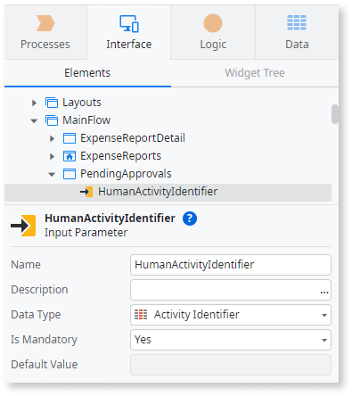
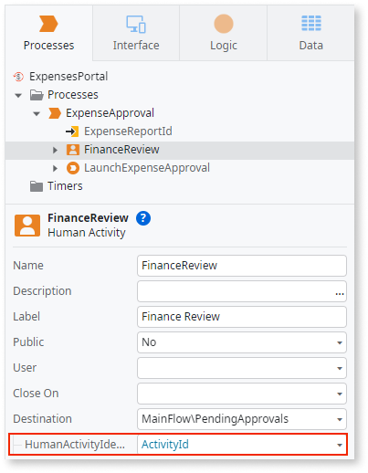
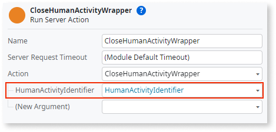
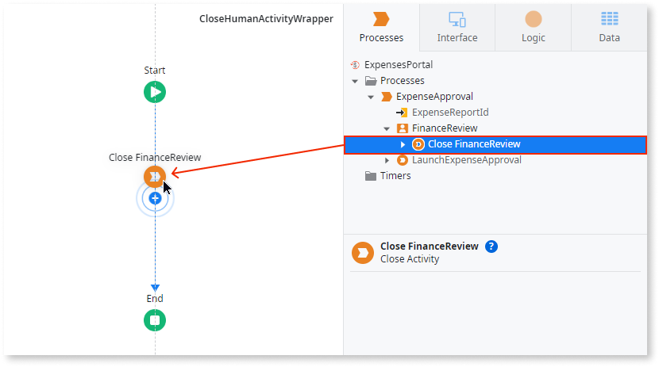
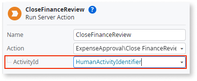
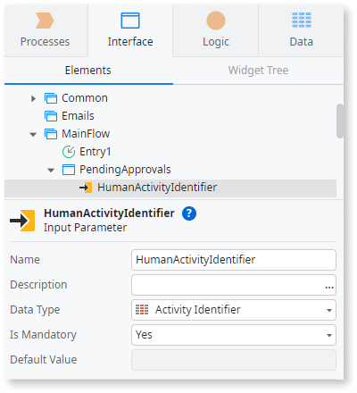
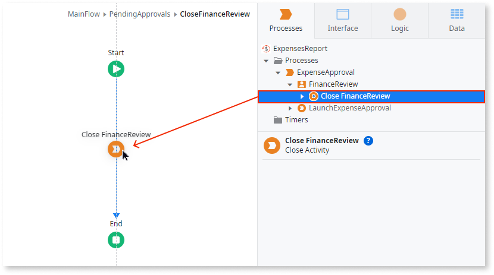

# Close Human Activity Action

Use the Close&lt;Human Activity Name&gt; [process extended action](intro.md) in a server action flow to close a Human Activity. Once closed, the Human Activity ends its execution.

The Close&lt;Human Activity Name&gt; action can only be executed on the server side.  

In Reactive Web and Mobile apps, you can only use the Close&lt;Human Activity Name&gt; action in server actions. To close a human activity from a client action, create a server action to wrap the call to the Close&lt;Human Activity Name&gt; action, then call the server action from the client action.  

In Traditional Web apps, you can call the Close&lt;Human Activity Name&gt; action directly from server and screen actions.

## Input Parameters of the Close Human Activity Action

The Close&lt;Human Activity Name&gt; action has the following input parameters:

* **ActivityId:** Activity instance Id. (Type: Activity Identifier; Mandatory)

* **Human Activity Output Parameters**: One input parameter for each output parameter in the human activity definition, if any.

<div class="warning" markdown="1">

The input parameters must be of the same type and in the same order as defined in the human activity.

</div>

## Close Human Activity from a Client Action using a Server Action

<div class="info" markdown="1">

Client Actions are only available in Reactive Web and Mobile apps.

</div>

To close a Human Activity from a client action:

1. Add a new input parameter to the screen where you want to close the human activity. (In Reactive Web apps, this screen is the one set as Destination in the human activity.) Set the data type of the input parameter as ```Activity Identifier```.

    

1. **Only for Reactive Web apps:** In the process flow, select the human activity to edit its properties. Under the **Destination**, set the newly added input parameter with the human activity identifier runtime property: ```ActivityId```.

    

1. Create a new server action to wrap the call to the Close&lt;Human Activity Name&gt; action:

    1. Open the client action of the screen where you want to close the human activity, and add a **Run Server Action** to the flow. Select **New Server Action**.

    1. Double-click the **Run Server Action** node to open the newly created action. Rename it to something meaningful, such as ```CloseHumanActivityWrapper```.

    1. You can't access the screen input parameters on a server action unless the client action passes them as a parameter to the server action. Add an input parameter to the new server action and set its data type to ```Activity Identifier```.

    1. Open the client action and select the **Run Server Action** node.

    1. Set the server action's input parameter to the screen's input parameter.

        

1. Open the server action flow.

1. In the **Processes** tab, expand the human activity and drag the Close&lt;Human Activity Name&gt; action to the server action flow.

    

1. Set the **ActivityId** input parameter of the Close&lt;Human Activity Name&gt; with the input parameter of the server action.

    

## Close Human Activity in a Screen Action

<div class="info" markdown="1">

Screen Actions are only available in Traditional Web apps.

</div>

To close a Human Activity in a screen action:

1. Add a new input parameter to the screen set as the Destination in the human activity. Set its data type as ```Activity Identifier```.

    

1. In the process flow, select the human activity to edit its properties. Under the **Destination**, set the newly added input parameter with the human activity identifier runtime property: ```ActivityId```.

    

1. Open the screen action flow.

1. In the **Processes** tab, expand the human activity and drag the Close&lt;Human Activity Name&gt; action to the screen action flow.

    

1. Set the **ActivityId** input parameter of the Close&lt;Human Activity Name&gt; with the input parameter of the web screen.

    
