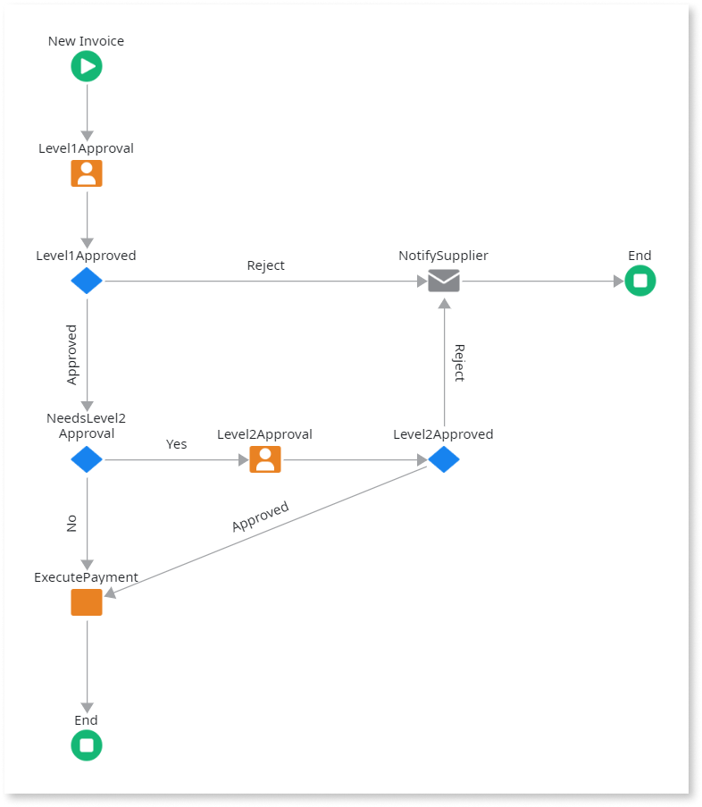
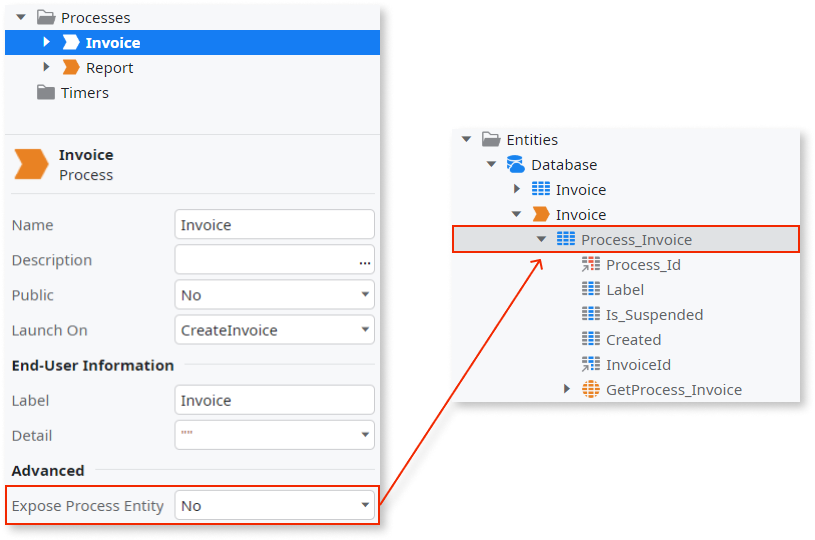
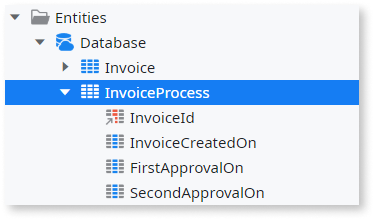
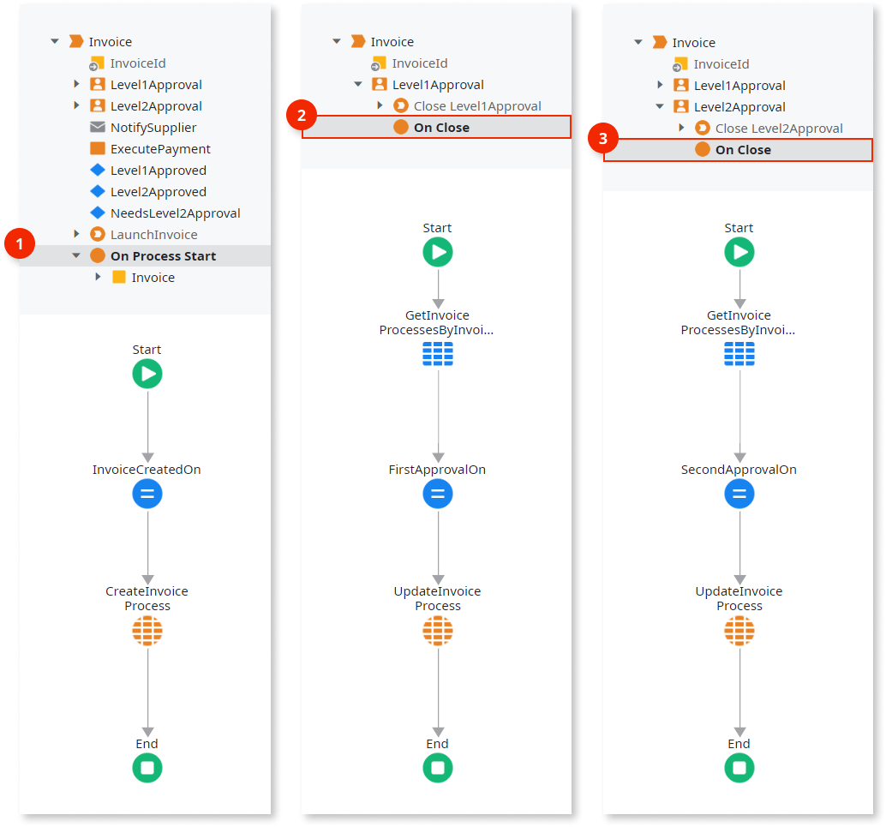

# Scale queries over process entities

When designing functionality that queries runtime information of [Processes](../intro.md), it is normally done through [Process Entities](../process-entities/intro.md).

Each process entity makes available part of the whole process runtime information stored by OutSystems. As such, if the number of executing process instances grows to millions of records, queries over process entities will be slow.

In this case, we recommend that you do the following:

1. Create an **Entity** to manually store runtime information you need about the process. This entity should be called **&lt;ProcessName&gt;Process**.

1. Use a [Process Callback Action](../actions-callback/actions-callback.md) or an [Activity Callback Action](../actions-callback/actions-activities-callback.md) to add logic to manually store the needed runtime information.

By creating this entity, you may also extend the logic and **store other runtime information** you need.

## Example

As an example, imagine a process to pay invoices of suppliers: the invoice has to pass a first level of approval, then a possible second level of approval (depending on the amount to pay), and, if rejected on any approval, an e-mail is sent to notify the supplier.

There is a requirement to make a report with the time it takes to make the first approval and also the possible second approval. There are thousands of invoices to pay, therefore, we should not use the process entity.

Let's disable the process entity...

...and create an **InvoiceProcess** entity to store the date and time of: invoice creation, first approval, and second approval.

The **InvoiceId** attribute must be both the primary key and a foreign key pointing to the **Invoice** entity (your business table), not to the internal BPT runtime table. This ensures referential integrity, prevents orphaned records in the InvoiceProcess table, and allows you to clean up finished processes from the BPT runtime without constraint errors.

Now, use the callback actions to fill the new entity with values for their attributes:

1. Add a **On Process Start** callback action to the process to create a **InvoiceProcess** record with the invoice identifier and its creation date and time.

1. On the **Level1Approval** human activity, add a **On Close** callback action to update the **InvoiceProcess** record with the first approval date and time.

1. On the **Level2Approval** human activity, add a **On Close** callback action to update the **InvoiceProcess** record with the second approval date and time.

## Report implementation

Now that you have stored the approval times, you need to query the data to create the approval report. You can implement this by querying the native process entities, or by using the custom entity to store only the data you need.

### Without the custom entity

Without a custom entity, querying the native process entities to retrieve approval times requires joining multiple tables to extract the timing information from process instances and their activities.

Your query must:

* Query the Process entity to find invoice process instances.

* Join with the Activity entity multiple times to find the Level1Approval and Level2Approval activity instances.

* Extract the close dates from each activity instance.

* Calculate the approval duration by comparing the timestamps.

This approach becomes increasingly slow as the number of process instances grows to millions of records, because each report execution must join multiple large tables and scan through all process and activity records. Additionally, running reports on tables that support the BPT runtime creates resource conflicts, such as lock conflicts, between report queries and the BPT engine. This impacts the performance of the BPT engine itself and reduces overall system scalability.

### With the custom entity

With the **InvoiceProcess** custom entity, your report query becomes simple and fast.

Query the **InvoiceProcess** entity directly and retrieve the columns you need: **InvoiceId**, **CreatedOn**, **Level1ApprovedOn**, and **Level2ApprovedOn**.

Calculate the approval durations by subtracting the timestamps. Since you're querying a single, lean custom entity instead of joining multiple process-related tables, the query executes quickly even with millions of invoices in the system.

This is the recommended approach because:

* The query scans a single, purpose-built entity instead of joining multiple process entities.

* The custom entity stores only the data you need, reducing query complexity and execution time.

* Report performance remains consistent and fast as your invoice volume grows.

* You can extend the custom entity to hold new business information as requirements change, without impacting the internal BPT engine.

* You can create custom indexes on the custom entity to optimize report performance, which you cannot do on the native BPT tables.
