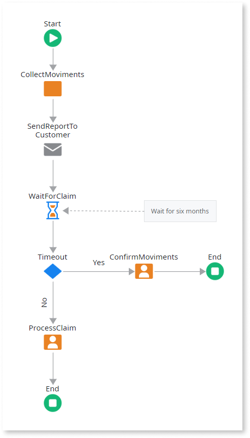
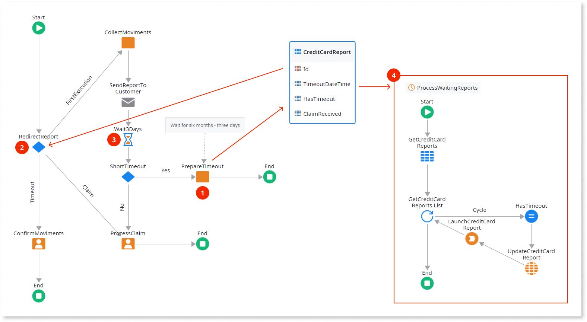

# Terminate Idle Processes

When you design a [Process](../intro.md) that stays idle for a long time, it may have a negative impact on the deployment of applications. This is essentially due to:

  1. Process instances that stay active for a long time cause accumulation of information in the database.

  1. During the deployment, the [impact analysis](../process-upgrade/intro.md) goes over all the information about active process instances, thus taking more time.

In this case, we recommend that you do the following:

  1. Analyze the process flow and identify points where the process stays idle for a long time.
  
  1. Use the [Decision](<../../../ref/lang/auto/class-decision.md>) tool to control the process execution at these points:

      * **First Execution**: end the process, and save information for resuming it like, for example, the date and time for it to be resumed and information to know where to resume.

      * **Resumed Execution**: skip activities in the flow until the point where the process is to be resumed.

Set a way of launching the resuming processes using one of the following techniques:

* A Timer
* Another process
* An action on the screen

## Example

As an example, imagine a process that monthly collects movements of credit cards and sends them to each customer by e-mail. Then, the customer has six months to make a claim for wrong movements. Most of the times, customers make the claim in the first 3 days after receiving the e-mail.

The process stays active and idle for 6 months in the **WaitForClaim** activity. So, let's change the process flow and create a timer to resume the process:

1. The **PrepareTimeout** automatic activity is added to store all necessary information to resume the process.

1. The **RedirectReport** decision is added to control the flow in the following way:

    * **First Execution**: the path followed by the first execution of the process.

    * **Claim**: the path followed by the resuming process if the customer made a claim while the process was stopped.

    * **Timeout**: the path followed by the resuming process if there are no claims while the process was stopped.

1. This is an improvement to the process due to the fact that "Most of the times customers make a claim in the first 3 days after receiving the e-mail." This way, the process waits for 3 days (a short time) and if the customer makes a claim in the meanwhile, the process follows on normally without having to be stopped and resumed later on.

1. Create and set the **ProcessWaitingReports** timer to launch the processes to resume stopped processes.
