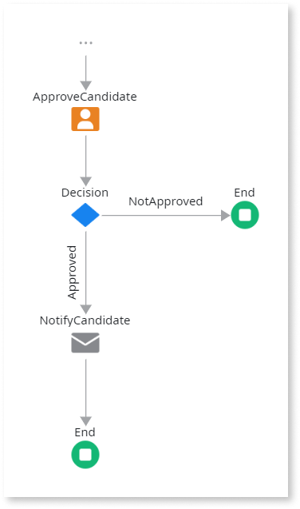
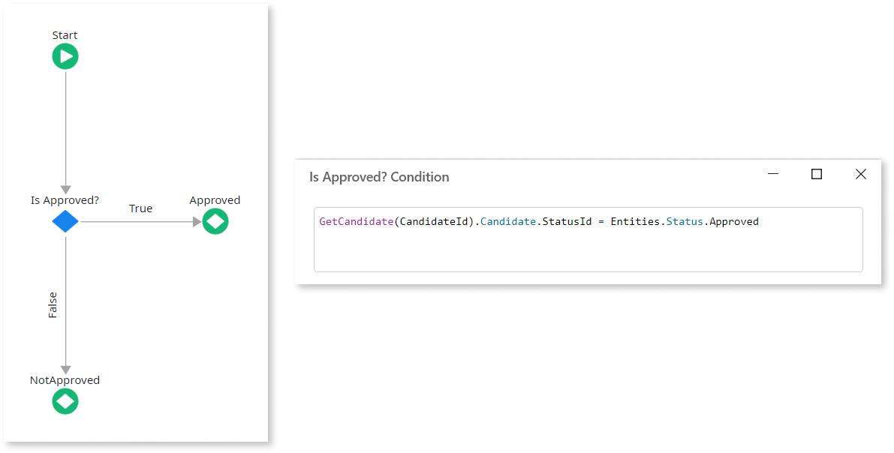

# Designing Conditional Paths

Use this pattern to design multiple paths where only one of them is followed in the process flow. Use the [Decision](<../../../ref/lang/auto/class-decision.md>) tool to design this pattern.

When the process is executed, it follows the path of the connector corresponding to the **Outcome** of the **Decision**.

## Example

As an example, think of a recruitment process that ends taking one of two actions: send an email if the candidate is approved or does nothing if not approved.

In this example there are two named connectors, therefore, two outcomes have to be defined in the flow of the **Decision**:

 
