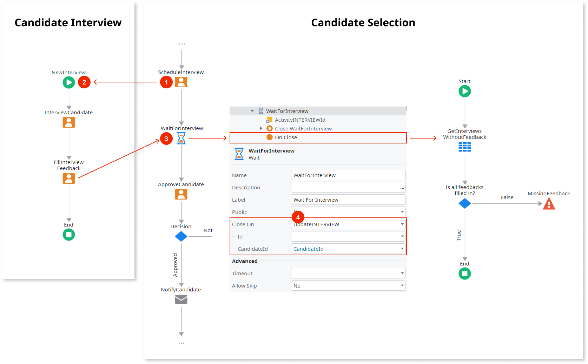
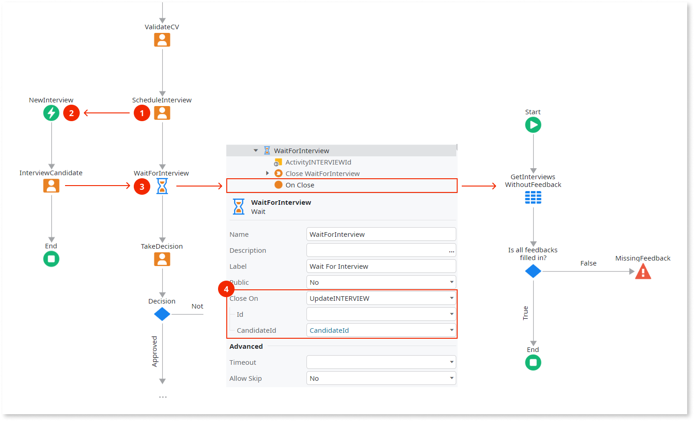

# Executing Multiple Instance Activities

Use this pattern to execute multiple instances of the same flow of activities. It is specially useful in situations where the number of executed instances is only known at runtime.

To execute multiple instances of a flow of activities, either place those activities in a new [Process](../process.md) or in the flow of a [Conditional Start](<../../../ref/lang/auto/class-conditional-start.md>).

The **advantage** of using a new **Process** is that it **clarifies the structure** of the process and **improves scalability**, even if the number of process instances grows to millions. It also helps you [limit the use of conditional starts](../best-practices/limit-conditional-starts.md).

The **disadvantage** is that **further design has to be done** to [communicate with the new process](process-communicate.md) and also to make sure all child processes are terminated when a parent process is terminated.

## Example

As an example, think of a recruitment process for candidates who apply for a job. At some point in the process interviews are scheduled, each one to be held by an interviewer. The number of scheduled interviews depends on the job position. The recruitment process only continues after all interviews are finished.

### Using a New Process

When the **CandidateSelection** process is executed the following occurs:

1. In the [Human Activity](<../../../ref/lang/auto/class-human_activity.md>) interviews are scheduled (created).

1. One instance of the **CandidateInterview** process is executed per scheduled interview (the process is configured that way in its `Launch On` property).

1. The **Wait** activity holds the execution of the **CandidateSelection** process.

1. Every time an interview is updated, the **Wait** activity is tentatively ended by executing the **OnClose** callback action: it only ends when all interviews have the feedback filled in.

### Using a Conditional Start

When the process is executed the following occurs:

1. In the [ScheduleInterviews](<../../../ref/lang/auto/class-human_activity.md>) human activity interviews are scheduled (created).

1. One instance of the [Conditional Start](<../../../ref/lang/auto/class-conditional-start.md>) is executed per scheduled interview (it is configured that way in its `Start On` property).

1. The **WaitForInterview** wait activity holds the execution of the process.

1. Every time an interview is updated, the **Wait** activity is tentatively ended by executing the **OnClose** callback action: it only ends when all interviews have the feedback filled in.
