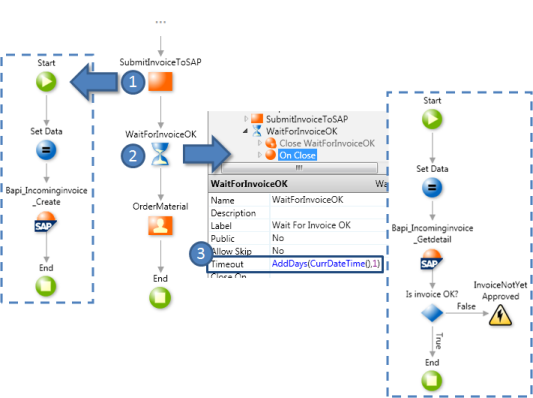

# Designing Polling of External Systems

Use this pattern to poll an external system, that is, to periodically request data from an external system and take an action when some condition is met with the returned data.

## Example

As an example, think of an integration with SAP, where a process submits an invoice to the SAP system and has to wait for it to be approved in SAP before continuing.

When the process is executed the following occurs:

1. The [Automatic Activity](<../../../ref/lang/auto/class-automatic-activity.md>) submits the invoice to SAP.

2. The **Wait** activity holds the execution of the process.

3. When the timeout occurs, the **Wait** activity is tentatively ended by executing the **OnClose** callback action: it only ends when the invoice is ok, otherwise the waiting continues until the next timeout (one more day from the current date and time).
