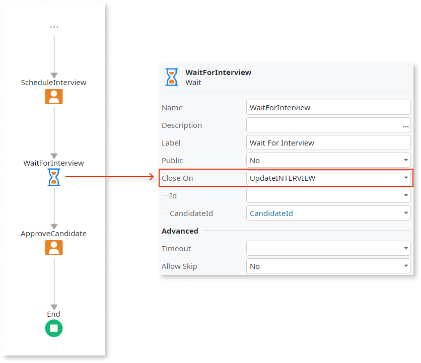

# Designing Waiting Activities

Use this pattern to design flow paths which, at some point, can only proceed the execution after some condition is verified. Use the [Wait](<../../../ref/lang/auto/class-wait.md>) activity to design this pattern.

The Wait activity holds the process execution until an event occurs, a timeout or database event, or if explicitly closed, using the **ActivityClose** action in an action flow.

To add business logic to validate whether the waiting is really to be ended or not, use the **OnClose** callback action of the Wait activity.

## Using Timeouts

A pattern to end a Wait activity is to set a timeout and then handle it accordingly.

### Example

As an example, think of a process to handle orders that starts provisioning ordered materials, packs them, and waits for the payment confirmation: if paid within 30 days of having the order packed and ready for shipping, the order is shipped, otherwise, the order is canceled.

## Using Database Events

Another pattern to end a Wait activity is to set the `Close On` property with a database event: the creation or the modification of an Entity record.

### Example

As an example, think of a recruitment process for candidates who apply for a job. At some point in the process, one interview is scheduled and the process waits for the interview to be updated with the feedback before continuing.

## Validating Whether the Waiting Ends

To add business logic to validate whether the waiting is really to be ended or not, use the **OnClose** callback action of the Wait activity.

### Example

As an example, think of a recruitment process for candidates who apply for a job. At some point in the process some interviews are scheduled and the process waits for all interviews have the feedback filled in.

When the process is executed, every time an interview is updated, the Wait activity is (1) tentatively ended, executing the **OnClose** callback action to only allow it to end when all interviews have the feedback filled in.
