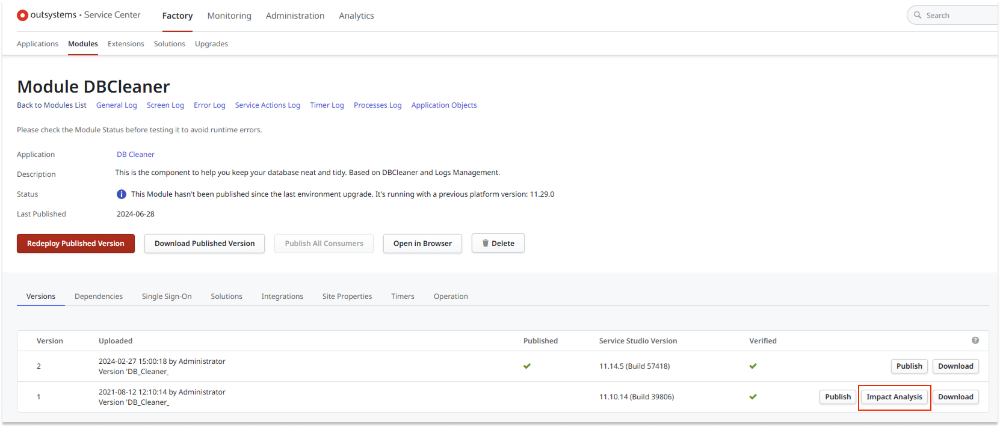

# Upgrade processes

When you publish a module containing modified [process flows](../process-flow/process-flow-editor.md), all of the executing process instances that were based on the former process flows are automatically upgraded by OutSystems. However, the success of these upgrades depends on both the kind of changes you made to the process flow and the current execution state of process instances. An **impact analysis** determines whether a process instance is suspended or upgraded to execute the new process flow.

## About the impact analysis

When designing processes, the impact of changes made to process flows is analyzed for all **active process instances** that are executing previous versions of those process flows. Changes with impact include:

* Adding or removing activities in the flow
* Changing the order of activities in the flow
* Adding or removing connectors
* Adding or removing mandatory process input parameters
* Adding or removing activity output parameters
* Changing the type of process input parameters
* Changing the type of activity output parameters

## Running the impact analysis

An impact analysis can be run in the following ways:

* **Effective**: The impact analysis is automatically run and process instances are effectively upgraded or suspended in each deployment done in Service Studio, Service Center, or LifeTime.

* **Preview**: You can run the impact analysis in preview mode (without effectively upgrading or suspending processes), by simply uploading the application in Service Center and running the **Impact Analysis**.

All process instances that have their **execution suspended** have to be analyzed in Service Center to decide whether to continue or stop them.
