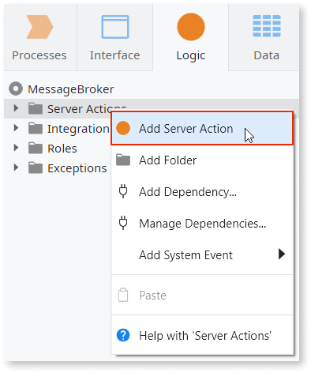
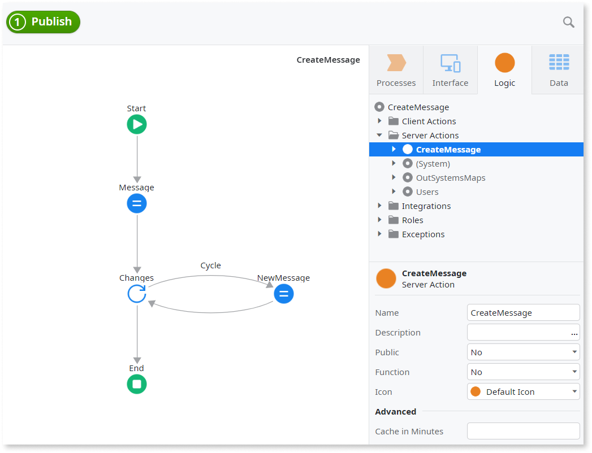
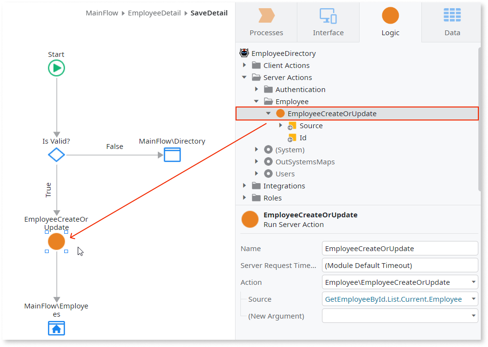

# Use Actions to Encapsulate Logic

When implementing the logic of your application, you can create actions in your module to later invoke in other action flows. This allows you to centralize the logic and makes your module easier to maintain. You change the logic in only one place and all other actions using it will benefit.

## Use Actions to Encapsulate Logic

To encapsulate logic in a new action, do the following:

1. In the Logic tab, add a new Action to your module.

    

1. Implement the logic in the action flow.

    

Also, sometimes you have the same piece of logic already implemented in several places of your module, but you decide that it would make more sense to encapsulate that logic and use it elsewhere, to keep your module easier to maintain. In this situation, do one of the following to encapsulate the existing piece of logic in a new action:

* Add a new Action to your module, copy the piece of logic you want to encapsulate from one of the actions containing that logic, and paste it into the new Action.

* Use [Extract to Action](../../getting-started/tips-tricks/tips-tricks.md#reuse-logic-with-extract-to-action) to create a new Action with that piece of logic.

## Use the Encapsulated Logic

To use the encapsulated logic in another action, do the following:

1. Open the action flow of the action where you want to use the encapsulated logic.

2. Drag the action with the encapsulated logic from the Logic tab and drop it in the action flow.

    

3. Set the values of the Input Parameters, if any.

Learn also [how to expose and reuse functionality between modules](expose-and-reuse.md).
