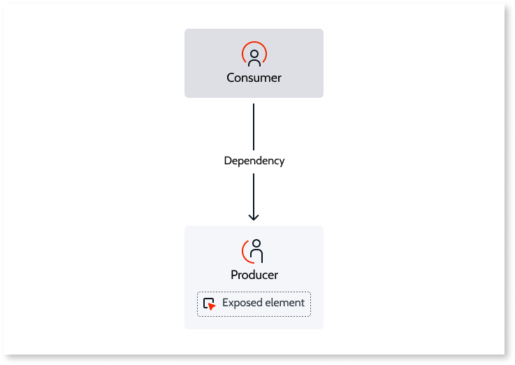
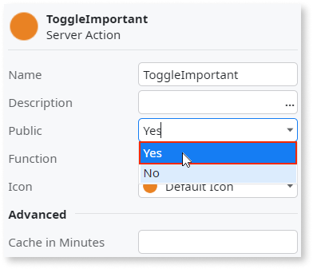
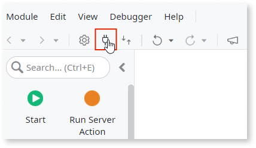
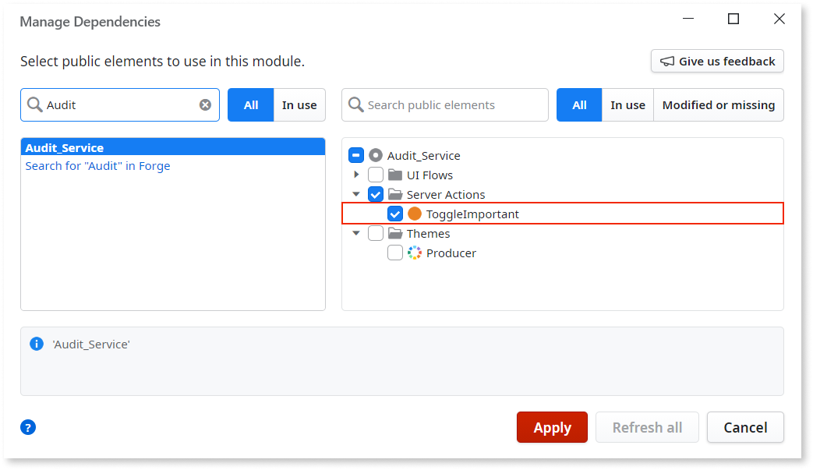
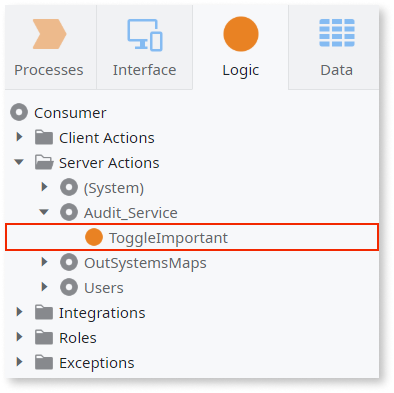
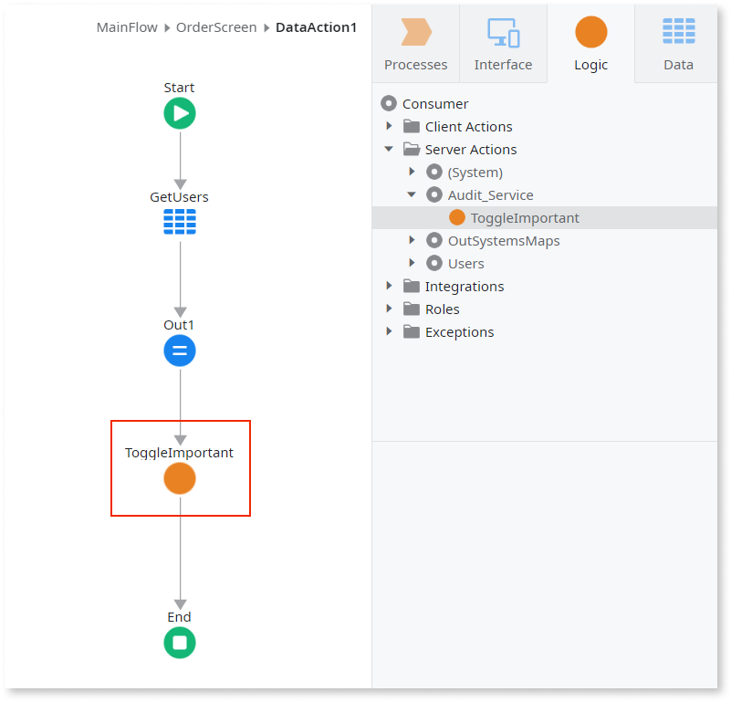

# Expose and reuse functionality between modules

When developing your OutSystems applications, elements are implemented and reused anywhere inside the same module. However, you can expose some elements in your module to be reused by other modules.

The module that implements and exposes functionality is the **producer** module. On the other hand, the module that reuses the exposed functionality is the **consumer** module. The functionality exposed by a **producer** module is considered as **dependencies** in the **consumers**.

Changes made in the producer module to the signature or implementation of the exposed elements may have impact in the consumer module. Check [this topic](handle-changes.md) to learn how the changes made in the producer in the exposed elements will impact the consumer modules.

## Expose functionality to other modules { #expose }

When you expose functionality to other modules of the environment, your module is the **producer** module. Most of the elements you create in the module, such as actions or entities, aren't exposed by default. You have to make them **Public** to expose them to other modules.

To expose an element to other modules, do the following:

1. Set the element's **Public** property to **Yes**.

    

1. Publish your module. After publishing your module, you can reuse the public elements in other modules in the environment.

By definition, Service Actions are always public to other modules, so you don't need to set them as public. This also happens for the elements exposed by [Extensions](../../integration-with-systems/integration-studio/getting-started/extension.md).

Depending on the type of elements that you expose, OutSystems generates a **strong dependency** or a **weak dependency** between your module and the consumer modules. Check [Understand Strong and Weak Dependencies](strong-weak-dependencies.md) to understand the differences between strong and weak dependencies and how each element is exposed.

## Reuse functionality from other modules { #reuse }

When you reuse functionality from other modules of the environment, your module is the **consumer** module.

To reuse elements from other modules, do the following:

1. Open the **Manage Dependencies** window.

    

1. Select the producer module and then select the element you want to use.

    

1. Press **Apply** to make the element available in your module.

    

1. Use the element exposed by the producer as any other element in your module.

    

In the consumer module, you can see all the details you need to reuse the exposed element, such as the element name, the description, or the input/output parameters — called the **element's signature**.

You can't modify the exposed elements in the consumer module, you must edit them in the producer module.
