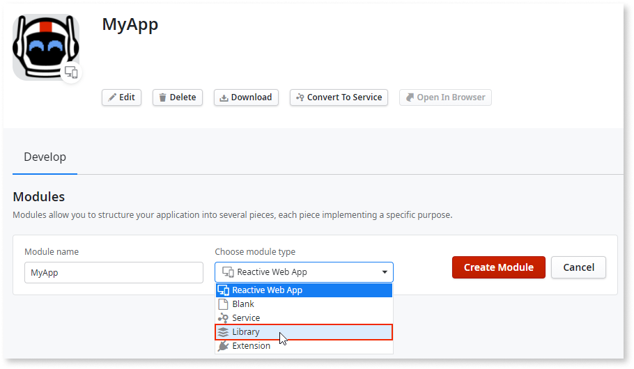

# Libraries

Applies to Mobile Apps and Reactive Web Apps only.
Library modules can't be created in Traditional Web and Service apps.

A Library is a module type that helps you lay the foundations of your application. Libraries have a direct fit in the **foundation layer** of the [architecture canvas](https://success.outsystems.com/documentation/best_practices/architecture/designing_the_architecture_of_your_outsystems_applications/the_architecture_canvas/) and allow you to reduce the number of dependencies.

**Best practice**

Start building your OutSystems applications with architecture in mind. Having a sound architecture allows you to change fast according to business needs, and to have different lifecycles for distinct applications, allowing them to evolve at different paces.

Good architecture promotes the reusability of common modules, avoiding duplicated implementations, and clear ownership of modules and applications throughout your factory.

The Library module type was designed with the following principles in mind:

* **Libraries are stateless.** They don't store information in the database and they don't have direct access to Entities.
* **The elements of a library are only deployed in the context of consumer applications.** They are not deployed as standalone applications, reducing the load in the application server.
* **Libraries are agnostic to the database where applications referencing them are deployed.**

For example, you can use Libraries to build the following:

* **UI elements and style guides**: Used to enforce reusability and standardization throughout a factory. For example, use libraries to implement components like [TinyMCE](https://www.outsystems.com/forge/component-overview/1263/inputtotinymce) or [CKEditor](https://www.outsystems.com/forge/component-overview/97/ckeditor).
    
* **Reusable utilities**: Used to group functionalities while adhering to a sound architecture.  
For example, use Libraries to implement:

    * **Connectors** — integration with external services APIs or UI. For example, a `MyRESTServiceUtils` Library to abstract REST services consumption.

    * **Logic** — encapsulate logic that can be called by several applications. For example, a `CipherUtils` Library to help encrypt/decrypt data.

Due to their stateless and database agnostic desing, Libraries can only contain certain elements. The elements you can use in Libraries are enforced both in Service Studio editors, while you're editing your module, and in the **Manage Dependencies** window, when you're referencing elements from other modules. Follows a list of the availability of elements in a Library module:

| Service Studio element | Availability in Library modules |
| :---: | :---: |
| UI Flows |  |
| Screens |  |
| Blocks |  |
| Images |  |
| Themes |  |
| Scripts |  |
| Server actions |  |
| Data actions |  |
| Service Actions |  |
| Client Actions |  |
| Entities |  |
| Static entities |  |
| Structures |  |
| Resources |  |
| Consumed REST Consumed SOAP SAP |  |
| Exposed REST Exposed SOAP  |  |
| Exceptions |  |
| Processes |  |
| Timers |  |
| Roles | |

## Restrictions

Considering the architectural philosophy behind Libraries, some concepts must be approached differently. Take the following into account when creating a Library:

* Libraries can only reference elements from other Libraries or from Extensions. However, you can still reference System actions.
      
* Static Entities can be created and referenced in Libraries but can't be used in queries, as dropdown sources, or as foreign keys for entities. However, you cannot reference Static Entities from (System) in Libraries.
* Though you can reference both public Server Actions and public Structures made available by Libraries in a Traditional Web App, you cannot reference the following elements from a Library in a Traditional Web App:
    * Blocks
    * Client Actions
    * Images
    * Themes
    * Scripts
    * Resources.
* Libraries can only access Site Properties in read-only mode. The effective values of Site Properties can still be modified via Service Center, or via LifeTime using [Configure Site Properties during deployment](../../deploying-apps/tp-configure-site-properties-during-deploy.md).
  

When using Libraries, it's not possible to deploy [existing resources](../data/resources.md) to Target Directory.

## Create a Library

1. In Service Studio, create a new application (Mobile or Reactive Web) and give it a name.  
    Alternatively, if you are creating a Library in an existing application, click the icon of an existing Mobile or Reactive Web application and then click **Add Module**.

1. Enter a name for the new module and choose **Library** as the module type in the dropdown.

    

1. Click **Create Module**.

### Debugging a Library

To debug a Library module you need to set the **entry module** to a module that's consuming the library, like you already do when debugging producer modules. Check [Debugging Producer Modules](../../debugging-apps/debug-producer-modules.md) for more information.
