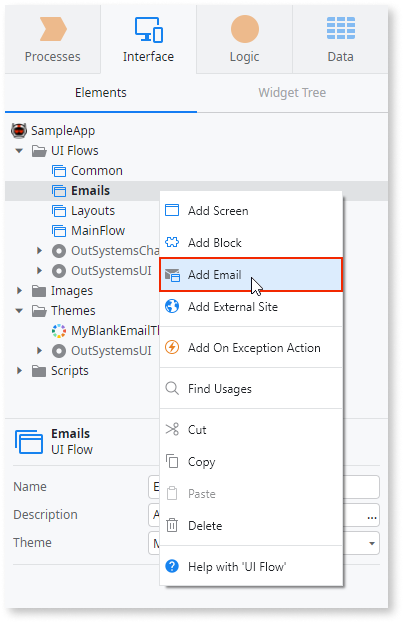
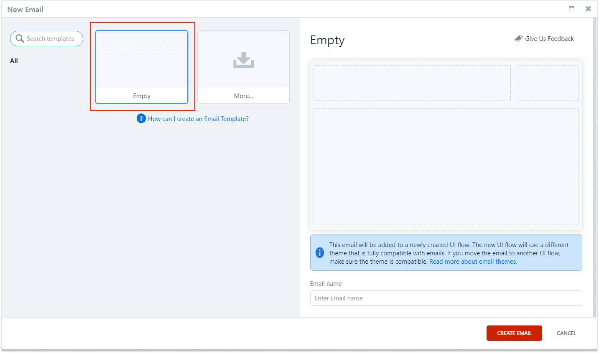
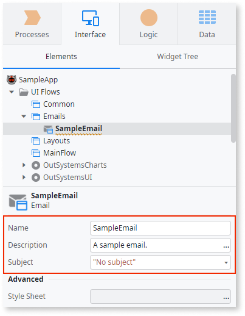
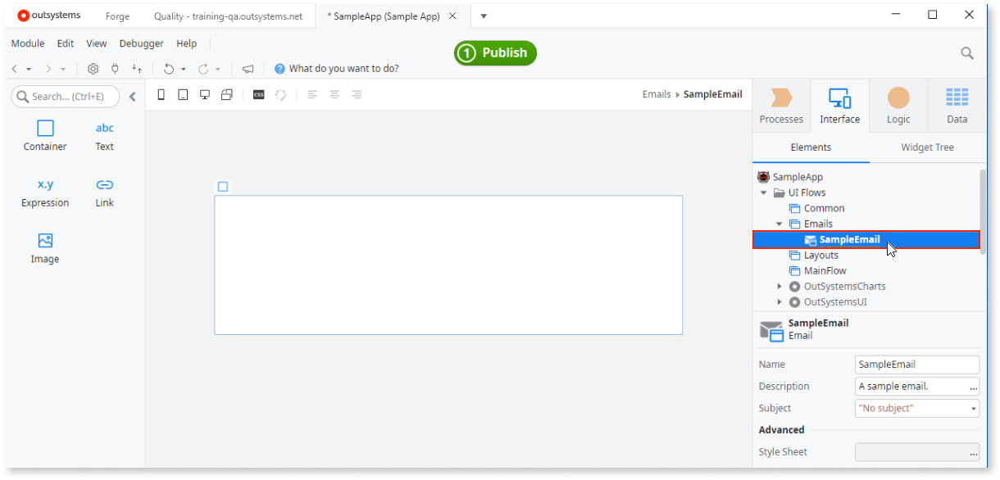
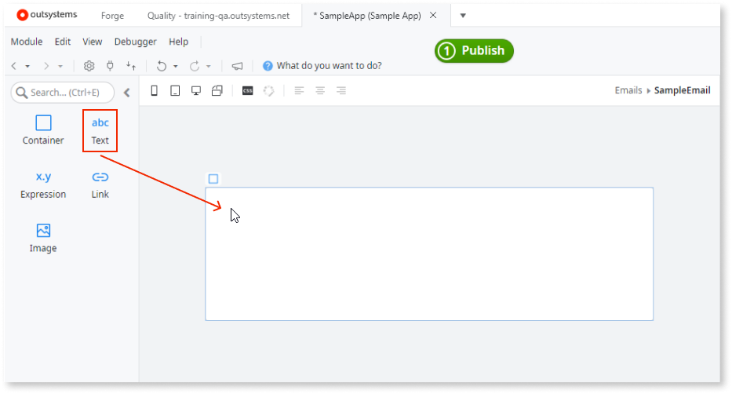
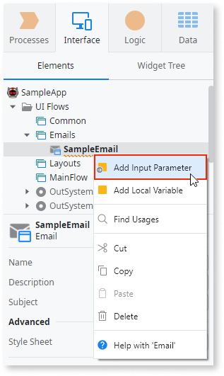
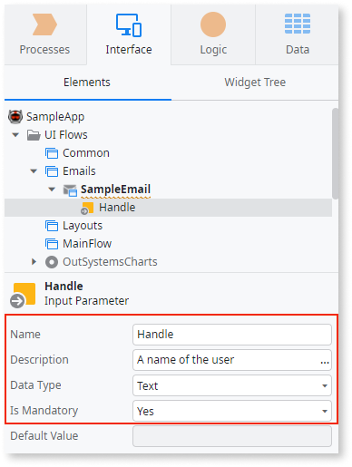
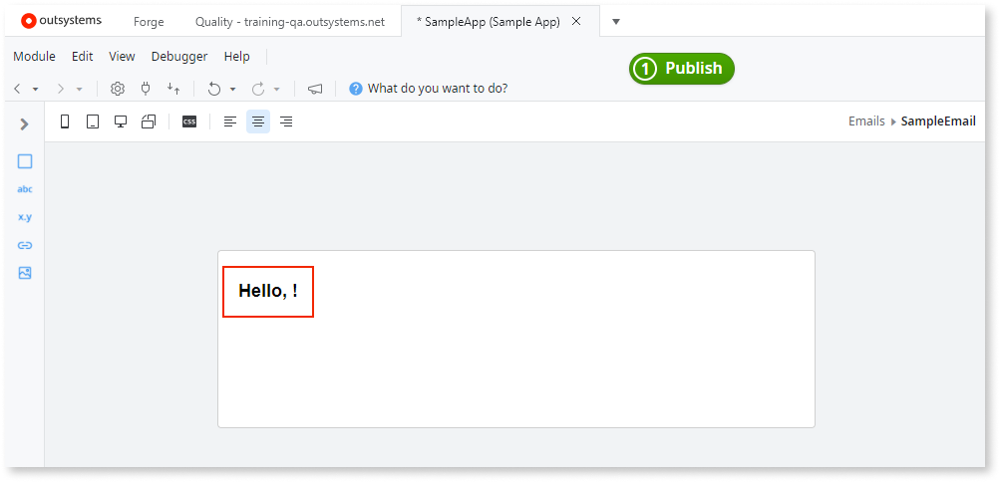

# Managing emails

In Service Studio, Email is a UI element that lets you design and manage the content of email messages. Like Screens, you can find and create Emails in the UI Flows. However, unlike Screens that usually use the OutSystems UI, Emails require lightweight styles to follow the industry best standards for email sizes.

Before following the guides in this article, make sure you meet the [prerequisites](intro.md#prerequisites).

## Creating a new Email

To create a new Email in Service Studio, follow these steps:
 
1. Go to **Interface** > **UI Flows** and do one of the following:

    * In you're adding the first email in the module, right-click any UI Flow and select **Add Email**.
    * If you already have an email in the module, right-click the **Emails** UI Flow and select **Add Email**.

    

    

    Emails require a light theme. When you add your first email to the module, Service Stdio creates Emails UI Flow and a light theme, and then adds your email.

    

1. In the **New Email** window, select **Empty** and click **Create Email**.

    

    1. Select the Email under the UI Flow, and enter the following details:

    * A name in the **Name** field
    * `"No subject"` as a temporary subject in the **Subject** field

    

## Adding content to Email

To add content to your emails, follow these steps in Service Studio:

1. Go to **Interface** > **UI Flows** > **your Emails UI Flow** and double-click the Email you want to edit. The Email opens for editing. The widget list shows the widgets that Emails currently support.
    
    

    

    If you don't have Emails in your module, add one by following the instructions in [Creating a new Email](#creating-a-new-email).

    

1. Drag the **Text** widget to the Email and enter some text.

    

    

    To learn more about what elements you can use in Emails, see [Widgets available in Emails](widgets.md#widgets-available-in-emails). 

    

1. (Optional) Go to the **Text** widget properties and edit the text look and feel in the **Styles** tab.

## Handling inputs in Emails

Customize the content of your emails by adding information to the corresponding Email. Emails support compound data types and can use the data from the client scope of Email.

To add an Input to your Email and show the value in the email body, follow these steps:

1. [Add an Email to your module](#creating-a-new-email) and optionally [add some text](#adding-content-to-email).

1. Right-click the Email in the **Interface** tab and select **Add Input Parameter** from the menu. Service Studio adds an Input Parameter.

    

1. Set the following Input Parameter properties:

    * **Name** - enter `Handle`
    * **Data Type** - select **Text**
    * **Is Mandatory** - Select **Yes** to make the **Handle** a required value in the Email

    

1. Double-click the Email in the **Interface** tab to open it for editing.

1. Drag an **Expression** widget to the Email. The expression editor opens.

1. Enter `"Hello, " + Handle + "!"` and click **Close**.

    

When you open this email in the email client, the expression displays "Hello, John!" when the value of **Handle** is `"John"`.

[Follow security best practices](https://success.outsystems.com/Documentation/Best_Practices/Security/Reactive_web_security_best_practices) when designing emails that have user inputs.

## Clipped content warning { #clipped-content-warning }

If the content of an email is too big, some email readers clip the content. For example, Gmail shows **[Message clipped] View entire message** for all emails larger than 102KB. This can happen if you're generating content in your emails with a Theme that has a lot of CSS not designed for emails.

To reduce the size of the email content, use a blank Theme or a dedicated email Theme. When you add email based on one of the email templates, Service Studio applies an email theme automatically for you. You can also [create UI Flow without styles](../ui/navigation/ui-flow.md#creating-ui-flow-without-styles) and then add your emails under this UI Flow. 

## Email templates

You can create email templates and share them with other developers in the OutSystems environment. The templates ensure consistent look and feel of the emails, and speed up development.

**Install email templates from Forge**

You can get email templates from Forge. Go to [OutSystems Email Templates](https://www.outsystems.com/forge/component-overview/11507/outsystems-email-templates) and install the component. Then, to create a new email, select a template. The templates are under development (not stable) and work better when you install them directly from the Forge web page.

**Create your templates**

You can also create your email templates by following the instructions for [creating screen templates](../ui/screen-templates/intro.md). The process and user experience for creating email templates is similar to creating screen templates. Due to the intended use, email templates, just like emails, don't support logic or non-email themes.

