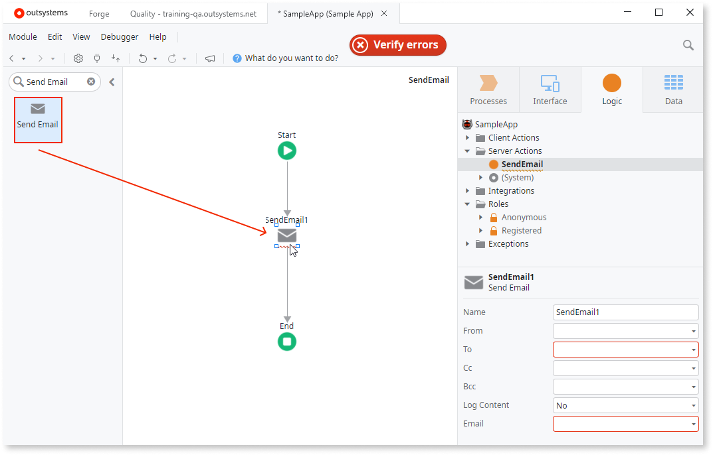
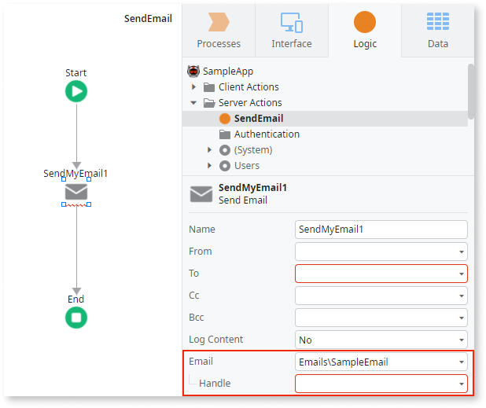
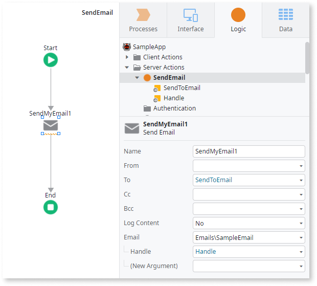
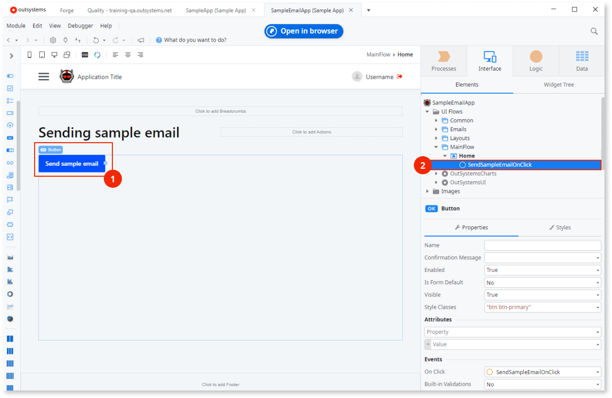
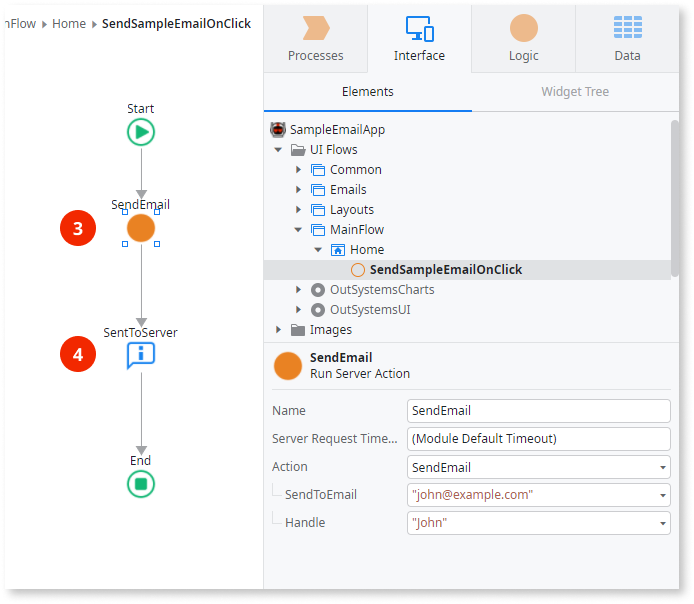
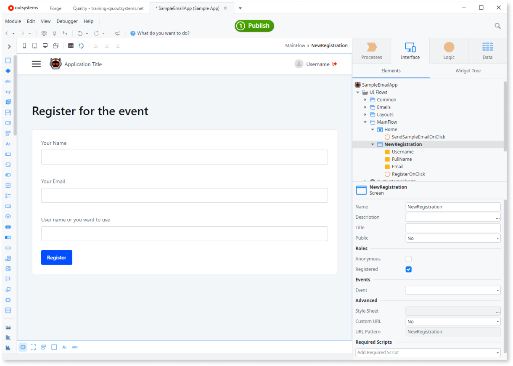
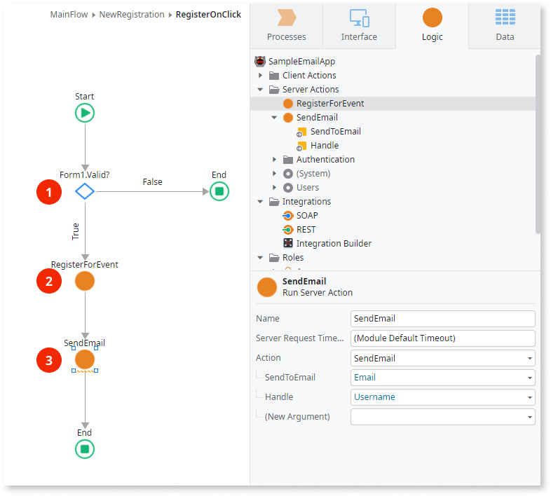

# Sending emails

Email is a fundamental component of app development, serving as a channel for communicating directly with your users. In OutSystems, you can design, build, and send emails to handle communication workflows. When designing an app to send emails to your users, consider the following types of actions:

* **Sending emails.** This is a generic action. The platform takes an Email you created in Service Studio, renders it as an email, and then sends it to the user's inbox.
* **Triggering emails.** This is an event that initiates the sending of an email. This is usually an automated action, but you can trigger sending an email manually in the UI.

Before following the guides in this article, make sure you meet the [prerequisites](intro.md#prerequisites).

## Creating logic for sending emails

To create logic that sends an email, follow these steps in Service Studio:

1. Go to the **Logic** tab and create a new server action by right-clicking **Server Actions** and selecting **Add Server Action** from the menu. A new server action opens for editing. The logic for sending emails runs on the server side.

1. Drag the **Send Email** action to the flow. Service Studio adds **Send Email** to the flow and shows an error to let you know some parameters are missing.

    

1. Go to the **Send Email** properties action and select your Email in the **Email** list. Service Studio now shows the list of input parameters your Email requires.

    

1. To create the parameters in the server action to pass the values to the Email, right-click the Server Action and select **Add Input Parameter**. Repeat as needed to add the following:

    * All parameters that the Email requires
    * The input parameter for the **To** field of the **Send Email** action

1. Go to the **Send Email** action properties in the flow and set the **To** property and the required values from the Email you selected in the **Email** list.

    

    

    Be careful when editing the **From** property in the **Send Email** action. Most spam algorithms reject emails with a misconfigured **from** field.

    

    Your module is now ready to send the email. The next step is to create logic to trigger the sending of the email.

## Triggering emails

Apps often need to send emails automatically. This automation typically falls into two categories:

* **Transactional emails**: Sent immediately in response to a user's action (for example, a registration confirmation, password reset, or purchase receipt).
* **Batch or scheduled emails**: Sent by a background process without any user present (for example, a daily report or a weekly newsletter).

This guide focuses on the first category: transactional emails. A common example is the app automatically sending a confirmation email as soon as a user fills out an event registration form.

### Trigger emails manually

You can manually trigger the sending of an email when you test the app and when you have use cases that require it. On the UI, there can be an element, such as a **Button** widget (1) with an **On Click** event to call a client action (2).

In the client action, you can call the server action that sends the email (3). You must provide the input parameters required by the action. The feedback message from the UI (4) lets the user know the app called the logic to send the message.

### Triggering transactional emails in response to user actions

There are many use cases where you might want to send an email automatically, for example, when you send an email to users after registration. Consider event registration, where users who want to attend the event need to fill in the registration details in a form.

The logic for new registrations checks if the user entered valid information (1). If the information is valid, the logic handles the registration request (2) and then triggers the sending of the confirmation email (3).

The pattern shown here is simplified for demonstration. It is best practice to avoid calling multiple server actions from a single client action. Instead, create one wrapper server action that contains both the registration and email logic. This improves performance and maintainability.

### How OutSystems Handles the Email Sending

At runtime, the **Send Email** tool renders the email content, adds it to a sending queue, and continues execution, thus not sending it right away. It is another OutSystems process, the OutSystems Scheduler Service, that picks queued emails and effectively sends them, i.e. emails are **asynchronously sent** by OutSystems.

As emails are sent asynchronously in a different session you cannot rely in session data to render emails.

OutSystems tries to send failed emails for a period of days (default period is 2 days). When an email continues to fail after this period, OutSystems quits trying to send it.

All emails you send through an OutSystems web application are logged and you are allowed to check up on them in **Service Center**.
