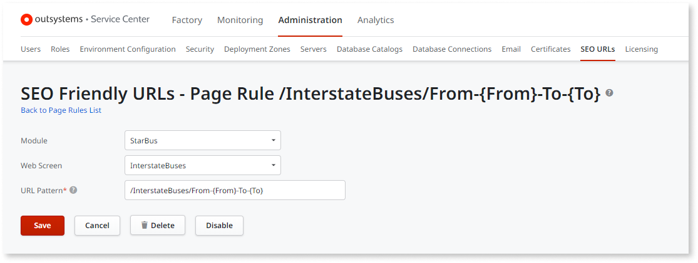
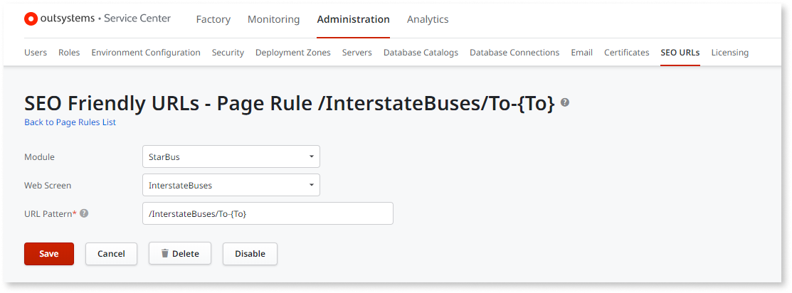
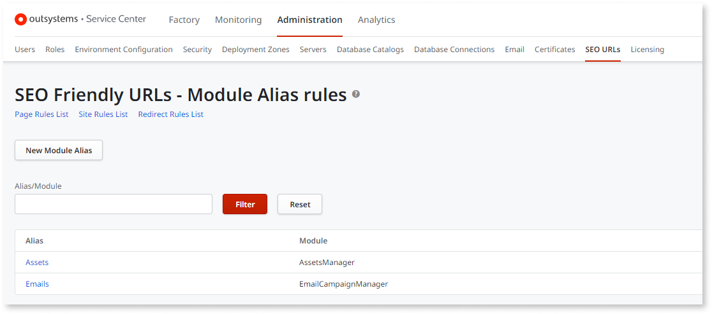
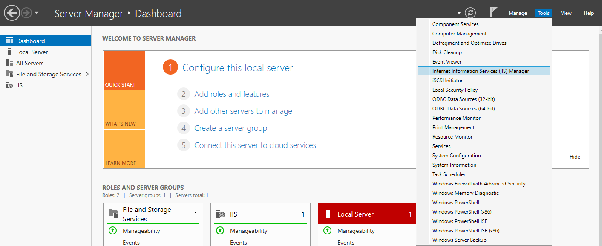
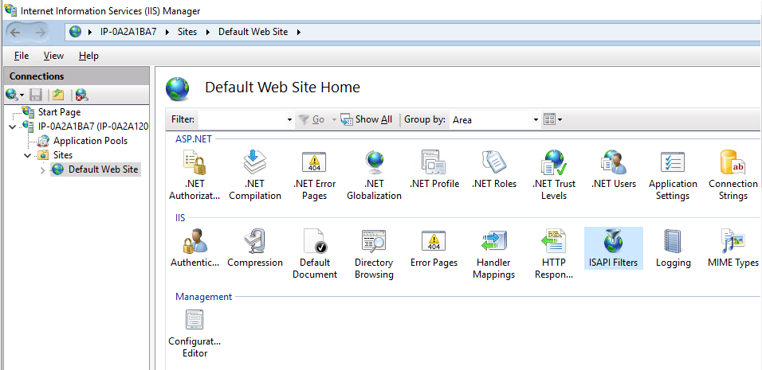
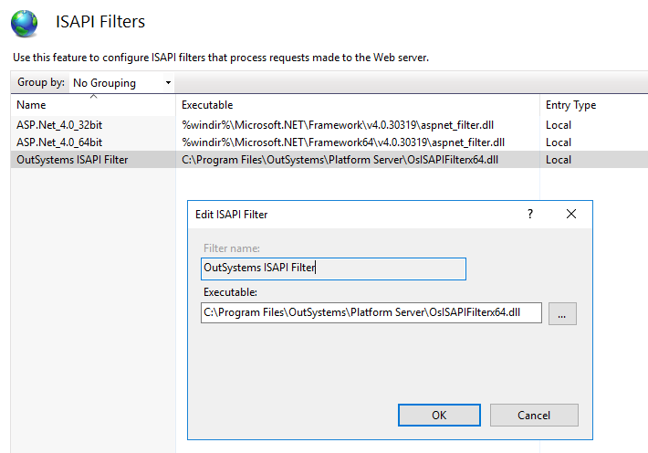

# SEO-Friendly URLs for Traditional Web apps

<div class="info" markdown="1">

Applies only to Traditional Web apps.

</div>

<!-- Help id 30374 links to this document. -->

The URLs that are easy to read, memorize, and type contribute to great user experience (UX) and search engine optimization (SEO). OutSystems lets you configure the app URLs for UX and SEO. This guide describes the available techniques to simplify the URLs of the Traditional Web apps.

Applying these techniques promotes SEO because the search engines (and users) give more relevance to friendly URLs. Furthermore, you're allowed to configure URLs for duplicate content across different domains, and to handle broken links from former indexed results when your URLs change.

<div class="info" markdown="1">

This document applies to Traditional Web Apps. For Reactive Web Apps, see [SEO-Friendly URLs for Reactive apps](seo-friendly-url-reactive.md).

</div>

## Configuring URL Rules

In Service Center, the console of Platform Server, a set of configurations let you to define rules by which incoming URLs are handled and transformed in the platform. Find these configuration options under the **Administration** tab, in the **SEO URLs** option. 


At runtime, when clicking on a link on a page of your application, OutSystems optimizes the destination URL, and changes it to the best path that takes the most of your SEO-friendly URLs configuration. 

### Page Rules

<div class="info" markdown="1">

This section applies to Traditional Web apps. For Reactive Web Apps, see [SEO-Friendly URLs for Reactive Web apps](seo-friendly-url-reactive.md).

</div>

Use Page Rules to transform your URLs trailing information such as, page names and page parameters, into relevant keywords for search engines to rank them in a way that clearly describes your pages content. To specify these URLs transformations use the **New Page Rule** button.


The platform compares all incoming URLs with your rules, one by one, following the order you defined in the **SEO Friendly URLs - Page Rules** screen. The rule that's part of the app **Module** that matches the **URL Pattern** is the first applied. The app displays the **Web Screen** page and the parameter placeholders in the URL path. The Web Screen parameter name are enclosed in {} and the platform passes them to the page with their runtime values.

When there's Web Screen names ambiguity, prefix the Web Screen name with its Web flow name and a dot (‘.’). 

At runtime, the platform assures that clicking on links to the Web Screens that have entries on any of these rules, have their destination URL transformed to use the **URL Pattern**. 



With the above settings, when the application navigates to:

```
http://www.example.com/InsterstateBuses.aspx?From=Lisbon&To=Faro 
```

Shows the following URL:

```
http://www.example.com/InsterstateBuses/From-Lisbon-To-Faro
```

However, if there's only the 'To' parameter in the URL, the last rule applies, because the From parameter isn't defined to apply the previous rule. 



As such, navigating to the URL:

```
http://www.example.com/InsterstateBuses.aspx?To=Faro 
```

Shows the following URL:

```
http://www.example.com/InsterstateBuses/To-Faro
```
### Modules aliases

<div class="info" markdown="1">

This section applies to Traditional Web Apps. For Reactive Web Apps, see [SEO-Friendly URLs for Reactive apps](seo-friendly-url-reactive.md).

</div>

A module Alias is an alternative module name to be used in URLs: normally a simpler, friendlier, and keyword relevant name. 

To check or add module aliases, select the **Module Alias List**.



Each module can only have one alias. You can still use the original module name in URLs.

With the above settings, you may simply use Assets or Emails words in your URLs instead of using AssetsManager or EmailCampaignManager, for example, use:
```
http://www.example.com/Assets 
```

```
http://www.example.com/Emails
```
Instead of:
```
http://www.example.com/AssetsManager 
```

```
http://www.example.com/EmailCampaignManager 
```
### Site Rules

Use Site Rules to simplify and organize URLs to better highlight site structure as, for example, www.myCompany.com/Site/ or www.myGallery.com/GallerySite/ where the Site and GallerySite parts are disposable. Another possibility is for you to automatically set the application’s working language depending on the existence of these disposable parts in the URL.

Implement this kind of configurations selecting the **Site Rules List** option.


The platform compares all incoming URLs with your rules, one by one, following the order defined in the Site Rules screen. The first rule matching its **Base URL** value with the beginning of the URL path (excluding the protocol prefix) is the one applied: if there's a language **Locale** defined it gets set in the application. If there’s a **Root Application** defined, it's executed instead of the default application for the IIS site pointed at by the URL.

With the above settings use the simplified www.myCompany.com URL to access myCompany’s website instead of the www.myCompany.com/Site URL. The same applies to myGallery’s website, where the www.myGallery.com/GallerySite URL is simplified to www.myGallery.com.

On the other hand, the site for Taxi Anywhere displays the application default web page with the language locale automatically set according to the URL.

### Redirect Rules {redirect-rules}

When domain changes occur make your old URLs point to the new ones using the Redirect Rules. It allows for old URL references to keep working, and for search engines to have a way of knowing that a replacement took place, thus not affecting their previous search engine ranking information.

<div class="info" markdown="1">

If you have enabled [secure endpoints in LifeTime](../../security/host-header-protection.md) make sure the domains you're redirecting to are present in the **Additional secure endpoints** in LifeTime.

</div>  

To transform incoming URLs and force client-side redirects select the **Redirect Rules List** option.  


All incoming URLs are compared with your rules, one by one, following the order defined in the 'Redirect Rules' screen. The first rule matching its **Base URL** value with the beginning of the URL path (excluding the protocol prefix) is the one applied: the matching part in the URL path is replaced by the rule’s **Replace With** value, remaining the rest of the URL path unchanged. The browser is then redirected to the new URL. 


With the above settings, when navigating to:
```
http://uk.example.com/Home.aspx?TaxiType=Van 
```
The browser is redirected to:
```
http://www.example.com/uk/Home.aspx?TaxiType=Van
```
## Other Search Engine Optimization Techniques

Besides using the SEO Friendly URLs feature, there are other techniques you can apply when designing your web sites such as: setting unique and accurate page titles, adding meta tags to your HTML, etc. [Learn more about SEO techniques](https://support.google.com/webmasters/answer/7451184?hl=en&ref_topic=9268559).

## Installing ISAPI Filters and Logging

<div class="info" markdown="1">

You need to follow the instructions in this section if you're installing the platform yourself (you're performing the **on-premises installation**). **If you use the OutSystems cloud, ISAPI Filters are already installed in your environment**.

</div>

To start using the SEO Friendly URLs on OutSystems on-premises environments, you have to install ISAPI Filters in your Internet Information Services (IIS). For that, follow the steps described in the ‘Installing ISAPI Filters’ section. Regarding logging, useful for you to detect errors or malfunctions, check the ‘Logging’ section to see how to turn logging on (and off).

If you are using the OutSystems Cloud, the necessary configurations are already active by default.

### Installing ISAPI Filters 

<!-- Help id 30374 links to this section. Edit the URL mapping if you change the title / URL of the doc. -->

The OutSystems Platform works with ISAPI Filters installed in Microsoft Internet Information Services (IIS). To install the ISAPI Filter in Microsoft IIS, perform the following steps (instructions based on Windows Server 2016 and IIS 10.0):

1. Make sure you have followed all the steps in the OutSystems Platform Server installation checklist;

1. Grant write and modify permissions to the ‘logs’ directory (located under your OutSystems Platform Server installation directory) for the IIS_IUSRS group.

1. Launch Internet Information Services (IIS) Manager. In the Windows Start Menu, select **Server Manager**, select **Tools**, and then select the **Internet Information Services (IIS) Manager’ application**.

    


1. In the IIS Manager tree, under the **Sites** folder, select **Default Web Site**;

    

1. Double-click on **ISAPI Filters** icon to open it, and then click on the **Add** link on the **Actions** pane;

    

1. Set the **Filter Name** to 'OutSystems ISAPI Filter', and the 'Executable' to:

    * 32-bit Operating Systems: `<your_OutSystems_Installation_Directory>\OutSystems\Platform Server\OsISAPIFilter.dll`

    * 64-bit Operating Systems: `<your_OutSystems_Installation_Directory>\OutSystems\Platform Server\OsISAPIFilterx64.dll`
    
    

    * Press ‘OK’ button to finish adding the 'OutSystems ISAPI Filter'

1. In the IIS Manager tree, under the **Application Pools** folder, select the **DefaultAppPool** pool and then click on **View Applications** on the **Actions** pane on the right side:

    

    * If the 'Root Application' Virtual Path is listed under **DefaultAppPool**, double-click it and change the 'Application pool' for 'Root Application' to **OutSystemsApplications**.

1. Test accessing a URL in your browser, for example: [http://localhost/ServiceCenter](http://localhost/ServiceCenter). If it's not working, reset your IIS by doing the following:

    1. Open a Command Line window;

    1. Execute the IISReset command.

    1. After the reset is complete, try accessing the URL again to be sure everything is working. 

1. Finally, check that the ISAPI Filter is working properly: open Windows Event Viewer, in the Application logs look for entries with ‘OutSystems ISAPI Filter’ as Source, and check that no errors occurred;

1. The ISAPI Filter is set up and ready for use.

### Logging

Turn on detailed logging of your SEO Friendly URLs to keep track of detailed information about URLs transformations and ISAPI Filters status. The log information is written into a file named **‘OsISAPI.log’** that is located under the ‘logs’ directory on each of your Front-end servers. The ‘logs’ directory can be found inside the **Platform Server** installation folder (for example, `C:\Program Files\OutSystems\Platform Server\logs`).

Depending on your ISAPI Filters configuration and the number of accesses to transformed URLs, logging may involve writing large amounts of data into the log file, and it may lead to degradation of your Platform Server’s performance. As such, before turning on the logging, try to evaluate the impact on your Platform Server’s performance.

To switch detailed logging on and off you must edit a file in all Front-end servers you want to change that setting: the file name is **‘OsISAPIConf.cache‘** and it is located in the same directory as the log file (described above). 

#### Turning On the Detailed Logging

Open the ‘OsISAPIConf.cache‘ file with a simple text editor like NotePad or WordPad. Change the file content to the word ‘Verbose’, and save the file. The log starts being written verbosely: 
```
… 

#4808 2010-04-14 10:20:22 [WARNING] - Logging level set to VERBOSE. 

#4808 2010-04-14 10:20:26 [INFO] - Processing localhost/ServiceCenter/Error_Logs.aspx 

#4808 2010-04-14 10:20:26 [INFO] - Transformed to localhost/ServiceCenter/Error_Logs.aspx 

#4808 2010-04-14 10:23:31 [INFO] - Number of Redirect/Site Rules loaded: 4, Number of Alias Rules loaded: 54, Number of Page Rules loaded: 6 

#4808 2010-04-14 10:23:48 [INFO] - Processing localhost/ServiceCenter/_OSGlobalJS.en.js?95

…
```

#### Turning Off the Detailed Logging

Open the ‘OsISAPIConf.cache‘ file with a simple text editor like NotePad or WordPad. Change the file content to the word ‘Quiet’, and save the file. The log stops being written verbosely: 
```
… 

#4808 2010-04-14 10:36:35 [WARNING] - Logging level set to QUIET. 

#4808 2010-04-14 10:37:05 [INFO] - Synchronizing Data... 

#4808 2010-04-14 10:37:07 [INFO] - Number of Redirect/Site Rules loaded: 4, Number of Alias Rules loaded: 54, Number of Page Rules loaded: 6 

#4808 2010-04-14 10:38:58 [INFO] - Number of Redirect/Site Rules loaded: 4, Number of Alias Rules loaded: 54, Number of Page Rules loaded: 6 

…
```

