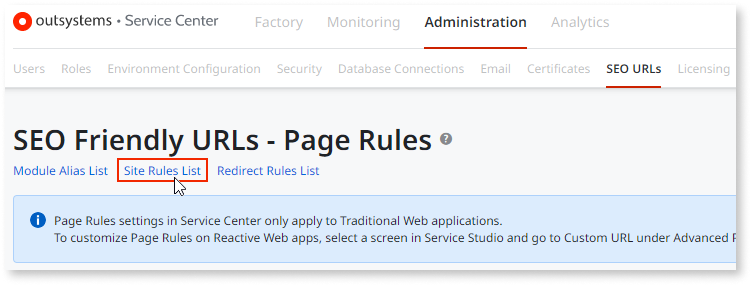
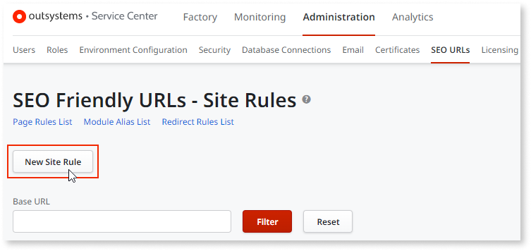
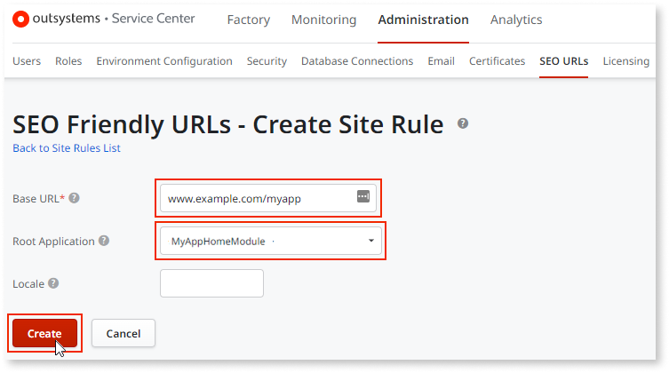

# Site rules for SEO-friendly URLs

A site rule is a configuration at the app level. Site rules enable you to customize the domain URL and app name using keywords that your audience might use to search in a browser. The domain is essential to an effective URL structure and impacts how users find and consume your app.

Use site rules to simplify and organize URLs to better highlight site structure. For example, `www.myCompany.com/Site/` or `www.myGallery.com/GallerySite/` where the Site and GallerySite parts are disposable. You can also automatically set the app’s working language depending on the existence of these disposable parts in the URL.

The platform compares all incoming URLs with your rules one by one. It follows the order defined in the **Site Rules** screen. The first rule matching its Base URL value with the beginning of the URL path (excluding the protocol prefix) is the one applied. If there's a language locale defined, it gets set in the app. If there’s a Root Application defined, the platform executes it instead of the default application for the IIS site pointed at by the URL.

With the above settings use the simplified `www.myCompany.com` URL to access myCompany’s website instead of the `www.myCompany.com/Site` URL. The same applies to myGallery’s website, where the platform simplifies the `www.myGallery.com/GallerySite` URL to `www.myGallery.com`.

On the other hand, the site for Taxi Anywhere displays the app default web page with the language locale automatically set according to the URL.

## Creating a site rule

To create a site rule, follow these steps:

1. Go to **Service Center** > **Administration** > **SEO URLs** > **Site Rules List**.  

      

1. Select **New Site Rule**.  

      

1. Enter the **Base URL** and the **Root Application**, and select **Create**.  

      

    As a result, you've enabled a new site rule.  
    You also have the option to select a site rule and edit, delete, or disable the **Base URL**.  

Remember the following when working with site rules:  

* You can only have one site rule per root application for domains with sub-paths.  
* Creating or editing a site rule can temporarily slow down the app because the platform needs to reload its configuration.  
* Each site rule acts as a new hostname. Ensure that network permissions account for modules accessing these new URLs.
