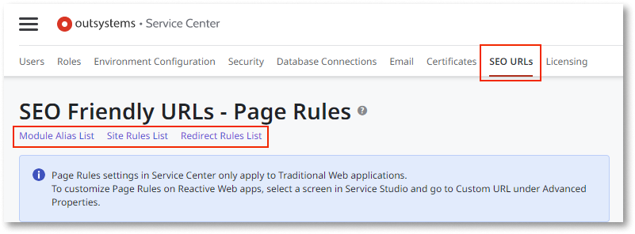
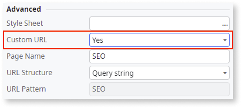

# SEO for OutSystems Reactive Web apps vs Traditional Web apps

The SEO behavior between Reactive and Traditional Web apps is broadly similar, with the exception of module aliases, which are not supported for Reactive web apps but a similar behavior can be achieved through site rules instead.

Site rules are not functionally equivalent to module aliases, which define alternative names for individual modules in URLs. For more details, see [Site Rules](seo-friendly-url-reactive.md/#site-rules).

For site and redirect rules, the setup process is the same between app types. You can set this process up in the SEO URLs section of Service Center. Page rules are only configurable through Service Center for Traditional Web apps.

For Reactive Web apps, you can configure page rules in Service Studio by selecting the screen and setting the **Custom URL** properties **Advanced** properties section.

