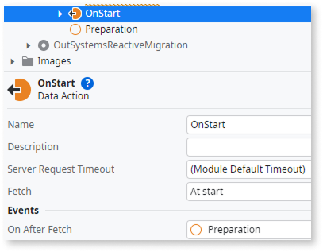

# Conversion mapping in Convert to Reactive

The **Convert to Reactive** feature converts Traditional Web elements into their Reactive Web equivalents. This article describes how each element type changes during conversion, including which properties transfer automatically and which require manual attention.

For an overview of the conversion process, refer to [Convert OutSystems 11 Traditional Web to Reactive](traditional-to-reactive.md).

## Session variables {#session-var}

Session variables become client variables in the converted module. Because client variables are accessible in the browser, review their usage for sensitive data exposure.

Storing sensitive information in client variables exposes it to the browser. Keep sensitive data on the server side and retrieve it through server action calls.

## Site properties

In Reactive Web, site properties can't be accessed directly.

For site properties used directly on screen elements, the conversion process creates a data action to retrieve the value and replaces its usage with the output of that data action.

If your module uses site properties in screen actions or in a Preparation (which are converted to client actions), the conversion process doesn't replace these references. After conversion, check TrueChange for errors indicating site property references that weren't replaced.

To retrieve site properties manually, follow these steps:

1. Create a server action that retrieves site property values.
1. Call this server action in your desired location, keeping in mind the best way to reduce the number of server calls.

## Preparation {#preparation}

The Preparation action converts to a client action with the same name, triggered by a data action.

* **Traditional**: Preparation runs on the server before the page renders. Server actions, aggregates, and SQL queries execute directly.
* **Reactive**: The converted action is triggered by the OnAfterFetch event of a data action. Data actions run as soon as the OnInitialize event ends (refer to [Screen and block lifecycle events](../../building-apps/ui/screens/screen-block-lifecycle-events.md)). Because the action now runs on the client, server calls happen independently with multiple round trips rather than all at once.

Logic that previously ran server-side in Preparation now runs client-side. Review for sensitive operations and data exposure. Move business rules, validation logic, and security checks to server actions.

For calls made inside the preparation you can learn more about:

* Aggregates and SQL queries in the [aggregates and SQL queries section](#sql).
* Server actions in the [server actions section](#server-actions).

## Screen actions

Screen actions convert to a set of client actions that contain the name of the original one. Aggregates and SQL queries are extracted to server actions called inside one of the client action.

For calls made inside screen actions you can learn more about:

* Aggregates and SQL queries in the [aggregates and SQL queries section](#sql).
* Server actions in the [server actions section](#server-actions).

## Logic elements

### Aggregates and SQL queries {#sql}

Aggregates and SQL queries inside Preparation and Screen actions are extracted to server actions:

* A new server action wraps the aggregate or SQL query with the same name of the original element and suffix "ServerAction", which in turn is put in a [server action call wrapper](#server-actions).
* The output of the wrappers called in the replacement client action is assigned to a local variable with the same name as the original aggregate or SQL query. This ensures expressions such as "AggName.List", "AggName.Count" continue working.

This transformation also creates server actions to handle pagination when required.

### Server action calls {#server-actions}

Server action calls inside client-side flows (Preparation and Screen actions) get wrapper actions as follows:

* Each server action call is replaced with a call to a wrapper action (suffixed with "Srv") that is placed in a new folder called "ExposedToClientSide" under Server Actions.
* The wrapper forwards all inputs and outputs to the original action.

This folder serves as a single audit point for some of the new client-server boundary calls. Review the generated functions for issues such as sensitive data or hardcoded credentials exposed in client-facing inputs.

## Built-in functions

These built-in functions are converted with some changes:

* CheckRole() becomes Client-side role check.

This can expose server-side functionality that was previously inaccessible on the client-side.

* IsLoadingScreen() is converted by using a boolean local variable LoadingScreen with default value "True." Calls to the function are replaced with variable reference.

* GetStaticEntity() becomes inline static entity attribute values.

## Widgets

The conversion handles most core widgets automatically. Some widgets convert with property or functionality changes, and a few are not supported.

### Fully converted widgets

These widgets convert without changes:

* Button
* Container
* If
* Label
* Link
* Placeholder
* Text
* Upload
* Web block

### Widgets converted with changes

These widgets are converted, but have some changes applied to them.

* CheckBox
    * If the Visible property isn't always True, the Checkbox is wrapped in an If widget with the same condition.

* ComboBox becomes Dropdown
    * Traditional ComboBox could bind integers/entity identifiers; the Reactive Dropdown always operates with Text.
    *For ComboBox scenarios that use SpecialList, the conversion creates a "LoadDropdownOptions" data action. This data action appends the SpecialList values to its output, which is then assigned to the Dropdown's List property.

* Comment widget converts differently depending on location:
    * In action flows: Converts to Comment in the Reactive action.
    * In UI flows: The comment is lost.

* EditRecord
    * Local variable created for record.
    * "EditRecord.Valid" converts to check all child input Valid properties.

* Expression: For expressions with EscapeContent set to "No", the expression is replaced with a UnescapedExpression block.

* Form
    * Local variable created to hold form data.
    * "FormName.Record" references replaced with local variable.

* Image:
    * Width and height move to CSS CustomStyle.
    * Renames empty-named images to "ImageWidget"

* Input
    * If the Visible property isn't always True, the Input is wrapped in an If widget with the same condition.

* ListRecords and TableRecords {#list-table-records}
    * Table references replaced with aggregate references.
    * "TableName.LineCount" becomes aggregate count.
    * Dynamic sorting creates "OnSort" screen actions with direction toggle logic.

    

    Dynamic sorting with SQL queries can expose your application to SQL injection attacks if sorting parameters aren't properly sanitized. Refer to [How to enable dynamic sorting in a table fed by a SQL query](https://www.outsystems.com/tk/redirect?g=9d1081a8-8d5e-4eca-80f5-ed401e66e733) to learn how to implement it securely.

    

* RadioButton becomes RadioGroup
    * Each individual radio button is converted into a radio group container with a single radio button inside it. If your original design contained multiple radio buttons that functioned as a set, you may want to consolidate them into a single radio group after conversion.

* ShowRecord
    * Local variable created for record.
    * Adds assign node to Preparation.
    * Replaces ShowRecordName.Record references with the local variable.

* TextArea
    * Label property not supported.

### Unsupported widgets

These widgets have no direct Reactive equivalent and are replaced with placeholder expressions:

* EditableTable becomes Expression with value "EditableTableNotImported"
* ListBox becomes Expression with value "ListBoxNotImported"

You must implement alternative patterns for these widgets manually.

## Import and export Excel

Excel import and export nodes are extracted to server actions, maintaining the functionality on the server.

## Notify and custom events

The Traditional "Notify" action converts to Reactive custom events:

* "Deprecated_Notify" action becomes "TriggerEvent"
* "OnNotify" becomes an event handler
* "Deprecated_Notify" inside Preparation are replaced by a comment

## JavaScript

JavaScript code from Screens and Web block properties is copied to a script element in the Reactive module and assigned to the converted screen or block.

## Themes

Depending on the Theme, themes are either:

* Copied as mock versions in the **ToBeFixed** folder.
* Have their Base Theme references adjusted to a Theme of the OutSystemsReactiveMigration module.

## Removed elements

These elements have no Reactive equivalent and are replaced with empty Assign nodes:

* Ajax Refresh becomes Empty Assign node. Reactive modules handle refreshes automatically.
* SendEmail becomes Empty Assign node with comment. Use server actions for email.
* CommitTransaction becomes Empty Assign node in actions that convert to client actions.
