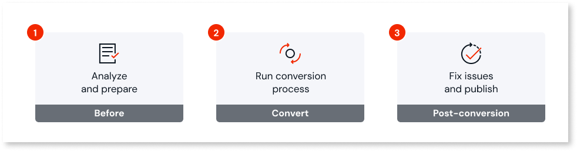
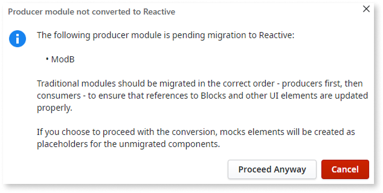
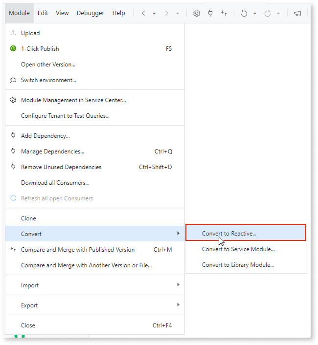
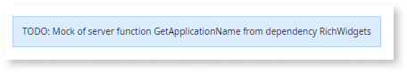
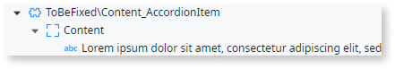
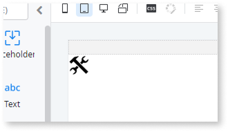

# Convert OutSystems 11 Traditional Web to Reactive

Service Studio includes a conversion accelerator that automates transforming your Traditional modules into Reactive modules. The conversion recreates screens, web blocks, data structures, and logic, adapting them to Reactive patterns with minimal changes. This gives you more time to focus on details and improvements.

## How it works {#how-it-works}

Your original module remains untouched because the conversion works on a clone. When you publish the converted module, it's placed in Independent Modules. If you're converting multiple modules, Service Studio automatically adjusts references to point to the newly converted versions, as long as you convert producers before consumers.

The conversion aims to match the original end-user experience as closely as possible. However, not all elements in the Traditional module are converted automatically. When this happens, unconverted elements are replaced with mock elements (actions with reminders or web blocks marked "to be fixed") so you know exactly what needs manual attention. For details on which elements convert and how, refer to [conversion mapping](conversion-mapping.md).

If your migration strategy involves a significant UX redesign or architectural overhaul, consider building a new Reactive Web App from scratch rather than converting.

### OutSystemsReactiveMigration module {#migration-module}

**OutSystemsReactiveMigration** is a module that supports the conversion process. It contains the Reactive widgets, UI patterns, base themes, and code that replace their Traditional counterparts, ensuring converted applications behave correctly on the Reactive runtime. If the module isn't already in the environment, Service Studio prompts you to publish it when the conversion starts.

### Confirmation dialogs {#confirmation-dialogs}

During conversion, Service Studio may display dialogs asking you to confirm or address specific situations:

* **Convert to Reactive**: Confirms you want to begin the conversion.
* **OutSystemsReactiveMigration not found**: Prompts you to publish this required module if it's missing or outdated. This module is required for the conversion to move ahead. For more information, refer to the [OutSystemsReactiveMigration module section](#migration-module).
* **Producer module not converted**: Warns that Traditional producer modules haven't been converted yet. Refer to [Conversion order](#dependencies).
* **Producer entities not converted**: Warns that entities are read-only or not public. Refer to [Entities](#entities) to understand the impact of proceeding.
* **Non-reusable Roles**: Warns that roles are not public. Refer to [Roles](#roles) to understand the impact of proceeding.

[After the conversion completes](#post-conversion), manual work may still be required. For example, you may have to fix errors and validate security patterns.

### Converting multiple modules {#multiple-modules}

When converting multiple modules, complete the full [post-conversion process](#post-conversion) for each module before starting the next one. Continue the producer-to-consumer order established before conversion.

The conversion process adds information to the module description that references what Traditional module it was converted from.

For example, "Converted from HRPortal (aaaaaaa-bbbb-1111-c2c2-ddddddddddd). Remove this line when all consumers are converted."

This message allows conversions of consumers to automatically correct references to the Reactive version of the producer module. After you've completed the conversion of all modules, you can safely remove this message.

## Prerequisites {#prereq}

Before converting a Traditional Web module to Reactive, make sure you meet the following requirements:

* Service Studio version 11.55.69 or later.
* You have **Change and Deploy Applications** permission.
* You have **Add System Dependencies** permission if the **OutSystemsReactiveMigration** module isn't already in your environment or up to date.

## Conversion process

This section walks you through the full conversion workflow:

1. [Before the conversion](#before): decisions about dependencies, entities, and roles.
1. [Converting your module](#conversion): running the conversion in Service Studio.
1. [Post-conversion](#post-conversion): fixing issues, testing, and publishing.

### Before the conversion {#before}

Before you start the conversion process, there are some details about your app and modules you should consider.

#### Decide which conversion type to use

Depending on the elements and dependencies in your module, consider converting it to a [service module](../reuse-and-refactor/convert-to-service.md) instead. This conversion type fits best if:

* The module has no interface elements.
* You can easily move the interface elements to another module.

#### Determine conversion order for multiple modules {#dependencies}

When converting multiple modules with dependencies between them, work from producers to consumers.

If you convert a consumer module before its Traditional producers, or if it consumes an OutSystems API that can't be converted, Service Studio displays a confirmation dialog. You can proceed, but unconverted interface-level dependencies become mock elements that require manual fixes.

#### Entities {#entities}

You have two options for handling entities:

* **Keep entities in the Traditional module**: Make entities public with write access. The Reactive module consumes them from the original Traditional module, preserving your data.
* **Create new entities in the Reactive module**: If entities are read-only or not public, the conversion creates empty copies without your original data.

#### Roles {#roles}

For the Reactive module to reference existing roles, those roles must be public. Otherwise, the conversion creates new copies of the roles in the Reactive module.

### Converting your module {#conversion}

To start the conversion, select **Module** > **Convert** > **Convert to Reactive**.

During the conversion your [module is cloned and its functionality recreated as a Reactive module](#how-it-works), which leaves your original intact.

The conversion process evaluates various modules in your environment to find dependencies. This means that the more modules an environment has, the longer it might take.

During conversion, Service Studio may display dialogs asking you to confirm or address specific situations that affect how your module is converted. Refer to [Confirmation dialogs](#confirmation-dialogs).

After the automatic process concludes, you still need to perform more actions. Refer to the [Post-conversion](#post-conversion) section.

### Post-conversion {#post-conversion}

After the conversion finishes, Service Studio opens the new Reactive module. Address the items in the following sections before publishing to ensure the module works correctly:

1. [Fix errors and warnings](#errors-warnings).
1. [Replace unconverted patterns](#mock-elements).
1. [Validate security patterns](#security).
1. [Perform regression testing](#testing).
1. [Next steps](#next-steps).

#### Address errors and warnings {#errors-warnings}

Use the TrueChange tab to review errors and warnings:

1. Fix the errors first, as they block publishing.
1. Address the warnings.
1. Review all [reminders in mock elements](#mock-elements) to identify what needs manual conversion.

#### Replace unconverted patterns {#mock-elements}

Elements that couldn't be converted automatically, appear as mock elements:

* **Actions** are mocked with the same name as the original and include a reminder that appears in the TrueChange tab. They keep the same inputs and outputs but omit the internal logic.

    

* **UI elements** become web block placeholders marked "to be fixed," but they retain any content placed inside them.

    

    These elements include the following icon inside them:

    

For a list of elements that are converted, refer to [conversion mapping](conversion-mapping.md).

#### Validate security patterns {#security}

In a Traditional module, much of what drives a screen, including Preparation and screen actions, runs on the server. In a Reactive module, that work is split between client-side logic and server-side logic. The conversion process moves some server-side logic to the client, which can expose previously protected data and operations.

Review the following security concerns in your converted module:

* **Client variables**: [Session variables become client variables](conversion-mapping.md#session-var), which are accessible in the browser. Check that no sensitive data (credentials, tokens, personal information) is stored in these variables. Move sensitive data to server-side retrieval through server action calls.

* **Preparation logic**: The [converted Preparation](conversion-mapping.md#preparation) runs as a client action. Review it for business rules, validation logic, and security checks that should remain server-side. Move these operations to server actions.

* **Exposed server actions**: The conversion creates [wrapper actions](conversion-mapping.md#server-actions) in the "ExposedToClientSide" folder under Server Actions. Use this folder as an audit point for possible exposure issues, such as sensitive data or hardcoded credentials in client-facing inputs.

* **Role checks**: The CheckRole() function converts to a client-side role check, which can expose server-side functionality that was previously inaccessible. Verify that client-side role checks don't gate access to sensitive operations that require server-side authorization.

* **Dynamic sorting**: If your [tables](conversion-mapping.md#list-table-records) use dynamic sorting with SQL queries, validate that sorting parameters are properly sanitized to prevent SQL injection attacks. Refer to [How to enable dynamic sorting in a table fed by a SQL query](https://www.outsystems.com/tk/redirect?g=9d1081a8-8d5e-4eca-80f5-ed401e66e733) to learn how to implement it securely.

For detailed information on how each element is handled by the conversion, refer to [conversion mapping](conversion-mapping.md). For general security guidance, review [best security practices for Reactive Web](../../security/ext-rd-reactive-security-best-practices/ext-rd-reactive-security-best-practices.md).

#### Regression testing {#testing}

After performing the previous post-conversion steps, you should perform regression testing on your application. Re-running existing tests to ensure that it still performs and functions as you expect.

For example, deploy both modules to a testing environment:

1. Publish the original Traditional module (which still contains your backend logic).
1. Publish the new Reactive module.
1. Run user acceptance testing (UAT) on the Reactive application while using the Traditional Web App as the reference for expected behavior.

This parallel testing approach helps you identify any functional gaps or regressions before going to production.

#### Next steps {#next-steps}

At this stage, your Reactive web application should work as expected. In preparation for the roll-out of the converted Reactive UI, consider doing the following in your original Traditional module:

1. Remove the UI elements (screens, web blocks) from the original Traditional module.
1. Convert the Traditional module to a [service module](../reuse-and-refactor/convert-to-service.md) so it becomes a pure backend module.

Finally, plan your next improvements, considering how to take full advantage of Reactive module capabilities.
