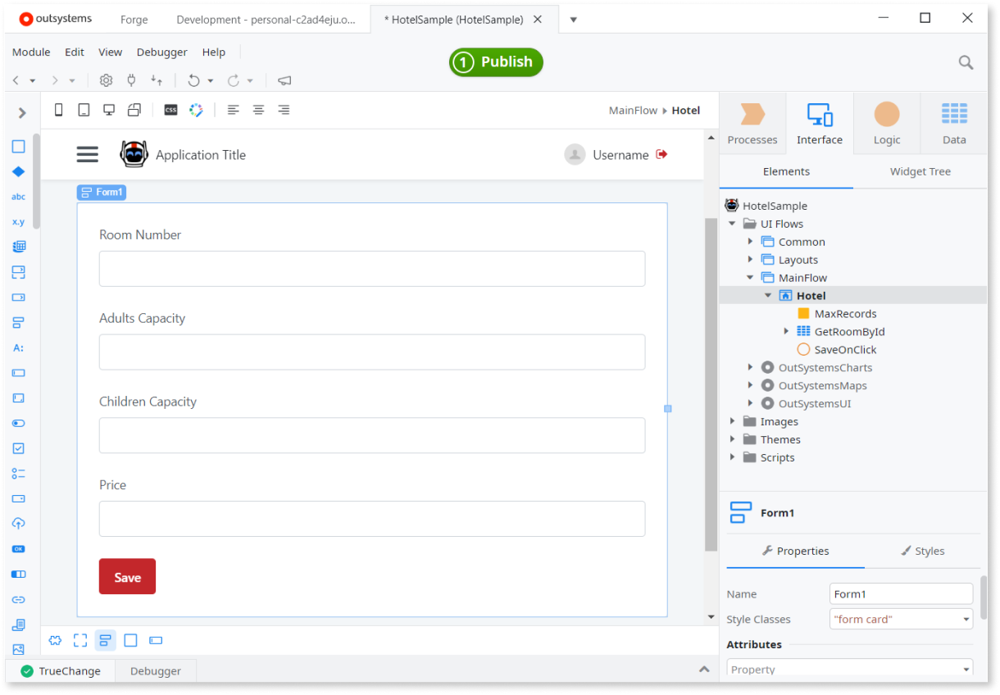
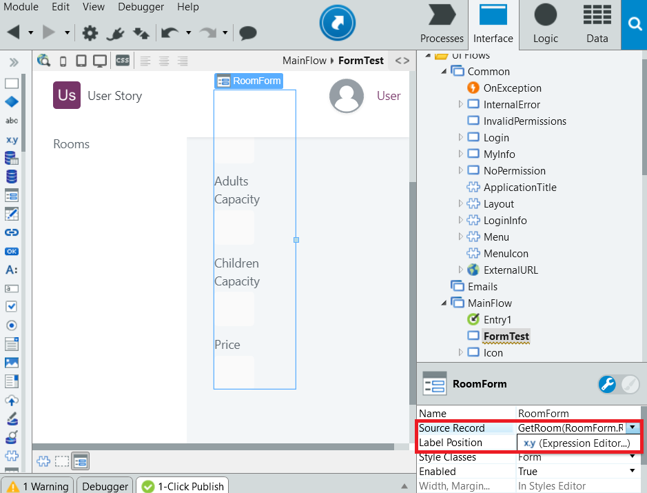

# Use a Form to Group Input Widgets

You can use a Form widget to allow end users to enter data and store it in database records.

## In Reactive Web and Mobile

In a Reactive Web App or Mobile App, the screen must have an aggregate or a variable to hold the form’s data.

To use a form to group input widgets in Reactive Web and Mobile:

1. Add the Form widget to the screen.

1. Drag the aggregate/variable to the form to create the inputs. A Save button is automatically added. 

    

1. Associate a client action to the Save button that calls a server action to store the aggregate/variable record in the database. 

## In Traditional Web

In a Traditional Web app, the screen must have an aggregate or a variable that defines the form record and holds the initial values.

To use a form to group input widgets in Traditional Web:

1. Add the Form widget to the screen and set Source Record to the aggregate/variable.

     

1. Add inputs to the form and bind them to the attributes of the form record.

1. Add a Button to the form.

1. Associate an action to the button that stores the form record in the database. 
