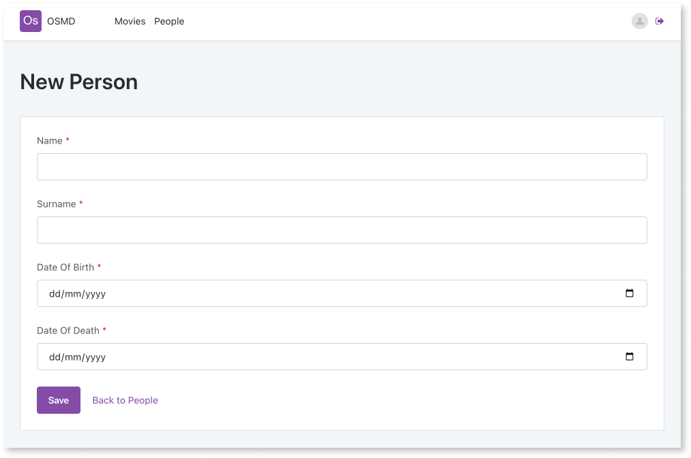

# Forms

Forms allow users to collect and submit data in real-time which enhances user experience. You can use a form to [group input widgets](form-use.md) which allows users to enter data and store it in database records. Forms also allow you to [validate form fields](form-validate.md). When users enter data in a form and submit it, the data is checked and validated.

