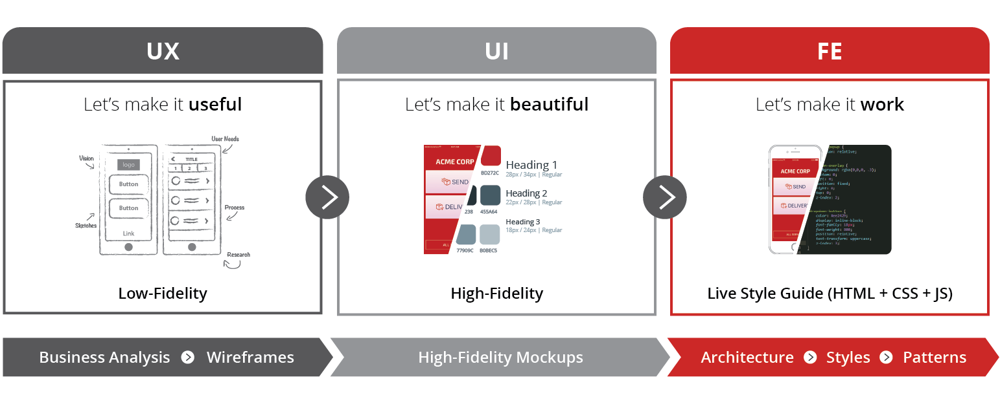

# Front-end journey - from mockups to code

The development of an application starts before the implementation of its core logic and functionalities. An initial journey of business analysis, test prototypes and design of reusable patterns is important to guarantee good alignment and to give the development team a good quick start to speed up the development.
This journey goes through 3 different stages:

1. Starts with a **UX Concept**, where you’ll try to translate the business requirements into some workflows and wireframes.

1. Then goes to a **UI** Designer that will create High-Fidelity mockups to provide a good overview on what the application would look like.

1. Next step is the **Front-End Development**, where we convert the mockups into application screens and user interactions.

## UX/UI: Design for OutSystems

In the following session you will be guided through this journey, from the gathering of the requirements to the creation of the Live Style Guide (the base component of the Front-End Development phase) that will accelerate, guide and facilitate your front-end developers job.

<iframe markdown="1" width="900" height="500"
src="https://www.youtube.com/embed/8ih45xQm8Gs">
</iframe>

## Your custom live style guide

The design of a live style guide is an essential part of the transition from Hi-Fi mockup to code. To help you creating your custom live style guide, you can take as a good quick start, the [OutSystems UI Reactive Style Guide Template](https://www.outsystems.com/forge/component-overview/7526/outsystems-ui-reactive-style-guide-template) and the [OutSystems UI Web Style Guide](https://www.outsystems.com/forge/component-overview/5119/outsystems-ui-style-guide), available in the OutSystems Forge.

