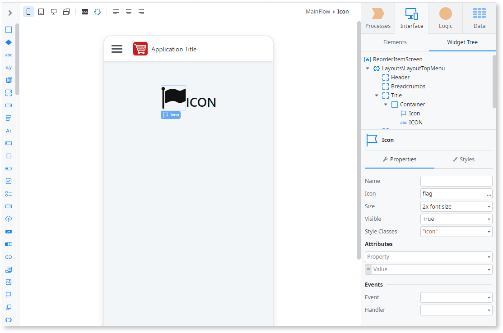
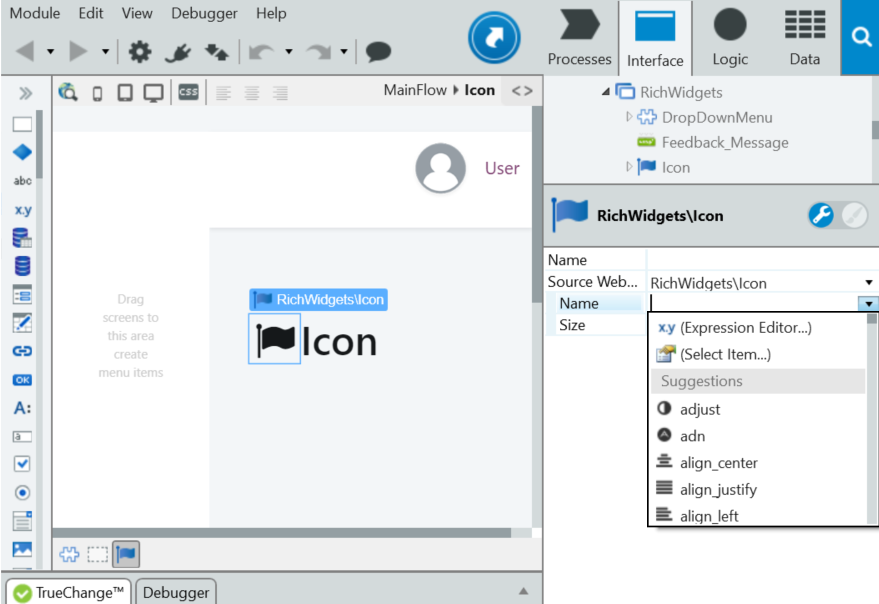

# Use Icons

Icons are small pictograms or symbols to help end users identify functionality or information on screens. OutSystems provides more than 600 Icons on a built-in collection of icons that can be used on the interface of applications.

You can use Icons together with other patterns. For example, you can add an Icon as a button label. 

Also, you can add actions to your icons, for example, you can add an Folder icon and associate an Onclick action, that with the right client action enables your users to navigate in your file system and select a file.

## In Reactive Web and Mobile

To use an icon in Reactive Web and Mobile:

1. Drag the Icon widget from the widgets toolbox and drop it onto the screen.
1. Select the icon you want to use and click OK.
1. Optionally, you can add an event, by selecting and event from the Events drop-down menu, and then create the associated action in the handler.

## In Traditional Web

To use an icon in Traditional Web:

1. In the Interface tab, go to Rich Widgets and drag an Icon block to the screen. 
1. Expand the drop-down list in the Name property and select the icon to be displayed. 

