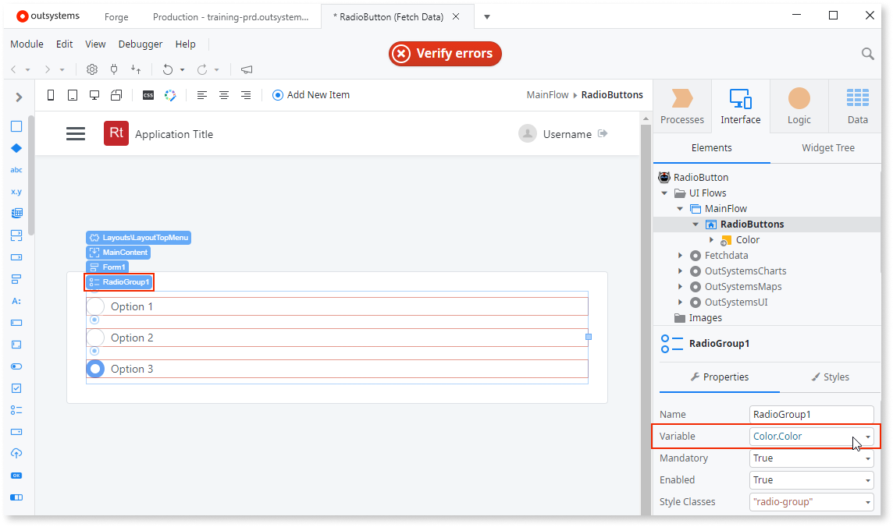
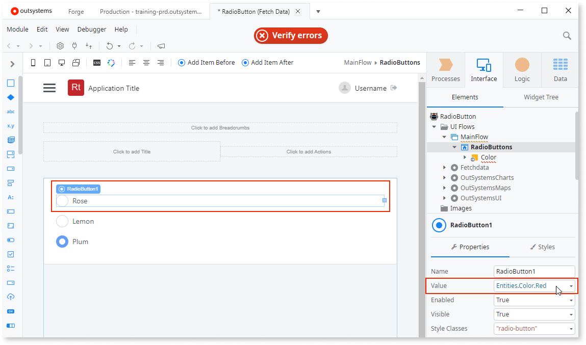
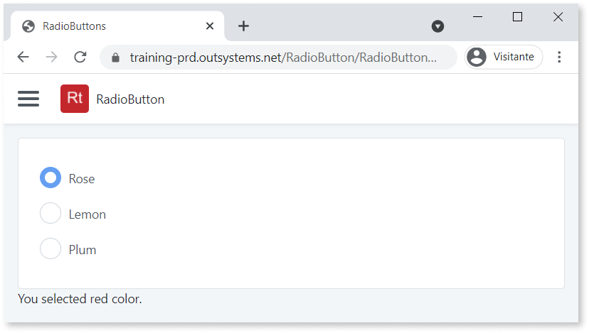
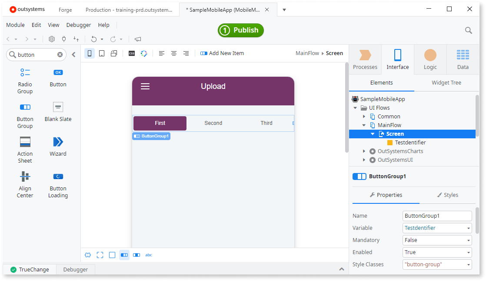
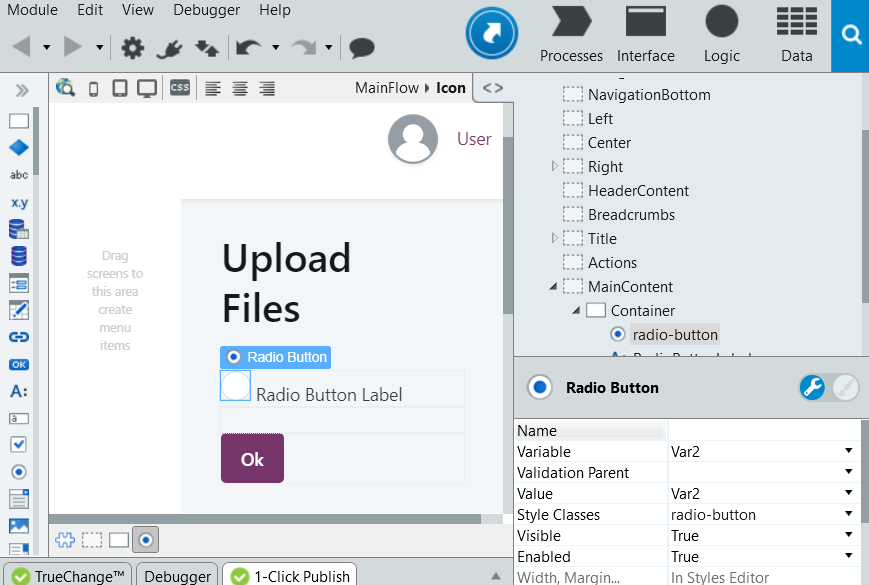

# Pick Only One Option in a Group of Choices

You can let users select a single option from a group of choices using radio buttons.

## In Reactive Web and Mobile

Follow the steps to create a form with three options.

1. Create a new Screen.
1. Right-click the Screen in the widget tree and select **Add Local Variable**. Enter `Color` in the **Name** field. Service Studio sets the Data Type to Color.

1. Search for Form in the toolbox and drag it to Screen.
1. Search for Radio Group and drag it into the Form. Then:

    * Select the Radio Group widget.
    * In the properties of the Radio Group widget, in the **Variable** field, select `Color.Color`.

    

1. Set the properties of Radio Buttons, which are the widgets inside the Radio Group widget.

    * For RadioButton1, select `Entities.Color.Red` in the **Value** property. Edit the label to "Rose".
    * For RadioButton2, select `Entities.Color.Yellow` in the **Value** property. Edit the label to "Lemon".
    * For RadioButton3, select `Entities.Color.Violet` in the **Value** property. Edit the label to "Plum".

    

1. Drag an Expression widget below the Form and enter `"You selected " + Color.Color + " color."`.

1. Publish the app and try it out in your browser.
    
    

### Button Group

You can also use Button Group in Reactive Web and Mobile:

1. Drag and drop the Button Group from the toolbox and bind it to the variable that will store the selected value. 
1. For each Button Group Item, define the value to assign to the variable when the Button Group Item is selected and edit the corresponding text label. 

## In Traditional Web

To use Radio Buttons in Traditional Web:

1. Drag and drop the Radio Buttons from the widgets toolbox. 
1. For each Radio Button, bind it to the variable that will store the selected value and define the value to assign to the variable when the Radio Button is selected. 

