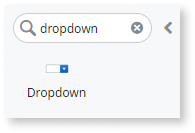
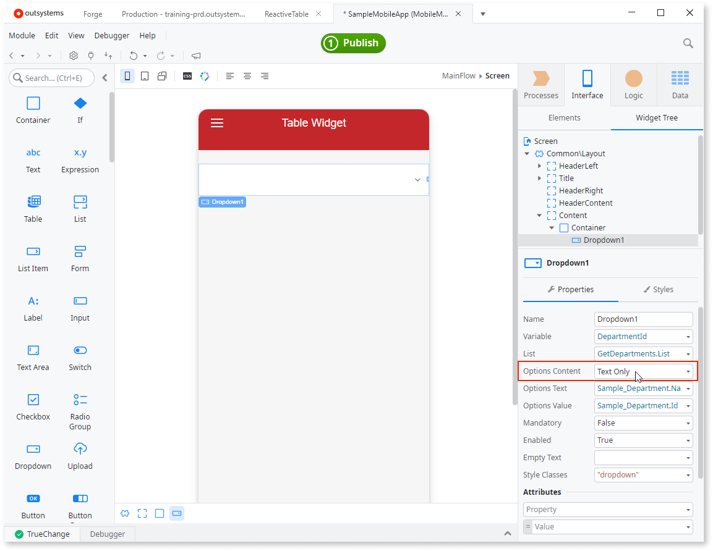
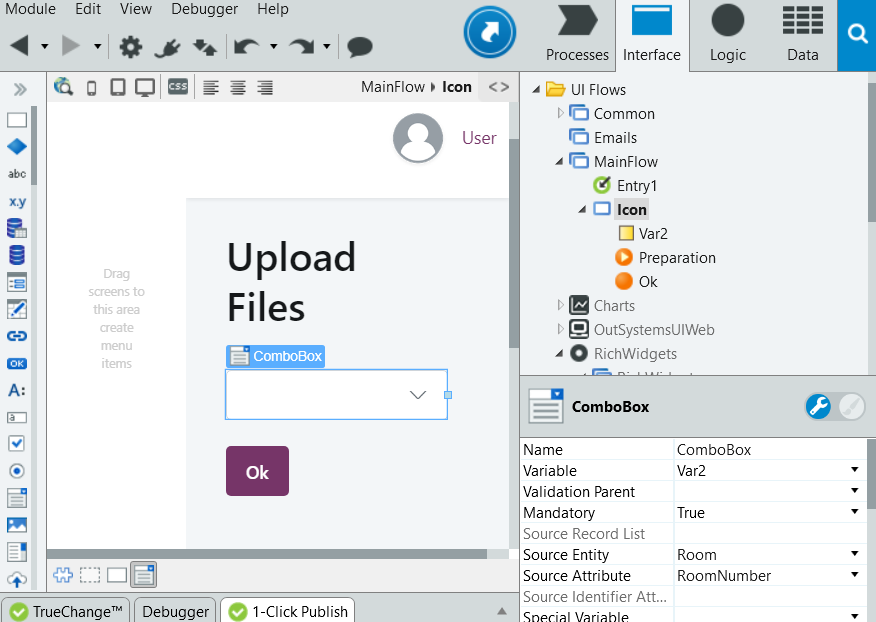

# Choose One Value from a List

Let the end users choose a value from a list of values by implementing a **Dropdown Widget** ( Reactive Web and Mobile) or a **Combo Box Widget** (in Traditional Web).

## In Reactive Web and Mobile

To choose one value from a list in Reactive Web and Mobile:

1. Drag the Dropdown Widget from the Widget Toolbox to a Screen.
    
    

1. Set the **List** property to the list of values. This is the data source for the Widget.
1. Set the **Options Content** property to **Text Only**. 
1. Set **Options Text** to the Attribute that identifies the displayed values. These values show in the drop-down list.
1. Set the **Variable** property to the variable that holds the chosen value.

In most cases your users need text in the list of values. However, for an advanced use you can set the **Options Content** property to **Custom** and then add other Widgets to the Dropdown - this is how you create drop-down with images, for example. 

## In Traditional Web

To choose one value from a list in Traditional Web:

1. Drag and drop the Combo Box from the Widget Toolbox to a Web Screen. 
1. Set the **Source Entity** property to the Entity with the values to display in the Combo Box.
1. Set the **Source Attribute** property to the attribute to display from the Entity. 
1. Set the **Variable** property to the variable that holds the Entity Identifier corresponding to the chosen value. 

Note: Combo Box widgets support several other ways of adding values to the list.
