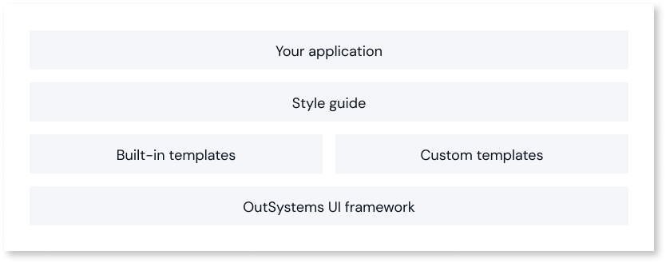
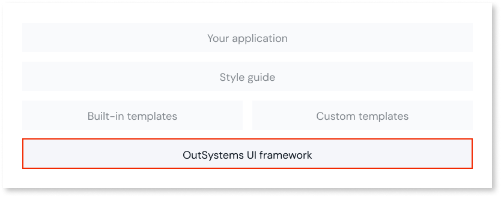
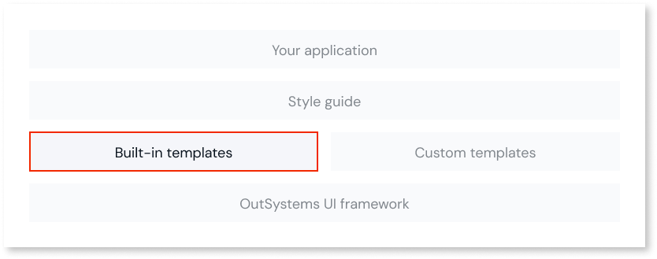
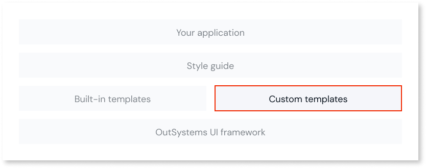
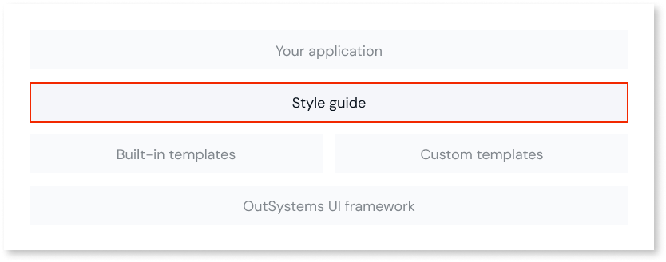
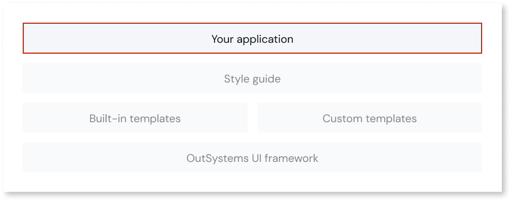

# User Interface

OutSystems UI defines the way to build the structure of the user interfaces of your OutSystems applications.

The following figure represents the OutSystems UI Architecture:

Let’s have a look at each component.

## The OutSystems UI Framework

The OutSystems UI Framework is the base of all user interfaces and provides UI patterns for Web and Mobile applications and beautiful built-in responsive screen templates for you to use, and allows you to create your customized templates. With these, you can create your live Style Guide which defines all the patterns and styles for building your applications.

For example, you can use the OutSystems UI Web Base and Email stylesheets, and [UI Patterns](patterns/intro.md) and layouts.

## The Built-in Screen Templates

Created and maintained by OutSystems, the built-in screen templates are ready to use for developing your applications. You can choose from a different set of [Web Screen Templates](https://www.outsystems.com/OutSystemsUIWebsite/ScreenOverview?RuntimeId=2) and [Mobile Screen Templates](https://www.outsystems.com/OutSystemsUIWebsite/ScreenOverview?RuntimeId=1).

## The Custom Application Templates

The application templates you use to build your applications. Refer to the OutSystems documentation to learn [how to create a Custom Application Template](reuse/create-a-custom-application-template.md).

## The Style Guide

The Style Guide is a document with your brand theme colors and patterns ready to use to create a consistent user experience on your applications. It is an essential piece to ensure adherence to your brand rules, user interface consistency, and foster usability. It is designed to guide you through all delivery assets to optimize the development process and user experience.

## Your Applications

Your applications can have all the necessary modules and contain all the CSS. All are created [based on an application template](https://success.outsystems.com/Documentation/11/Developing_an_Application/Application_Templates).

## How It Works

You can see how OutSystems UI works and browse the Screen Templates and UI Pattern catalog on the [OutSystems UI website](https://outsystemsui.outsystems.com/OutSystemsUIWebsite/HowItWorks), or learn more about the different components in the sections below.
