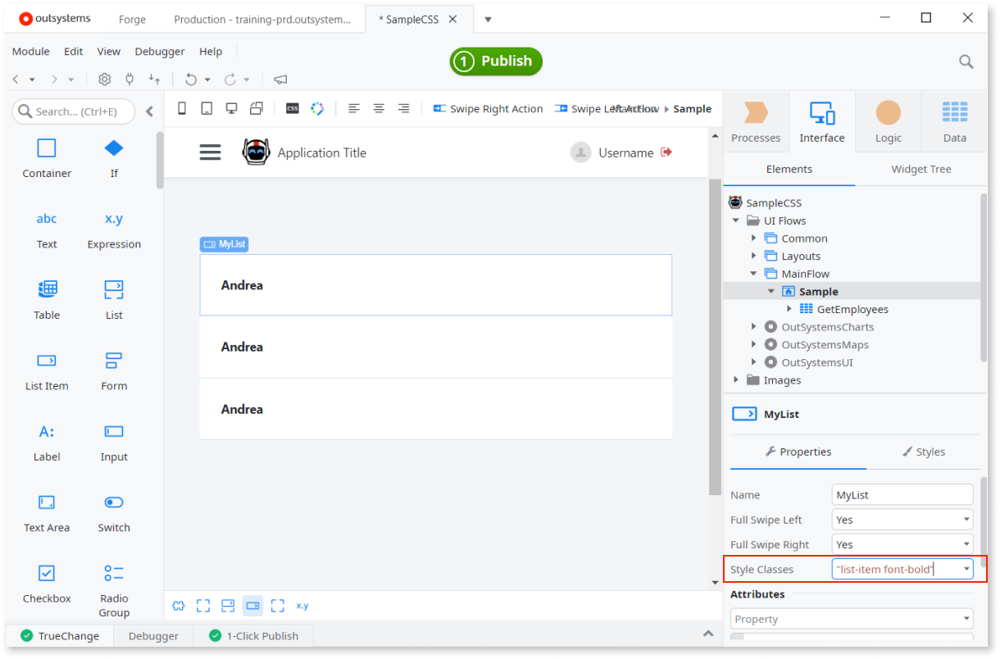
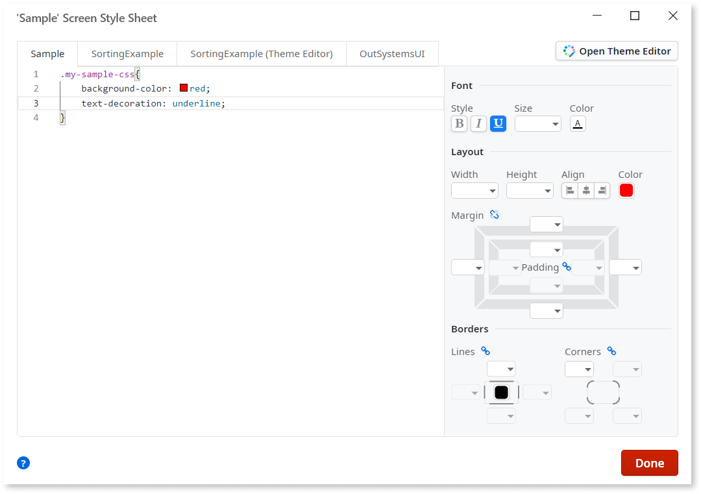
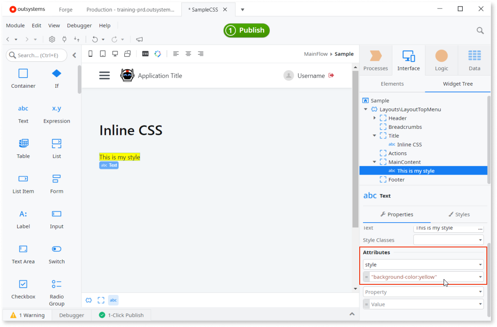
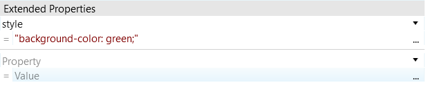
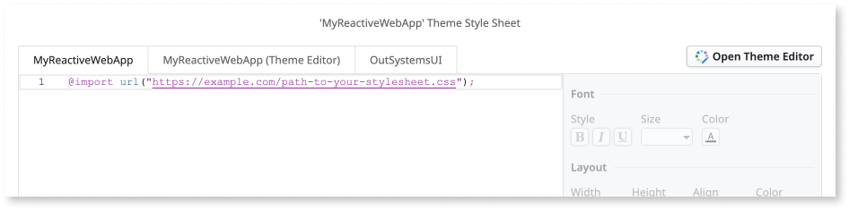

# Cascading Style Sheets - CSS

Cascading Style Sheets (CSS) is a language for describing how HTML content should look in a browser. OutSystems apps use the OutSystems UI framework that comes with the base Theme and CSS. You can add new styles and modify the existing ones by copying them from the base Theme.

These app UI elements have CSS which you can edit:

* [Themes](themes.md)
* Screens and Emails
* Blocks
* Widgets (complex widgets have more than one style)

## Applying CSS with the class attribute

You can specify static CSS classes of an element in the properties pane by using the **Style Classes**:

* In Mobile and Reactive Web apps, insert the class names with quotes and separated by a space (`"bold red"`)
* In Traditional Web apps, insert the class names without quotes and separated by a space (`bold red`)

To specify the CSS classes dynamically use an **Expression**:

* In the **Style Classes** field (Mobile and Reactive Web apps)
* In the `class` attribute of the **Extended Properties** (Traditional Web app)

## Editing CSS

You can edit the CSS code in the Style Sheet Editor. Open the editor by double-clicking the **Style Classes** property on the **Properties** tab.

You can also open the Style Sheet Editor by clicking the **CSS** button in the Main Editor toolbar. Select the tab with the app name and define or edit the style to make it available to all elements. Alternatively, select the tab with the name of the currently selected screen or block to narrow the scope of the style to that screen or block.

## CSS specificity

Specificity is the algorithm used by browsers to determine which style declaration is ultimately applied to an element. The styles have different priorities and the order Service Studio imports the style sheets affects how the browsers apply them. The last style to be applied has the highest priority.

1. System style sheet for Container widgets in the Grid.
1. Block style sheet.
1. Theme style sheet, which also includes a base theme (if specified).
1. Screen or Email style sheet.
1. Theme extra style sheet, with the Grid settings defined in the Theme properties.
1. Styles that Service Studio generates when you use Styles Editor.
1. Inline style you define in **Attributes** or **Extended Properties**.

The following video provides an overview of how CSS functions in a browser, with a focus on overriding styles.

<iframe src="https://player.vimeo.com/video/874775842" width="960" height="540" frameborder="0" allow="autoplay; fullscreen" allowfullscreen="">Video displaying how how CSS functions in a browser, with a focus on overriding styles.</iframe>

## Inline CSS

Using inline CSS is not a good practice. For more information, refer to the [CSS Best Practices](#css-best-practices) section.

Define your inline CSS in the **Attributes** section of the **Properties** tab. Add the `style` attribute and then enter the CSS rules with quotes (for example, `"background-color: yellow;"`).

In Traditional Web you can create inline CSS by adding `style` in the **Extended Properties**.

## OutSystems grid

OutSystems uses a high-level grid system. If you specify the number of columns in the Theme grid settings, the width of elements can be expressed in columns. In **Margin Left** you can use the `(Auto)` property to have the values calculated automatically.

## Importing CSS

Use the `@import` CSS at-rule in the Style Sheet Editor to bring in style rules from other valid stylesheets. Place the `@import` rule at the very top of the stylesheet, and ensure the URL is publicly accessible to end-users' browsers.

## Preprocessors

OutSystems development tools don't support the use of CSS preprocessors (such as Sass or LESS) in apps.

## CSS Best Practices

1. **Avoid Inline Styles**: Inline styles can quickly become hard to manage and maintain, especially in large and complex projects. When styling is scattered throughout the HTML elements, it becomes challenging to track and modify styles, leading to code duplication and potential errors.
1. **Avoid using ID selector**: The Id of each element is managed by the platform depending on its scope and could be changed anytime. To avoid unexpected behaviors, use CSS classes instead.
1. **Centralize CSS in theme**: Adding styles in blocks and screen stylesheets can lead to maintainability and scalability issues. It leads to style duplication and also may have some impact on performance because it increases the file requests to the server.
1. **Use CSS variables**: CSS variables allow you to define reusable values that can be used across your entire stylesheet. This makes it easy to maintain consistent styles throughout your application.
