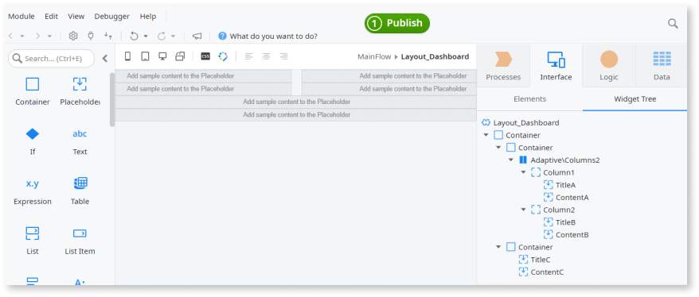
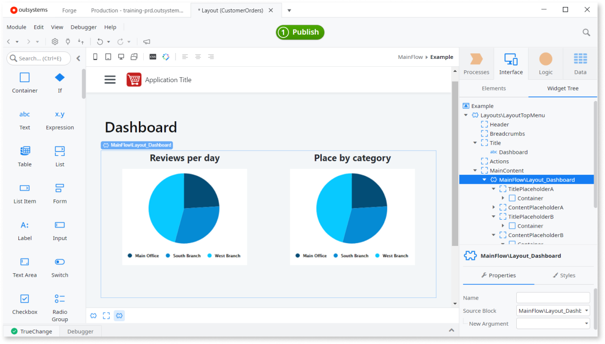

# Design the Layout of Screens Using Placeholders

In OutSystems, you can use layouts to define the position and look and feel of the elements on the screen. A layout can be reused in many screens so they can be consistent. You can design layouts with static content, to be shared by all screens using the layout, and with dynamic content, for the developer to fill on each screen.

To create and use a layout:

1. Create a **Block**.
1. Add the static content, like text or images.
1. Add **Placeholders** to reserve space for dynamic content.
1. To use the layout on the screen:
    1. Put the block implementing the layout on the screen.
    1. Fill in the content specific for the screen.

## Example

In an application to review and rate places, we want to add a dashboard to it. It has a distinct design from the other screens and we want to create a specific layout for it:

* The top is divided in two areas with titles and pie charts.
* The bottom is a single area with a title and the latest five reviews.

To create the layout for the dashboard, do as follows:

1. Create a Block called Layout_Dashboard1.
1. Use placeholders to build the structure of the block as shown in the image below. Use containers to help group and position the placeholders, as shown in the Widget Tree.

To use the layout, do as follows:

1. Go to the Dashboard screen and add Layout_Dashboard1 to the screen.
1. Add the Reviews per Day and Places by Category charts at the top.
1. Fetch and list the Latest 5 Reviews at the bottom. Learn how to [fetch data from the database](../../data/operations/fetch-display.md).
1. Publish and test.

