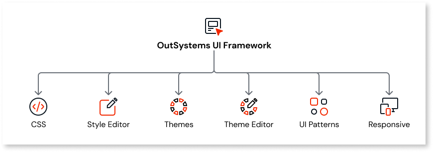

# Look and Feel

The OutSystems UI Framework is the base of all user interfaces. To enhance the look and feel of your app and provide a good user experience, the OutSystems UI Framework comes with [cascading style sheets (CSS)](css.md) that define how your HTML will look in the browser.  You can also [design the layout of your screens using placeholders](design-screens-layout.md) which help to define the position of the elements on the screen. The framework provides a [style editor](styles-editor.md) that allows you to change, for example, font color, margins or border thickness, as well as [themes](themes.md) and a [theme editor](theme-editor.md) that allow you to customize the overall style of your app. 

From badges, progress bars, and counters to carousel patterns, the OutSystems UI framework provides a library of over a 100 [UI patterns](../patterns/intro.md) that allow you to provide seamless user interactions and quickly build the most complex and rich user interfaces. Additionally, the framework provides the capability to design and create apps with the content displaying from [right to left](rtl.md).

On the OutSystems UI, [everything is responsive](responsive.md) - themes, layouts, and patterns. By default, OutSystems provides a set of adaptive and responsive behaviors that allow you to easily create apps to work with all browsers, devices, and resolutions.
