# Responsive UI 

<div class="info" markdown="1">

Applies to Mobile Apps and Reactive Web Apps only

</div>

On the OutSystems UI, everything is responsive — themes, layouts, and patterns. By default, OutSystems provides a set of adaptive and responsive behaviors that allow developers to easily create applications to work with all browsers, devices, and resolutions. 

## Device Detection

To have a multiexperience on reactive and native mobile applications, OutSystems has a built-in device detection mechanism that identifies the device type (desktop, tablet, or phone) and screen size and correctly displays layouts and UI patterns accordingly.

When the device type is detected, a set of classes is automatically added to the body HTML element.

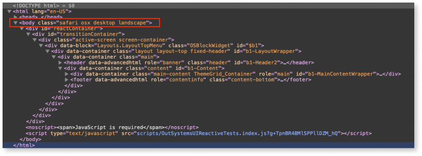

The CSS classes add the following:

* **Device:** .desktop, .tablet, .phone, .iphonex
* **Orientation:** .landscape, .portrait
* **Browser:** .chrome, .firefox, .edge, .safari, etc.
* **Operation system:** .windows, .osx, .ios, .android, etc.
* **Touch devices detection:** .is--touch

**Example:**

```
.desktop .btn { ... }
```

```
.tablet .btn { ... }
```

```
.phone .btn { ... }
```

## OutSystems UI changes based on devices

To improve the experience and the responsive behavior of your application, the OutSystems UI Theme has different rules for each device:

* The OutSystems UI Layouts changes the structure based on each device type and layout configuration
* The text sizes change based on each device type
* **:hover** and **:focus** states are removed from all links
* The size of input widgets, for example, input, textarea, checkbox, and buttons increases so that they have a bigger clickable area
* The login form is full width on phones
* Using the reactive layouts, the buttons and containers are full width on phones
    * In order to keep good readability for all applications on small devices, OutSystems apply this rule so that all containers are full width and the content is broken up on the screen. If you want to override this behavior, add the CSS class **.no-responsive** to each element.

## OutSystems UI Layouts

Depending on screen size and resolution, OutSystems UI captures device type (desktop, tablet, or phone) and adapts the content to the screen. To learn more about app templates, see [OutSystems UI Framework App Templates](https://outsystemsui.outsystems.com/OutsystemsUiWebsite/AppTemplates).

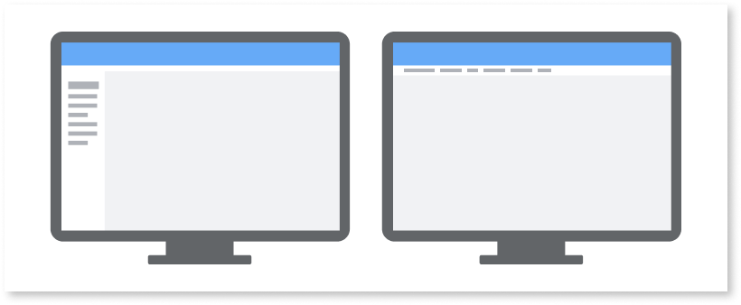

On Reactive applications, the OutSystems UI provides the following fully responsive layouts:   

* LayoutSideMenu
* LayoutTopMenu
* LayoutBase

The **LayoutTopMenu** and **LayoutSideMenu** layouts have different settings to control their behaviors. To create applications with a **hero image** and content, the **LayoutBase** is available to which you can add different sections with your custom content.

When an application is open on a mobile device, all the layouts have the same behavior, opening the menu as an overlay on the page content with all the menu items displayed.

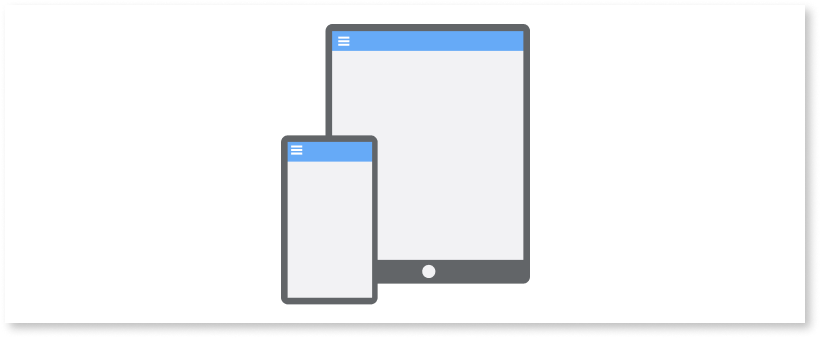

For Native Mobile applications, OutSystems UI provides a layout to use on a tablet, phone, and progressive web applications (PWA). The layout has the following  behaviors to open the menu:

* **Expandable:** Open the menu, pushing the screen content
* **Overlay:** Opens the menu applying an overlay on top of the screen content
* **Visible:** The menu is always visible

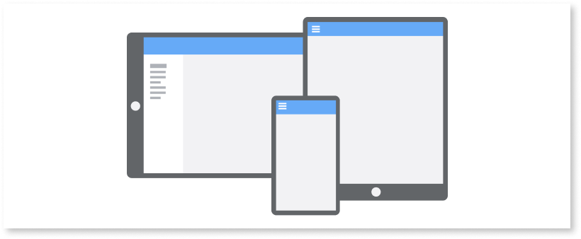

**Note:** On the phone, the layout always has the overlay behavior applied because of the available space on smaller screens, even when the **Expandable** or **Visible** behavior is enabled.

## Adaptive Patterns

Every app is different. The way your app adapts to a specific device is, therefore, unique. To address this, OutSystems UI offers a set of [adaptive patterns](https://outsystemsui.outsystems.com/OutsystemsUiWebsite/PatternOverview). These patterns give you full control of how your application will look on different screen sizes, allowing for different settings for phones and tablets.

**Available adaptive patterns:** _Columns2, Columns3, Columns4, Columns5, Columns6, ColumnsMediumLeft, ColumnsMediumRight, ColumnsSmallLeft, ColumnsSmallRight, DisplayOnDevice, Gallery, and MasterDetail._

## Adaptive Actions

All patterns on OutSystems UI can adapt the UI to the device, using only CSS. However, if your use case has specific scenarios to show or hide content, navigate to another page, or even run client actions, you need a little extra to run different logic according to the device.

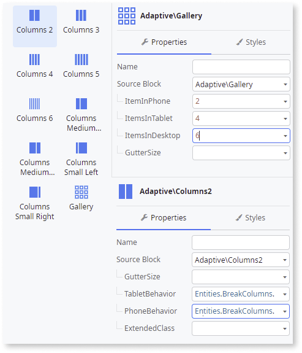

OutSystems UI provides a set of client-side actions that allow developers to decide which screen areas to hide, how images are placed, or even which screen to navigate to, according to the detected device. You can find the client-side actions on the **Logic** tab, inside the **DeviceDetection** folder.

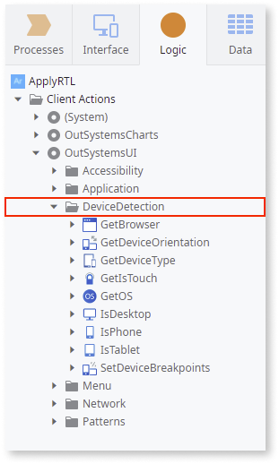

**Available client-side actions:** _GetBrowser, GetDeviceOrientation, GetDeviceType, GetIsTouch, GetOS, IsDesktop, IsTablet, IsPhone, IsWebApp, IsRunningAsPWA, IsLayoutNative, and SetDeviceBreakpoints._

## Columns Responsive Behavior

OutSytems UI provides a set of structure patterns that allow dividing content in columns that follow the underlying grid. The structure patterns are blocks with specific responsive parameters, which allow the developer to configure how they react on each mobile device. 

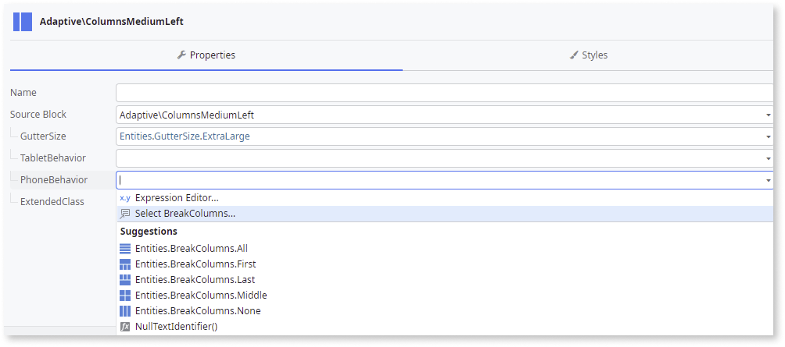

Possible values for tablet and phone include the following:

* **Break All:** All columns break. This means each column occupies the total width of the available space:

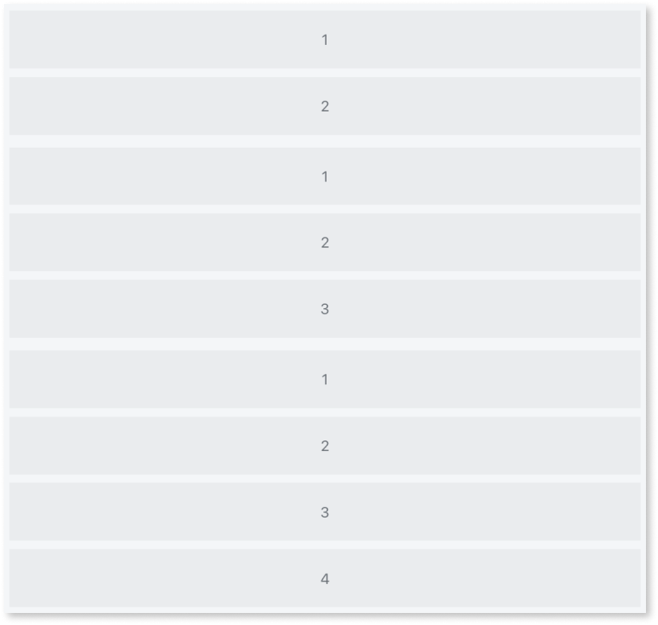

* **Break First:** Only the first column breaks. This means the first column occupies the total width and the other ones remain side by side:

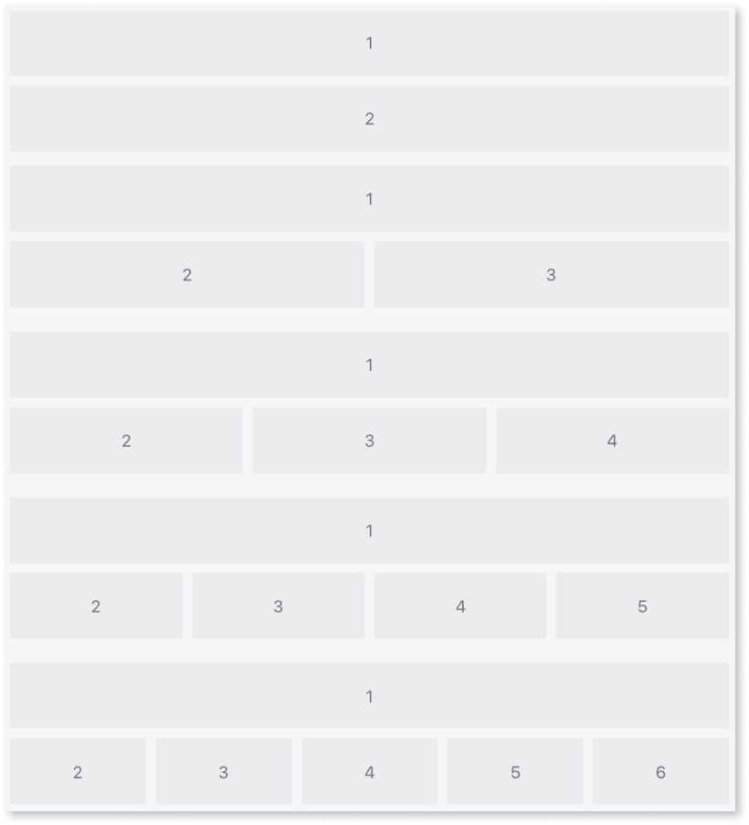

* **Break Middle:** All columns break. When there is an even number of columns, they are divided in half, with the same number of columns on top and bottom. When there is an uneven number of columns, there is always one more column on top than on the bottom:

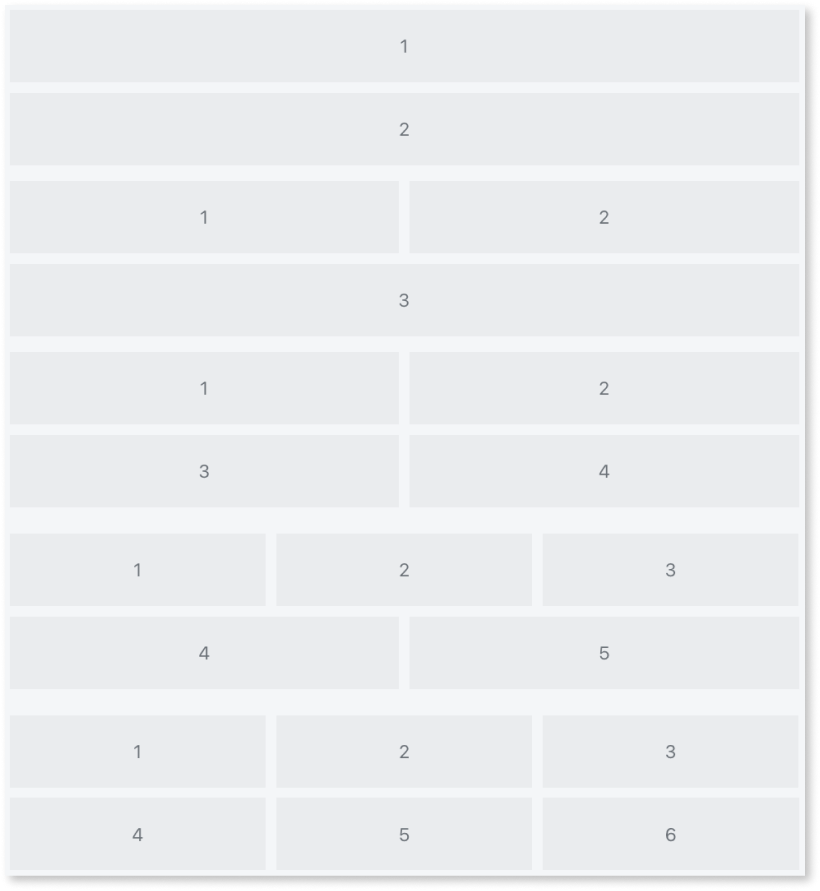

* **Break Last:** Only the last column breaks. This means the last column occupies the total width and the other ones remain side by side:

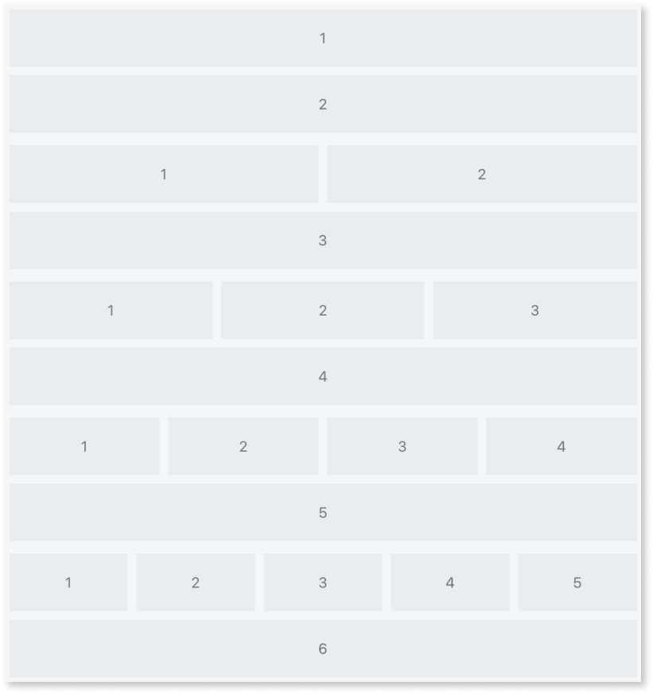

* **Break None:** No columns break. This means all columns remain side by side:

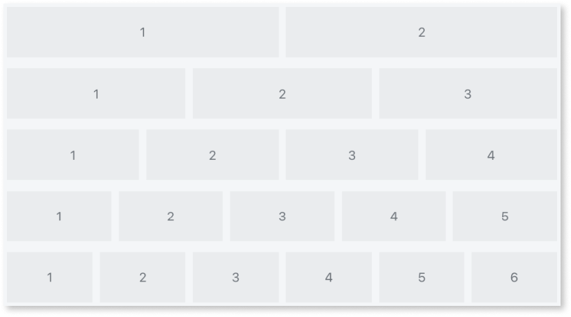

With OutSystems UI, you can use the platform grid to organize content, however, it has no responsive behavior. To organize content with responsive behavior, use the columns pattern instead, which allows you to configure the responsiveness yourself.

If you want to use the platform grid and add your content using containers with specific columns width, you can use the **DisplayOnDevice** pattern to set your content and the custom structure that will be shown on each device.

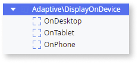

## Application content changes based on devices

OutSystems UI provides a set of actions — IsDesktop, IsTablet, IsPhone, IsWebApp, IsRunningAsPWA — to manage your content or to use in client actions. These actions also work as functions. You can find these client actions on the **Logic** tab, inside the **DeviceDetection** folder.

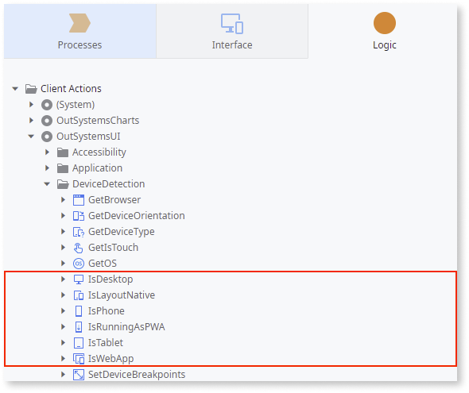

You can use actions in the following ways:

* To set values on input parameters:

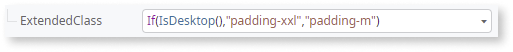

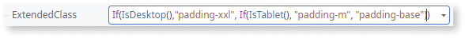

* To control the Container’s visibility:

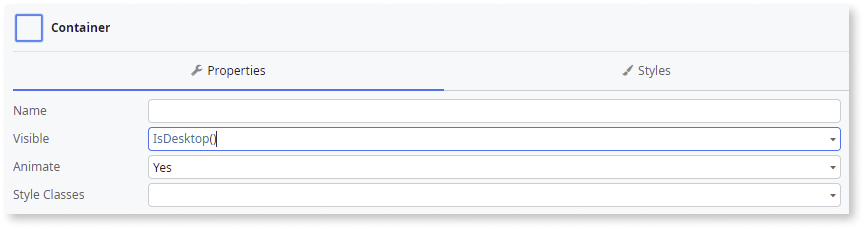

* To set conditions (If widget):

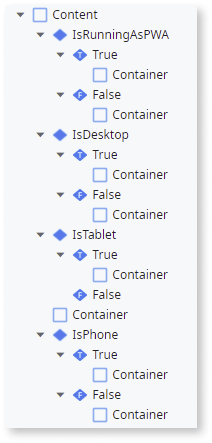

* To apply logic inside client actions on If conditions:

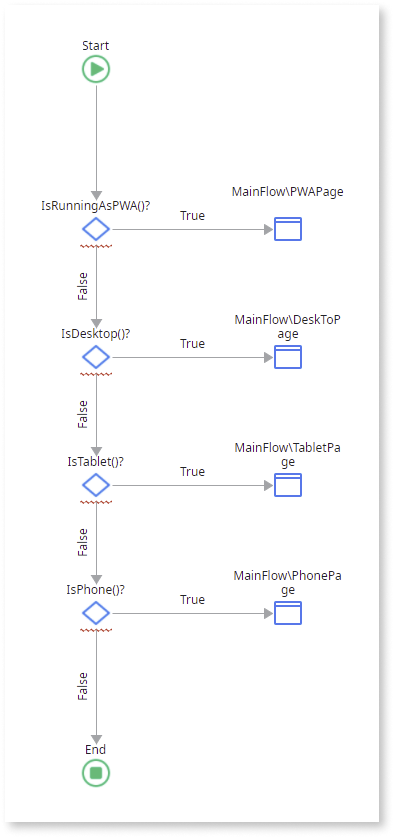

## Set responsive breakpoints

On the OutSystems UI, there are default device breakpoints that identify **tablet** and **phone** devices. Screen resolutions between **1024px to 700px of width** are recognized as **tablets** and screen resolutions **lower than 700px of width** are recognized as **phones**.

To override these breakpoints, there is the  **SetDeviceBreakpoints client action** (on the **Logic** tab, inside the **DeviceDetection** folder) that you can on your **application ready**, setting the new breakpoints to be applied:

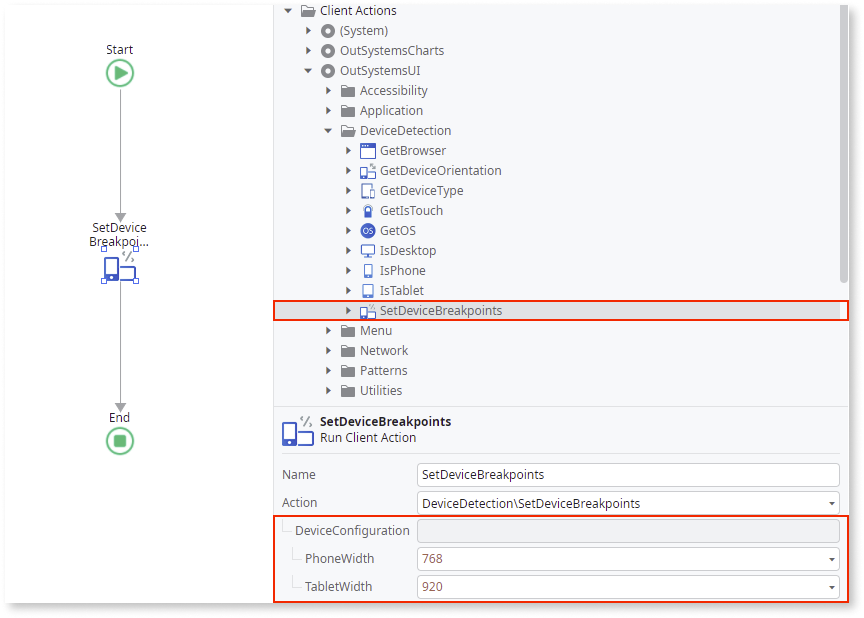

**Note:** When opening on an iPad Pro (or similar tablet devices) in landscape, it is treated as a desktop.

## Notch support

Recently, the inclusion of notch displays has become dominant on mobile devices, especially on iOS devices. This means applications must react to each display, repositioning its content based on the available notch area.

The safe areas are automatically applied to OutSystems UI layouts and patterns, with full support to notch, adapting the content on your application. If you want to create your own custom content, you can use the CSS variables provided by the OutSystems UI theme:

### iOS devices
```
/* iOS Safe Areas (Notch Support) */
var(--os-safe-area-top);
var(--os-safe-area-right);
var(--os-safe-area-bottom);
var(--os-safe-area-left);
```

### Android devices

```
/* Android top Safe Area (Notch Support) */
var(--status-bar-height);
```

**Example:**

```
.your-class {
    margin-top: calc(var(--space-base) + var
(--os-safe-area-top));
}
```
