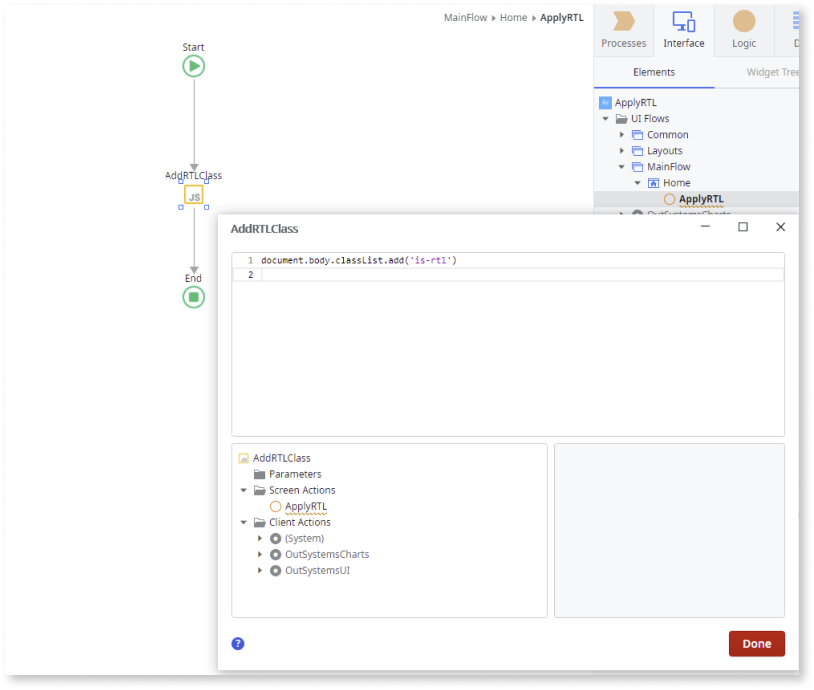
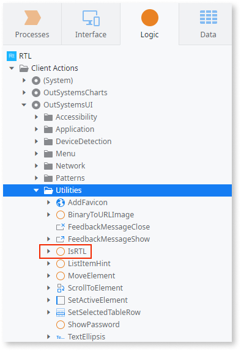
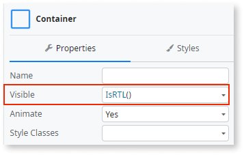

# Right-to-Left

Most applications are designed and created with all content displaying from left to right (LTR). However, to accommodate languages from the Middle East, for example, Arabic, the written content and layout must be swapped so that it displays from right to left (RTL). All patterns on the OutSystems UI framework support RTL by default. 

## Using the Multilingual feature

To translate your application to, for example, Arabic, you just need to set the locale **"ar"** and the RTL is applied by default. 

When you use the Multilingual feature, the RTL is automatically applied based on the language applied to the HTML and the platform adds the CSS class **"is-rtl"** to the body, changing the direction of this content.

```
.is-rtl {
   direction: rtl;
}
```


Here's the final result:


The multilingual feature is available from [Platform Server version 11.11.1 onwards](https://success.outsystems.com/Support/Release_Notes/11/Platform_Server). To enable the Multilingual feature in your application, follow the [Multilingual Reactive Web and Mobile Apps](../multilingual-tp/intro.md) guidelines. For more information about RTL languages, see [Checklist: Right-To-Left Languages (RTL)](https://lingohub.com/academy/best-practices/rtl-language-list).

**Note:** OutSystems doesn’t support Aramaic, Khowar, Hausa, or Kashmiri.

## Applying RTL manually

<div class="warning" markdown="1">

For environments that have a Platform server lower than **version 11.11.1**, you can apply the RTL manually by adding a class directly to the body element. 

</div>

To add the class injection, you must create an action with a JS node with the following JS snippet:

```
document.body.classList.add('is-rtl');
```



Here's the final result:


## Changing the application’s content based on RTL

OutSystems UI provides an **IsRTL** action that checks if RTL is applied or not (boolean value). This action also works like a function. You can find it in the **Utilities** folder. 

|

You can use it in the following ways:

* To set values on input parameters


* To control the Container’s visibility



* To set conditions (If widget)


* To apply logic inside client actions on If conditions


## Utilities

The following are some useful utilities that you can use during your app development to handle your RTL based content.

### Selectors and code snippets

Selector to get the **is-rtl** class:
```
document.querySelector('.is-rtl')
```

Selector to check if the **is-rtl** class is applied:
```
document.body.classList.contains('is-rtl')
```

Selector to get the HTML lang:
```
document.documentElement.lang
```

Use one of the following JS Snippets to toggle **is-rtl** class on the body:

```
var element = document.body;
if(element.classList.contains('is-rtl')) {
  element.classList.remove('is-rtl');
} else {
  element.classList.add('is-rtl');
}
```

**or**

```
var element = document.body;
element.classList.contains('is-rtl') ? element.classList.remove('is-rtl') : element.classList.add('is-rtl');
```

### Adding RTL class to the layout element

You can add the RTL class to the **layout** element instead of the **body** element. The RTL behavior on OutSystems UI patterns is the same.

You can add the class using a JS Node:

```
var element = document.querySelector('.layout');
element.classList.add('is-rtl')
```

You can also apply it directly to the layout block using the **ExtendedClass** parameter:


