# Translate your app

Translate the interface of your app to other languages to let more users use your app.

## Quick start

Here is a quick start to help you translate your app. To let the users use your app in their language, you need to:

1. [Add a new language and translate the text in the app](#adding-a-new-language-and-translating-the-text) by using the Service Studio translation editor.

1. [Create a language switcher](#creating-a-language-switcher) to let users change the language in the app.

1. If your app uses Static Entities, check [Working with Static Entities](#working-with-static-entities) for more information.

## Adding a new language and translating the text

To add a new language and translate your app, do the following in Service Studio:

1. Go to the **Data** tab and right-click on the **Multilingual Locales**. Then, select **Add Locale**. The **Select Locale** window opens.

    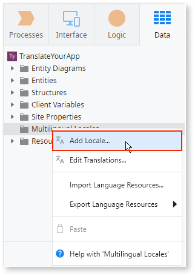

1. Select a locale and then click **OK** to open the **translations editor**.

    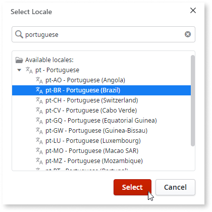

    

    Make note of the language code, since you will need it later. For example, for **Portuguese (Brazil)** the code is **pt-BR**.

    

1. In the translations editor, select the **Translate** option in the behavior list to see all text that needs translation.

    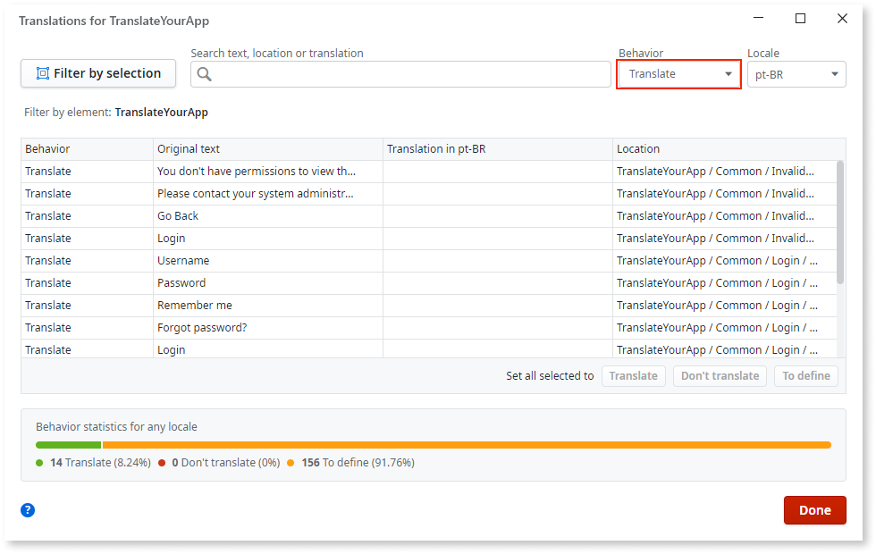

    See [Translating with the translation editor](translation-editor.md) for more information on how to use the editor.

1. Translate the text in the **Translation in (language code)** column. Click **Done** when you are finished.

    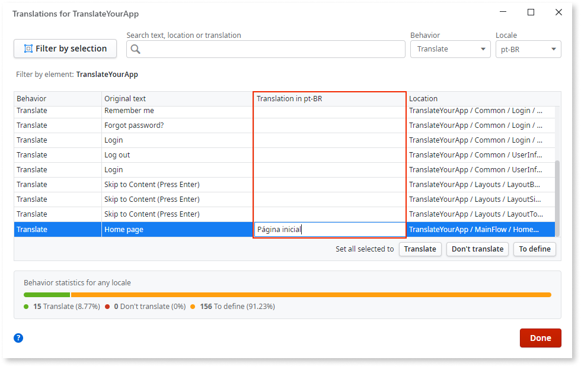
    
After you finish translating the text in your app, you then need to create a language switcher to show the available translations.

Translate the text in **all modules of your app**. This is important as an app can have multiple modules with user interface elements.

## Creating a language switcher

A language switcher lets your users change the language of the app. To create a language switcher, do the following:

1. Drag a Link widget to a screen and enter the language name in the **Text** part of the **Link**. 

    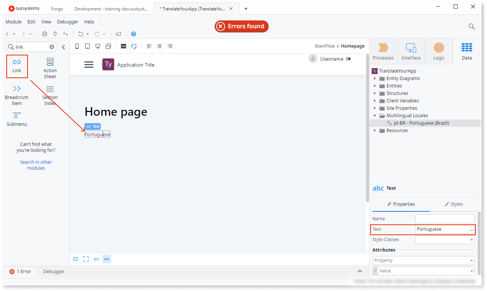

    The example shows how to use the **Link** widget to change the app language. You can create the same action with other widgets, including **Button** and **Dropdown**.

1. Select the Link widget to view its properties. In the **On Click** list, select **New Client Action**. New Client Action opens for editing.

    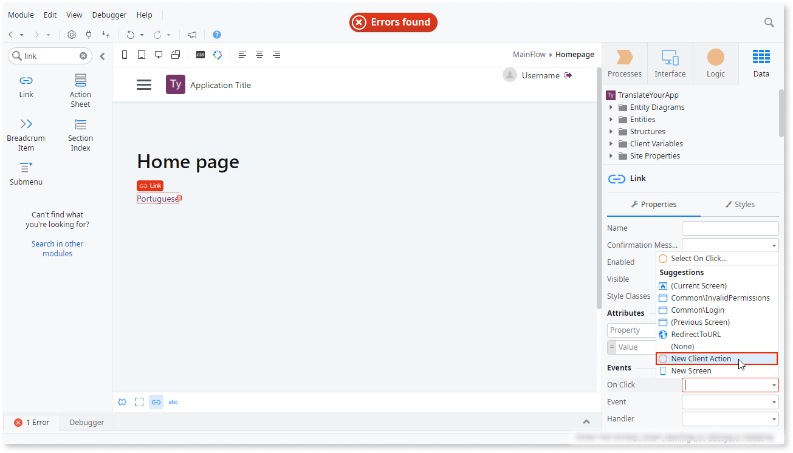

1. With the logic editor open, go to the **Logic** tab and expand the **(System)** section in **Client Actions**. Locate the **SetCurrentLocale** client action and drag it to the logic flow.

    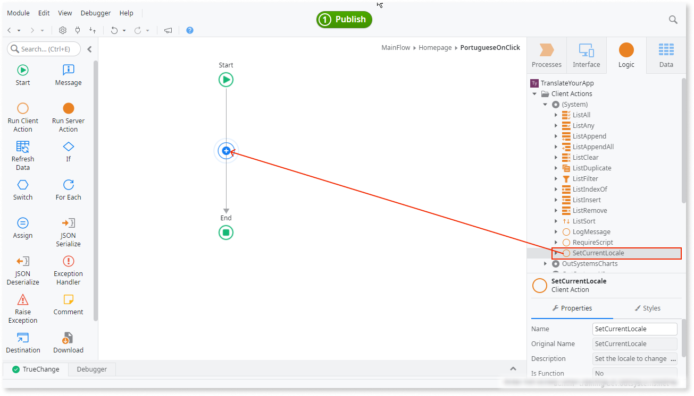

    

    If you can't find the **SetCurrentLocale Client Action**, you need to reference it first. Press **Ctrl+Q** to open the **Manage Dependencies** window and select **(System)**. In the right pane under **Client Actions**, select **SetCurrentLocale** and click **Apply** to confirm. You can now use **SetCurrentLocale Client Action** in your app logic. 
    
    **Note**: **SetCurrentLocale** and **GetCurrentLocale** can only be persisted across client and server actions when that locale is defined in the module.

    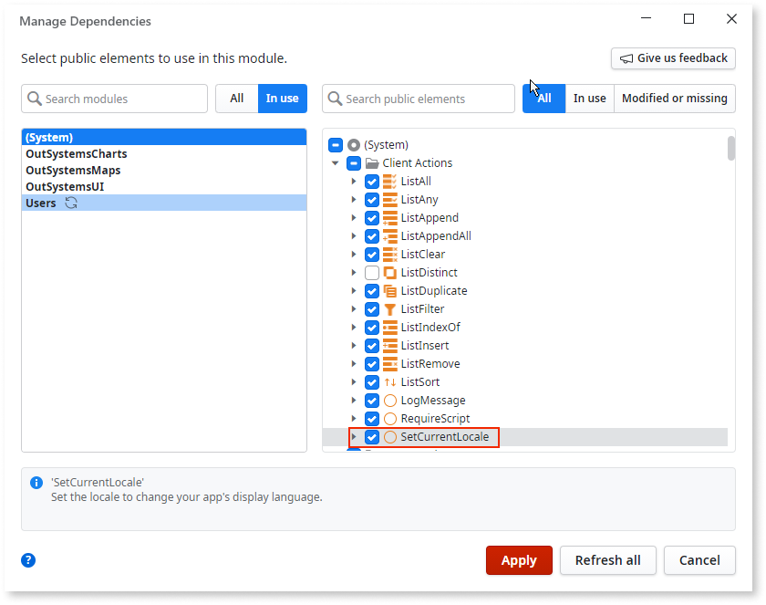

    

    

    Keep in mind that SetCurrentLocale **Server** Action doesn't work offline. Use **SetCurrentLocale Client Action** whenever possible. 

    

1. In the **SetCurrentLocale Client Action**, enter the code of the language (for example, `"pt-BR"`) in the **Locale** property.

    **Note**: For a locale to persist across client and server requests, you must define it at module level. 

    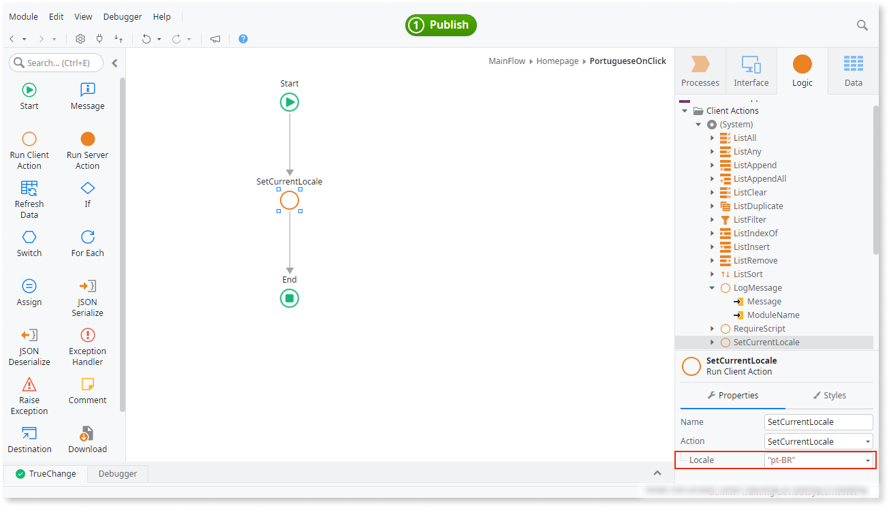

    

    If you have translations from **Static Entities**, add **Refresh Data** after **SetCurrentLocale**. For more information see [Working with Static Entities](#working-with-static-entities).

    

1. Publish the app and select your link to change the language of the app.

## Editing existing translations

Use the [translation editor](translation-editor.md) to edit existing translations. You can also [export and import text for translation](translation-management.md). 

## Getting the identifier of the current language

You can get information about the current language with the [GetCurrentLocale built-in function](<../../../ref/lang/auto/builtinfunction-environment.md#GetCurrentLocale>).

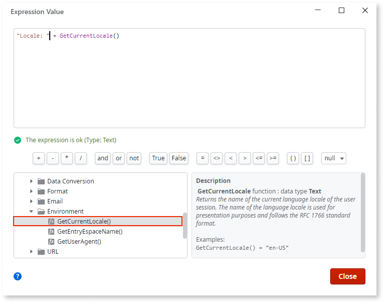

## Working with Static Entities

Text Identifiers in Static Entities cannot be translated.

Follow these steps to translate the text in Static Entities and show the translation in the app.

1. In the [translation editor](translation-editor.md), search for the text you want to translate and set **Behavior** to **Translate**.

    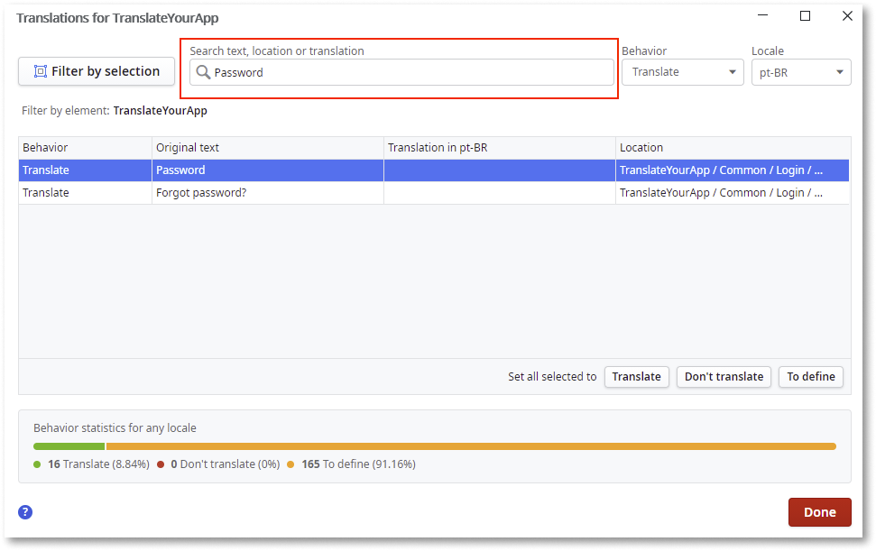

1. While still in the translation editor, enter the translation in the **Translation in (language code)** cell and click **Done**.

    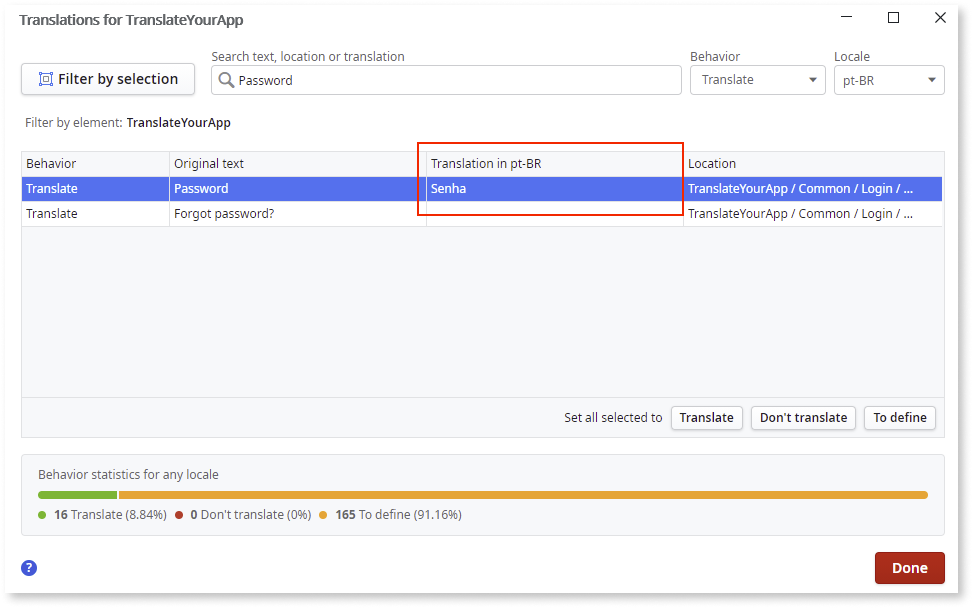
    
    

    Translations for static entity records are defined in the same module as the static entity 
    records. The static entity records and the translations can then be referenced in a UI module.
    
    

1. In the logic, to switch the locale, add **Refresh Data** just after the **SetCurrentLocale** action and select the Static Entity.

    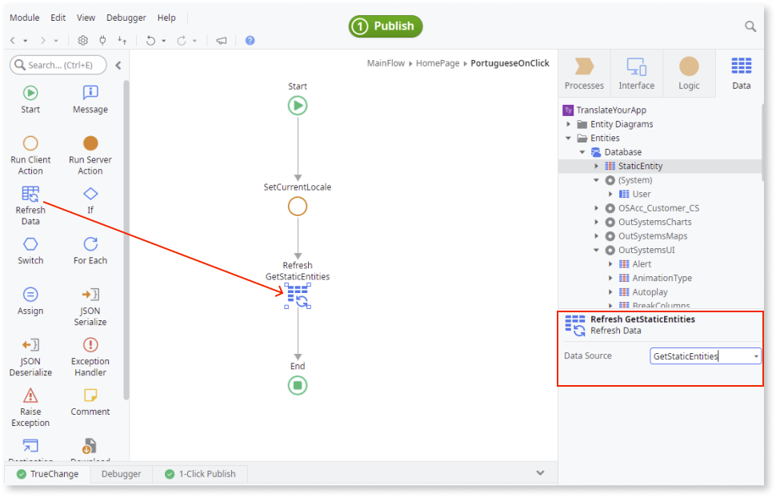

## Switching back to the default language

To let users switch back to the default UI language, [create a language switcher](#creating-a-language-switcher) that sets the locale code to **en-US**.
