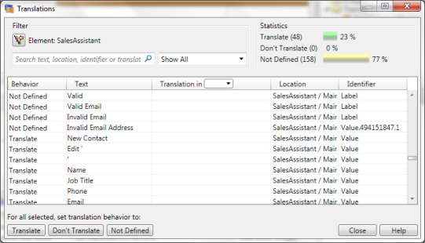

# Translations Behavior Editor

Applies only to Traditional Web Apps.

The **Translations Behavior Editor** allows you to set which [translatable resources](multilingual-web.md) of your application are actually meant to be translated and also to translate individual resources.

To open this editor do the following:

1. In Service Studio, go to the **Data tab**.

1. Right-click the **Multilingual Locales** folder (or any of the languages inside it) and click **Edit Translations...**

The **Translations Behavior Editor** provides you a list of all your module's translatable resources for you to select and set to be translated or not.

Translatable resources which aren't to be translated will be excluded from the translation process, therefore reducing the amount of translations involved.

## Types of Translation Behaviors

You are allowed to set your resources to have one of the following translation behaviors:  

* **Translate**: the resource is to be translated, that is, is sent for translation.
* **Don't translate**: the resource is not to be translated, that is, is not sent for translation.
* **Not Defined**: the resource is not sent for translation.

## Defaults for Translatable Resources

Some types of resources require a translation and their translation behavior is automatically set to `Translate`, namely:  

* **Screen Titles**: the Title property of Web Screens.
* **Button Labels**: the Label property of the Button elements present in Web Screens.
* **Text in the Screen**: free text present in the Web Screens.

Other types of resources that eventually may require translation are set with the `Not Defined` translation behavior.

The **Translations Behavior editor** window is divided into the four areas presented below.

## Translatable Resource List

This is the central area of the window where your Module's translatable resources are displayed. This is where you set the translation behavior for each translatable resource, and also where you can edit the translation for individual resources.

Each translatable resource has the following information:  

* **Behavior**: current translation behavior of the translatable resource.
* **Text**: the translatable resource text available for translation.
* **Translation In &lt;language locale&gt;**: the current translation. This field is editable and you may change the translated text here.
* **Location**: the location of the translatable resource in the module.
* **Identifier**: an identifier that is useful to differentiate a set translatable resources that have the same reference.

The translatable resource selection is made by simply clicking on the translatable resource line in the list. To set the translation behavior for more than one translatable resource select multiple translatable resources using the following keys:  

* **Control key**: if you select a translatable resource while holding down the Control key, the translatable resource is added to the set of selected translatable resources. If the translatable resource was already selected, clicking on it while holding down the Control key unselects the translatable resource but keeps the other selected translatable resources selected.

* **Shift key**: if you select a translatable resource while holding down the Shift key, all the translatable resources from the last selected translatable resource to the currently selected one are selected.

* **Ctrl+A**: Use Ctrl+A to select all the translatable resources displayed in the list.

Each translatable resource is bounded to an element in the module. To view that element in the module select the translatable resource and click on **...**, or double-click the translatable resource. This action also selects the element.

## Filter

The **Translations Behavior editor** loads the complete set of the module's resources. To narrow the displayed resources in the list and work the translation behavior of specific resources, the editor provides some filtering mechanisms in the Filter area:  

* **Element Filter Button**: Use this button to filter the translatable resources bounded to the selected element in the module. This is useful when you know which module element you want to set the translatable resources translation behavior.

* **Element**: Displays the hierarchy path of the module's element to which the translatable resource is bound. Every time you select a new translatable resource, this path is updated. Click on the elements in the hierarchy path to change the displayed translatable resources. The filter currently in use is shown in the hierarchy path with a darker color. Example: You selected a translatable resource bound to a Button widget. The module's hierarchy of the Button widget is shown in the Filter area. If you want to see all existing translatable resources in the web screen where the Button widget is, simply click on the web screen name in the path. The translatable resource list will be refreshed with all Web Screen's translatable resources including the Button translatable resources.

* **Search**: Used when filtering with the Filter button to display translatable resources with Value, Comment or Resource Name matching the search value.

* **Behavior**: Used when filtering with the Filter button to display translatable resources with a specific translation behavior. Filtering for the `Not Defined` value is very useful to find out which resources need to have translation behavior set.

## Statistics

This area displays the current state of the module translatable resources translation behavior.

## Setting the Translation Behavior

To set the translation behavior of a set of resources, select those resources and click on the Translation Behavior button of the behavior you want to set.

To set the behavior of a single translatable resource, click on the Behavior cell of that translatable resource and a combo box is displayed allowing you to choose the translation behavior.
