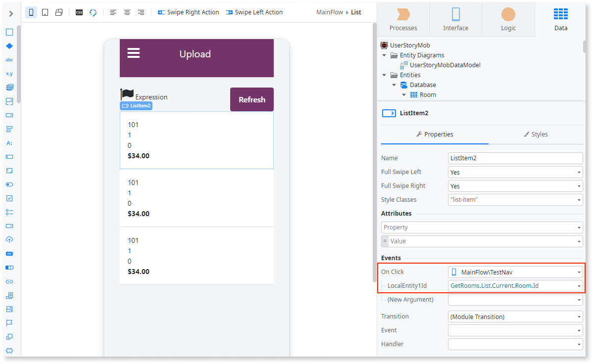
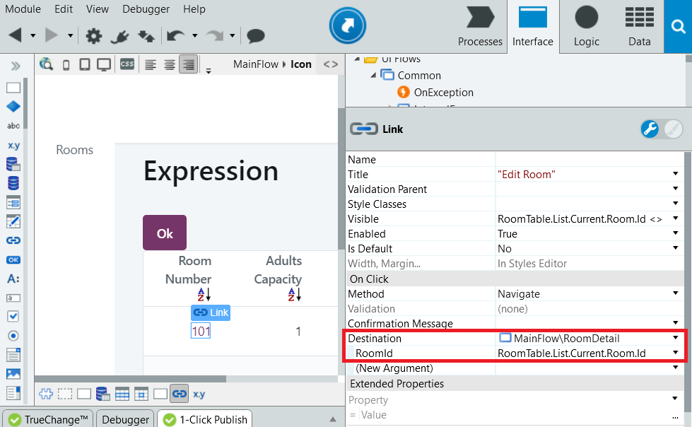

# Navigate to a Detail Screen

You can allow end users to check the details of a given record by navigating to a different screen while providing the item identifier as an input parameter.

## In Reactive Web and Mobile

To navigate to a detail screen in Reactive Web and Mobile:

1. On the screen that displays the list, select the List Item widget.
1. In the properties of the List Item widget, select the target detail screen as handler for the On Click event and define the identifier of the current list item as an input argument to the target screen.

## In Traditional Web

To navigate to a detail screen in Traditional Web:

1. On the screen that displays the list, associate a Link widget with a detail of the item displayed in the list.
1. In the properties of the Link widget, select the target detail screen in the Destination property and define the identifier of the current list item as an input argument to the target screen.

