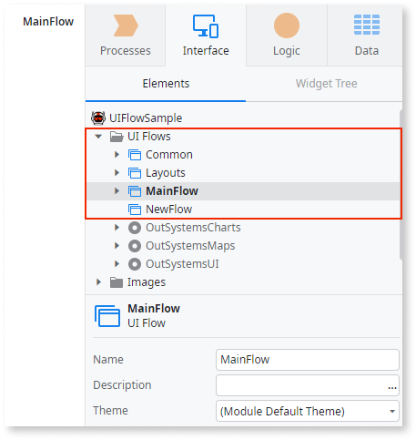
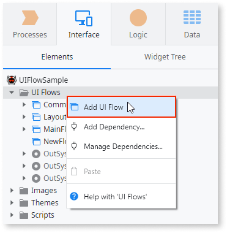
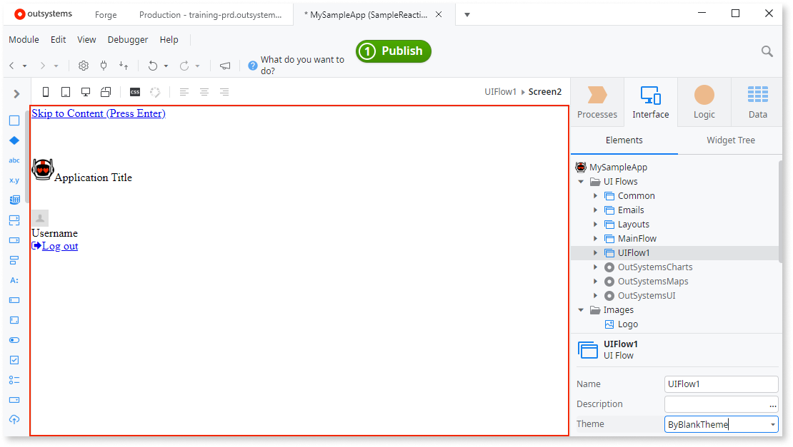
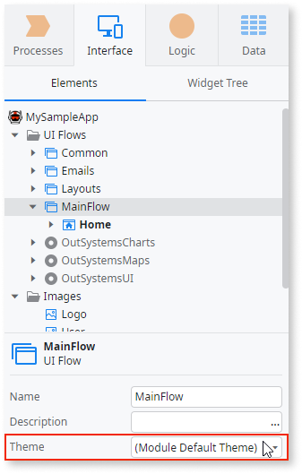
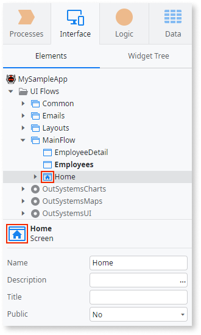
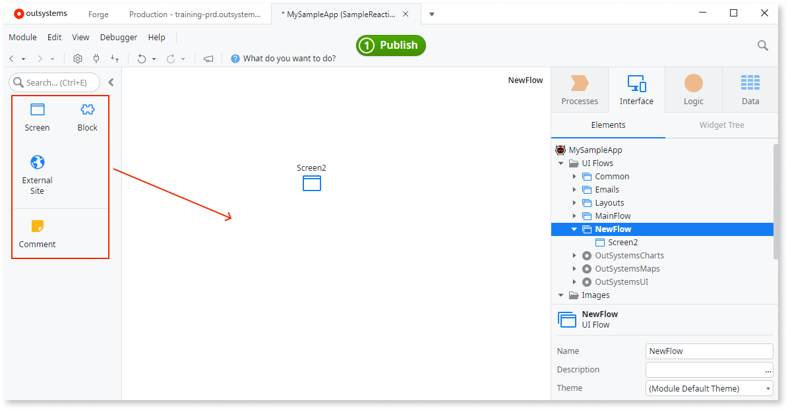
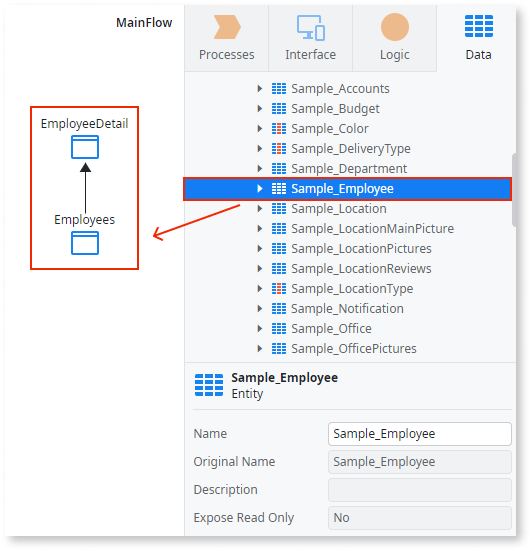

# UI Flows

**UI Flow** is an element that groups Screens and Blocks. All instances of UI Flow in an app are under the **UI Flows** in the **Interface** tab.

When you create a new app, the app already has some default UI Flows in **Interface** > **UI Flows**:

* **Common**. Contains UI and logic the app reuses in Screens and Blocks. For example, menus, info about the signed-in user, the sign in logic.
* **Layouts**. Contains Blocks that define the layout of the Screens.
* **MainFlow**. The default UI Flow where you can start adding Screens in your app. This UI Flow is empty in a new app.

Be careful when editing the default content of **Common** and **Layouts** UI Flows, as you may affect all Screens in your app.

## Adding a new UI Flow

To add a new UI Flow, do the following in Service Studio:

1. Go to the **Interface** tab and right-click on the **UI FLows** folder.

1. From the help menu, select **Add new UI Flow**.

    

## Creating UI Flow without styles

Follow these steps in Service Studio to create a UI Flow without CSS styles:

1. [Create your Theme without styles](../look-feel/themes.md#creating-a-theme-without-styles).

1. [Add a new UI Flow](#adding-a-new-ui-flow) to your module.

1. Set the UI Flow to use your Theme without styles. See [Setting the Theme of UI Flow](#setting-the-theme-of-ui-flow) for instructions.

1. Optionally, add a Screen under the UI Flow and verify if has no styles.

    

## Setting the Theme of UI Flow

All elements you add to a UI Flow use the default Theme of the module. You can change the Theme by editing the **Theme** property of the **UI Flow**. To change the Theme of a UI Flow, do the following in Service Studio:

1. Go to the **Interface** tab.

1. Select the UI Flow for which you want to change the Theme.

    

    All modules with UI from the default app templates use **MainFlow** as the default UI Flow for Screens. This is a convention more than a requirement.

    

1. In the UI Flow properties, select a Theme from the **Theme** list.

    

1. Optionally, create a Screen under the UI Flow to verify the Screen uses the UI Flow's Theme.

## Setting the default Screen

**Default Screen** is the index page in Reactive Web Apps, or the home screen in Mobile Apps. There can be only one Default Screen in the module, and it's marked with the house icon.

To set a Screen as default, do the following in Service Studio:

1. Navigate to the Screen you want to set as default.
1. Right-click on the Screen and in the help menu select **Mark as Default Screen**.

## UI Flow editor

When you double-click on a UI Flow, the UI Flow editor opens. Use the editor to:

* See the relationship between Screens
* Drag elements from the tool box that UI Flow supports

Even though you can draw connectors in **UI Flow**, these connections are only visual — you must define the interaction between Screens.

### Using toolbox

To create a Screen or Block, drag the element from the toolbox to the UI Flow editor. The available elements on the toolbox depend on the type of app you're creating.

### Scaffolding Screens

Drag **Entities** to the UI Flow editor to start the accelerators (scaffolding). For example, if you drag an Entity to a UI Flow editor, you automatically scaffold two Screens with working logic, one for listing the items, one for editing them.

## UI Flows in Traditional Web Apps

UI Flows in Traditional Web Apps have **Entry Point** which defines the URL within the app. The Entry Point with the property **Is Default** set to true is the index page of the app.

UI Flows in Traditional Web Apps also have security settings that apply to all Screens in the UI Flow.
