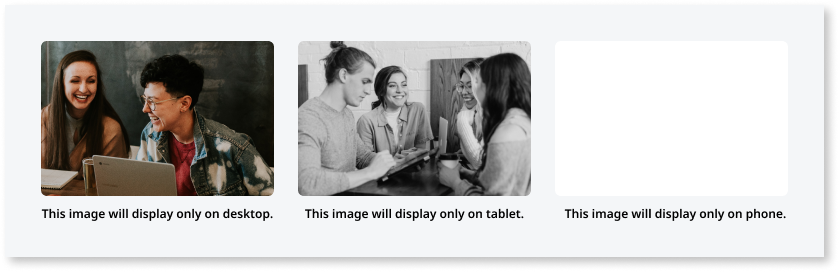
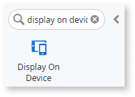
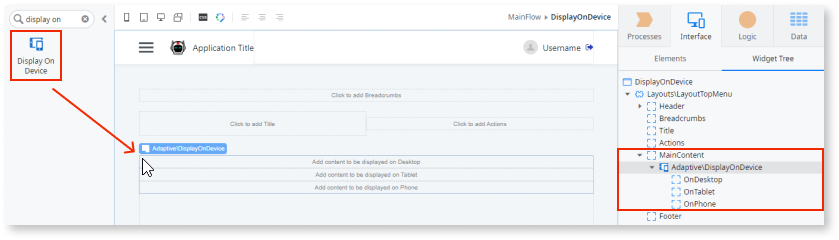
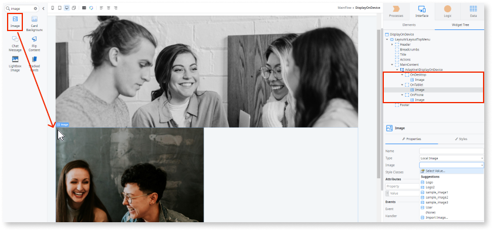

# Display on Device

Applies to Mobile Apps and Reactive Web Apps only

You can use the Display on Device UI pattern to select what elements are displayed on which device types. With this pattern you can improve the way information is displayed on different devices - computers, tablets, and phones - by specifically specifying which elements display on each of them.

**How to use the Display on Device UI Pattern**

1. In Service Studio, in the Toolbox, search for `Display on Device`.

    The Display on Device widget is displayed.

    
  
    If the UI widget doesn't display, it's because the dependency isn't added. This happens because the Remove unused references setting is enabled. To make the widget available in your app:

    1. In the Toolbox, click **Search in other modules**.

    1. In **Search in other Modules**, remove any spaces between words in your search text.
    
    1. Select the widget you want to add from the **OutSystemsUI** module, and click **Add Dependency**. 
    
    1. In the Toolbox, search for the widget again.

1. From the Toolbox, drag the Display on Device widget into the Main Content area of your application's screen.

    

    By default, the Display on Device widget contains OnDesktop, OnTablet, and OnPhone placeholders.

1. Add the required content to each of the placeholders.

    In this example, we add images by dragging the Image widget into each of the placeholders, and on the **Properties** tab, from the **Image** dropdown, selecting an image from the sample OutSystems UI images.

    

After following these steps and publishing the module, you can test the pattern in your app.
