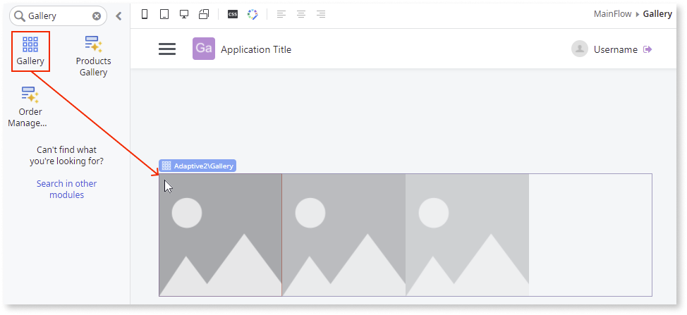
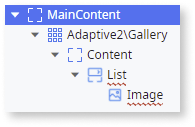
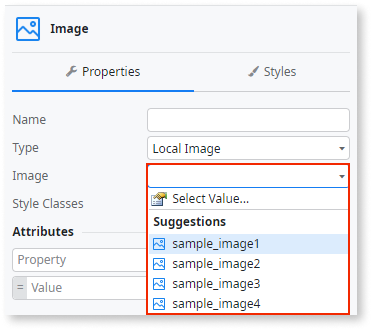
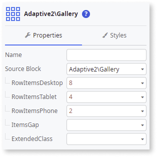
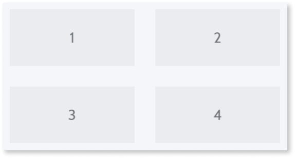
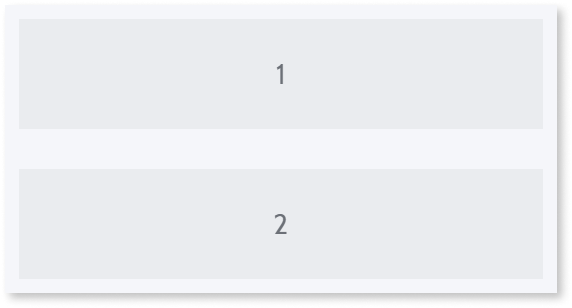

# Gallery

Applies to Mobile Apps and Reactive Web Apps only

**This documentation is not valid for deprecated components.** To check if your component is deprecated and how to migrate old versions, see the [Patterns and Versions Overview](https://outsystemsui.outsystems.com/OutsystemsUiWebsite/MigrationOverview).

To find out what version of OutSystems UI you are using, see [OutSystems UI version](../../intro.md#outsystems-ui-version).

You can use the Gallery UI Pattern to display groups of content. This UI pattern allows users to sequentially browse images, with the notion of a beginning and an end.

## How to use the Gallery UI Pattern

1. In Service Studio, in the Toolbox, search for `Gallery`.

    The Gallery widget is displayed.

    

    If the UI widget doesn't display, it's because the dependency isn't added. This happens because the Remove unused references setting is enabled. To make the widget available in your app:

    1. In the Toolbox, click **Search in other modules**.

    1. In **Search in other Modules**, remove any spaces between words in your search text.

    1. Select the widget you want to add from the **OutSystemsUI** module, and click **Add Dependency**.

    1. In the Toolbox, search for the widget again.

1. From the Toolbox, drag the Gallery widget into the Main Content area of your application's screen.

    

1. Add the required content to the Gallery widget.

    By default, the Gallery widget expects a list.

    

    To use the Gallery UI Pattern with items from a database, drag a [List](<../../../../../ref/lang/auto/servicestudio-plugin-nrwidgets-list.md>) into the Gallery widget and create your custom content.

    In this example, we delete the list and add local images to the Gallery widget.

    

1. On the Element tree, select the **Image** widget, and on the **Properties** tab, from the **Image** drop-down, select or import the image you want in the Gallery.

    **Note:** In this example, the image property **Type** is set to **Local** image. You can also add External and Binary Data images.

    
  
1. You can configure the Gallery's look and feel by selecting the pattern, and on the **Properties** tab, set the relevant (optional) properties, for example, the number of items you want to display on each device (see below for examples).

    

After following these steps and publishing the module, you can test the pattern in your app.

**4 items per row**

**3 items per row**

**2 items per row**

**1 item per row**

## Properties

|Property|Description|
|---|---|
|RowItemsDesktop (Integer): Optional|Defines the number of items that are shown simultaneously per row on a desktop. The number must be greater than 0. The default value is 4.|
|RowItemsTablet (Integer): Optional|Defines the number of items that are shown simultaneously per row on a tablet. The number must be greater than 0. The default value is 3.|
|RowItemsPhone (Integer): Optional|Defines the number of items that are shown simultaneously per row on a phone. The number must be greater than 0. The default value is 1.|
|ItemsGap(Space Identifier): Optional |Defines the space between the Gallery items.    The predefined sizes are the following:<ul><li>None</li><li>Extra Small</li><li>Small</li><li>Base (default value)</li><li>Medium</li><li>Large</li><li>Extra Large</li><li>Extra Extra Large</li></ul>|
|ExtendedClass (Text): Optional|Adds custom style classes to the Pattern. You define your [custom style classes](../../../look-feel/css.md) in your application using CSS.   Examples <ul><li>Blank - No custom styles are added (default value).</li><li>"myclass" - Adds the ``myclass`` style to the UI styles being applied.</li><li>"myclass1 myclass2" - Adds the ``myclass1`` and ``myclass2`` styles to the UI styles being applied.</li></ul>You can also use the classes available on the OutSystems UI. For more information, see the [OutSystems UI Cheat Sheet](https://outsystemsui.outsystems.com/OutSystemsUIWebsite/CheatSheet). |

## Accessibility – WCAG 2.2 AA compliance

The default version of this pattern complies with WCAG 2.2 AA accessibility standards. No changes or manual work are required. If you customize the pattern, validate your implementation to confirm it still meets accessibility requirements.
