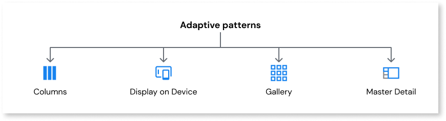

# Adaptive

Applies to Mobile Apps and Reactive Web Apps only

Mobile devices include everything from smartwatches to tablets. These devices have different resolutions, pixel density and aspect ratio. When building apps, it’s important that the various devices and screen sizes are supported.

Using adaptive patterns when building your app means your app can be viewed in multiple layouts on various screen sizes. When you use adaptive patterns in your app, the backend server detects the type of device the user is viewing the app on and then provides a pre-set layout for the device to best fit on screen. Adaptive patterns ensure the best user experience according to whatever device the user is using to view your app. 

OutSystems offers the following adaptive patterns:

* [Columns](columns.md)
* [Display on Device](displayondevice.md)
* [Gallery](gallery.md) 
* [Master Detail](masterdetail.md)
