# Master Detail

Applies to Mobile Apps and Reactive Web Apps only

You can use the Master Detail Pattern to display a master list of items and their related details, for example, a list of employees and their corresponding details.

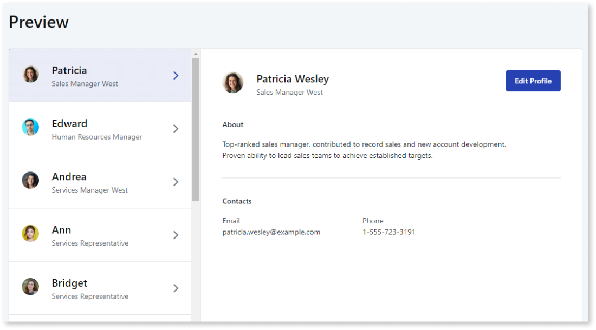

## How to use the Master Detail UI Pattern

1. In Service Studio, in the Toolbox, search for `Master Detail`.

    The Master Detail widget is displayed.

    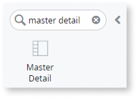

    If the UI widget doesn't display, it's because the dependency isn't added. This happens because the Remove unused references setting is enabled. To make the widget available in your app:

    1. In the Toolbox, click **Search in other modules**.

    1. In **Search in other Modules**, remove any spaces between words in your search text.

    1. Select the widget you want to add from the **OutSystemsUI** module, and click **Add Dependency**.

    1. In the Toolbox, search for the widget again.

1. From the Toolbox, drag the Master Detail widget into the Main Content area of your application's screen.

    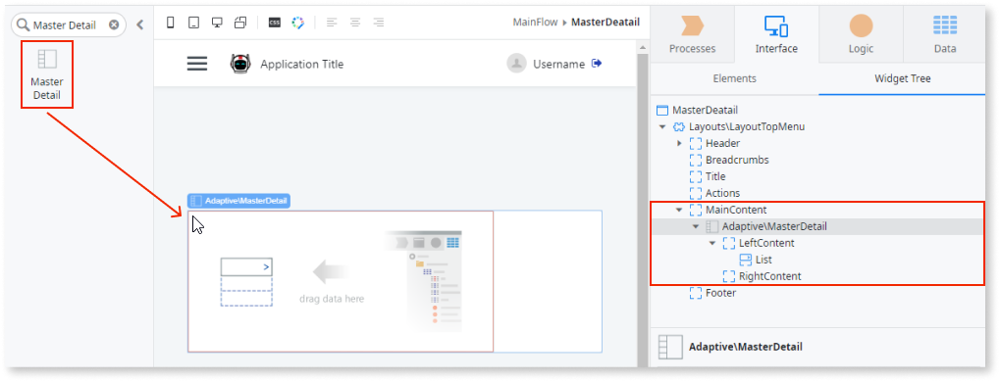

    By default, the Master Detail widget contains a right placeholder and left placeholder which expects a list.

1. To populate the list, create an aggregate, by right-clicking your screen name, and selecting **Fetch Data from Database**.

    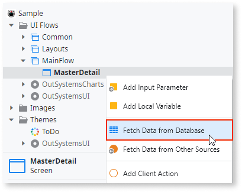

1. To add a database entity, click on the screen, select the relevant entity, and click **OK**. In this example, we use the **User** entity.

    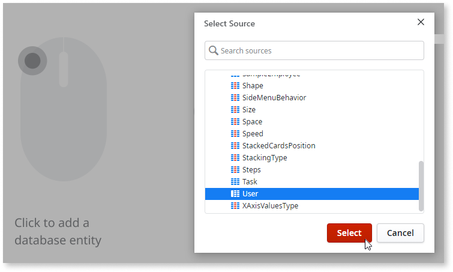

    A name for the aggregate is added automatically. In this example the aggregate name is **GetUsers**.

1. On the **Interface** tab, double-click your screen name, and in the LeftContent placeholder, select the List widget. On the **Properties** tab, from the **Source** drop-down, select the aggregate you just created. In this example, **GetUsers.List**.

    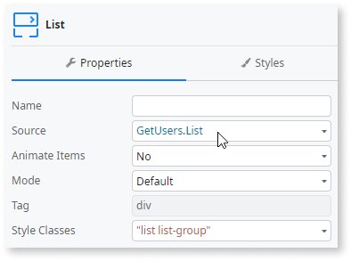

1. On the **Interface** tab, navigate to the attribute you want to display on the left side of the screen, and drag it into the List. In this example, we use the **Name** attribute.

    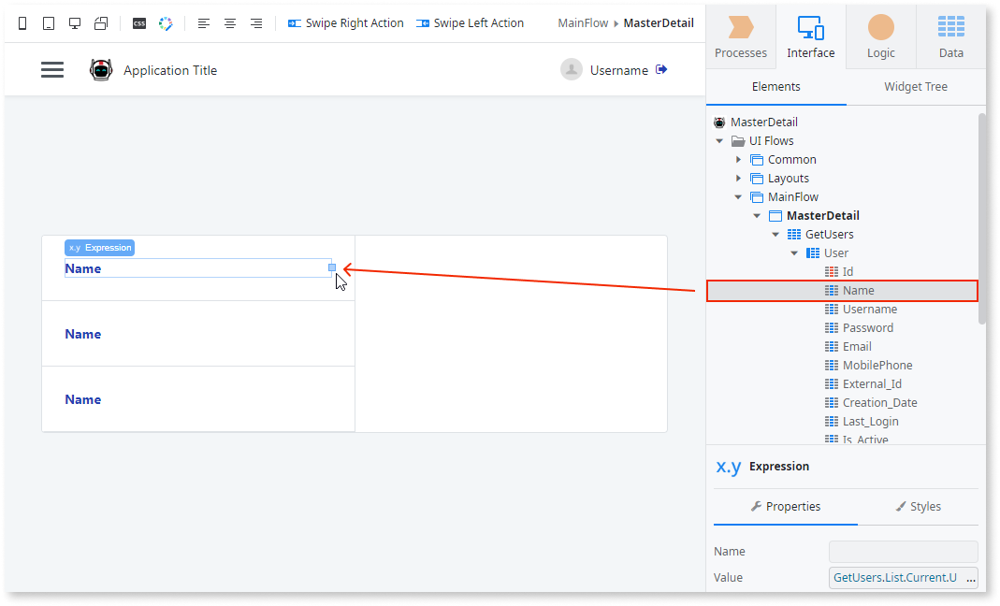

    This displays all of the users names on the left side of the screen.

1. So that each of the items in the list can be selected by the user, create a user action by selecting and right-clicking the expression in the List, and selecting **Link to -> New Client Action**.  

    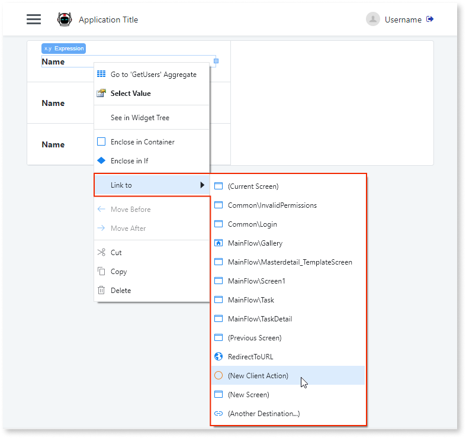

1. Double-click the new client action and enter a name. In this example, we call it **ClickSelectedUser**.

    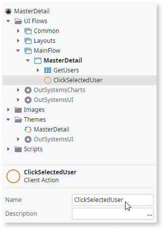

1. From the Toolbox, add the **Assign** logic to the client action, and from the  **Value** drop-down, select the Expression Editor. Navigate to and double-click the current user Id and click **Close**.

    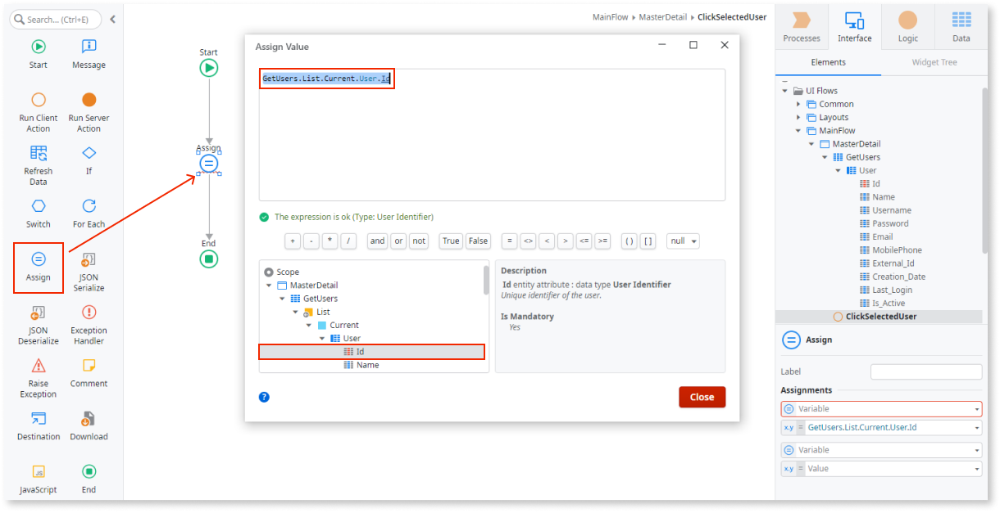

1. To store this user Id, create a local variable by right-clicking on your screen name and selecting **Add Local Variable**. Enter a name for the variable. In this example, we call it **SelectedUserId**.

    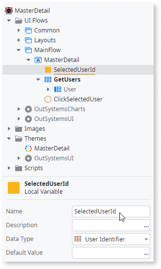

1. Select the **Assign** logic, and from the **Variable** drop-down, select the local variable you created (in this example, **SelectedUserId**).

    **Note**: You have now created all of the information that displays on the **left** side of the Master Detail widget. In the following steps, we will create the information to display on the **right** side of the Master Detail widget.

1. To display the selected user's details on the right side of the screen, create a new aggregate by right-clicking on your screen name and selecting **Fetch Data from Database**.

1. Enter a name for the aggregate. In this example, we call it **GetUserDetails**.

    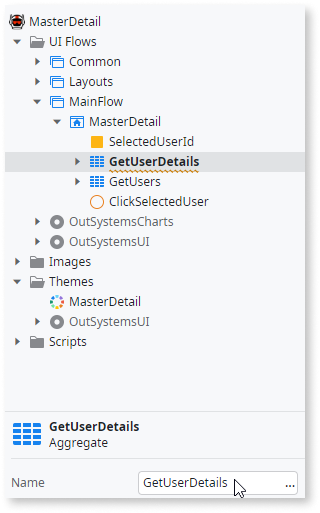

1. To add a database entity, click on the screen, select the relevant entity, and click **Select**. In this example, we use the **User** entity.

1. On the **GetUserDetails** screen, click **Filters**, then click **Add Filter**.

1. From the Filter Condition editor, enter the following condition and click **Close**.

    `User.Id = SelectedUserId`

    This filters all the results in the **User** entity to the currently selected user.

1. Double-click your client action name (in this example, **ClickSelectedUser**), and drag the GetUserDetails aggregate onto the client action. This executes the aggregate using the currently selected user.

    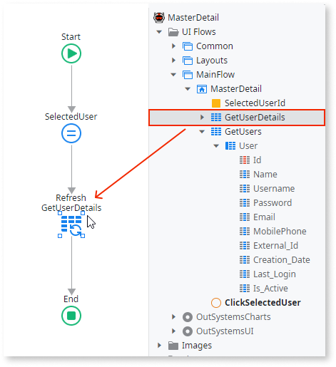

1. Double-click your screen name, and from the **GetUserDetails** aggregate, drag the attributes you want to display into the RightContent placeholder. In this example, we use the Username and Email attributes.

    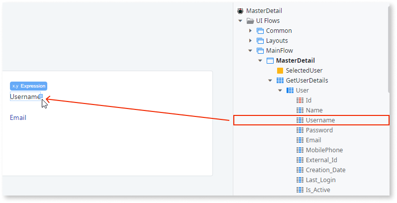

After following these steps and publishing the module, you can test the pattern in your app.

## Properties

| Property                           | Description                                                                                                            |
|------------------------------------|------------------------------------------------------------------------------------------------------------------------|
| LeftPercentage (Decimal): Optional | Set the LeftContent width using a percentage. Default value is 50%.                                                    |
| OpenedOnPhone (Boolean): Optional  | Variable to hold if the detail is opened on a phone. Default value is False.                                           |
| Height (Text): Optional            | Set the height of the widget (in pixels or %). By default, it is the height of the window, minus the title and header. |

## Compatibility with other patterns

This pattern should be used alone inside the screen content because it will adapt to the height of the parent. Additionally, you should avoid using the Master Detail pattern inside patterns with swipe events, such as [Tabs](<../navigation/tabs.md>).
