---
tags:
  - Accessibility
  - Aggregates
  - Mobile app
  - OutSystems UI
  - UI
  - UI Patterns
  - Widgets
summary: Implement the Master Detail UI pattern in OutSystems 11 (O11) for item-detail display in apps.
locale: en-us
guid: d6387a11-92d7-4075-874c-7f538bb21e32
app_type: mobile apps, reactive web apps
platform-version: o11
figma: https://www.figma.com/file/iBD5yo23NiW53L1zdPqGGM/Developing%20an%20Application?node-id=201:47
audience:
  - Developer
  - Front-end developer
outsystems-tools:
  - service studio
coverage-type:
  - remember
  - apply
isautopublish: true
---

# Master Detail

<div class="info" markdown="1">

Applies to Mobile Apps and Reactive Web Apps only

</div>

You can use the Master Detail Pattern to display a master list of items and their related details, for example, a list of employees and their corresponding details.

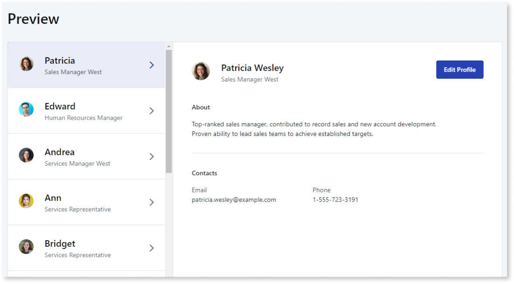

## How to use the Master Detail UI Pattern

1. In Service Studio, in the Toolbox, search for `Master Detail`.

    The Master Detail widget is displayed.

    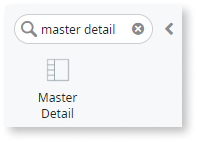

    If the UI widget doesn't display, it's because the dependency isn't added. This happens because the Remove unused references setting is enabled. To make the widget available in your app:

    1. In the Toolbox, click **Search in other modules**.

    1. In **Search in other Modules**, remove any spaces between words in your search text.

    1. Select the widget you want to add from the **OutSystemsUI** module, and click **Add Dependency**.

    1. In the Toolbox, search for the widget again.

1. From the Toolbox, drag the Master Detail widget into the Main Content area of your application's screen.

    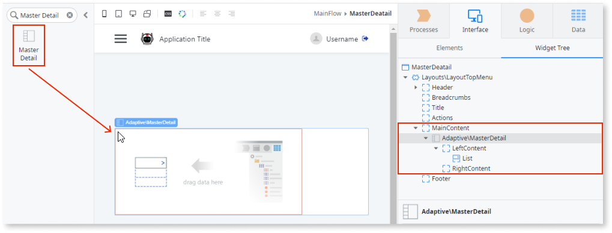

    By default, the Master Detail widget contains a right placeholder and left placeholder which expects a list.

1. To populate the list, create an aggregate, by right-clicking your screen name, and selecting **Fetch Data from Database**.

    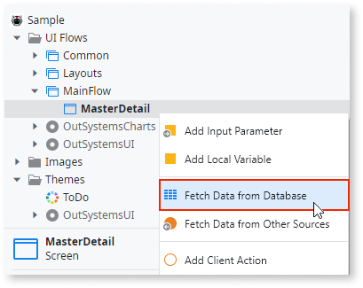

1. To add a database entity, click on the screen, select the relevant entity, and click **OK**. In this example, we use the **User** entity.

    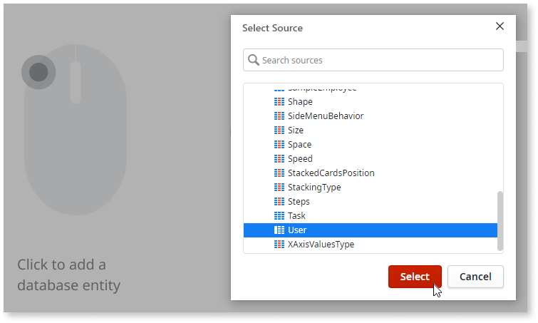

    A name for the aggregate is added automatically. In this example the aggregate name is **GetUsers**.

1. On the **Interface** tab, double-click your screen name, and in the LeftContent placeholder, select the List widget. On the **Properties** tab, from the **Source** drop-down, select the aggregate you just created. In this example, **GetUsers.List**.

    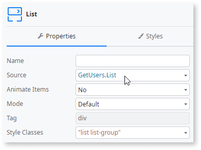

1. On the **Interface** tab, navigate to the attribute you want to display on the left side of the screen, and drag it into the List. In this example, we use the **Name** attribute.

    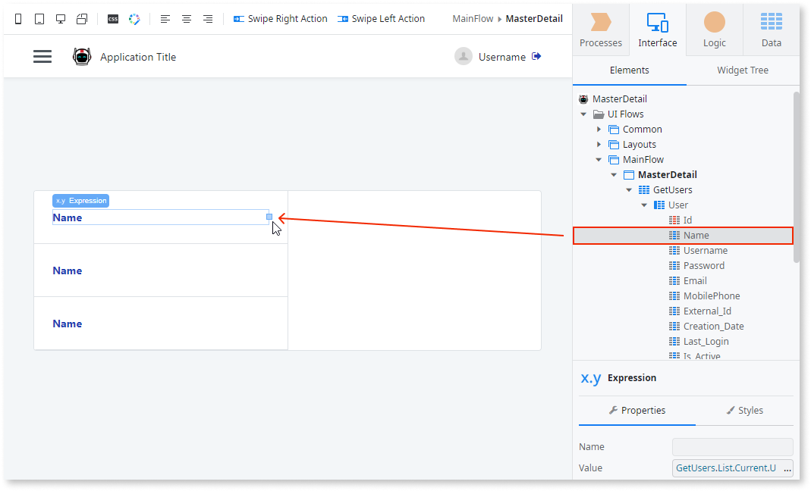

    This displays all of the users names on the left side of the screen.

1. So that each of the items in the list can be selected by the user, create a user action by selecting and right-clicking the expression in the List, and selecting **Link to -> New Client Action**.  

    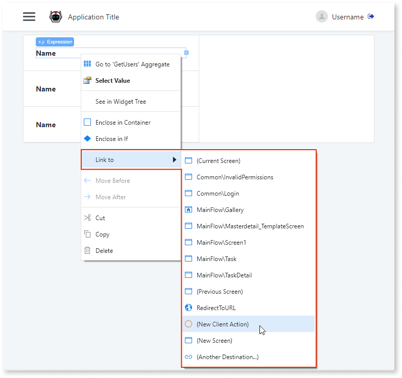

1. Double-click the new client action and enter a name. In this example, we call it **ClickSelectedUser**.

    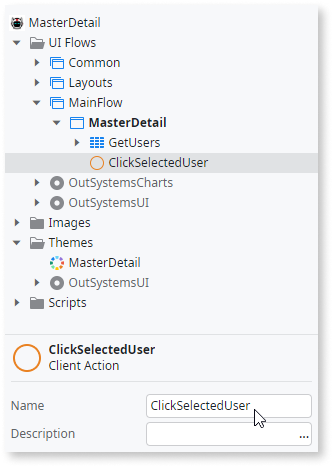

1. From the Toolbox, add the **Assign** logic to the client action, and from the  **Value** drop-down, select the Expression Editor. Navigate to and double-click the current user Id and click **Close**.

    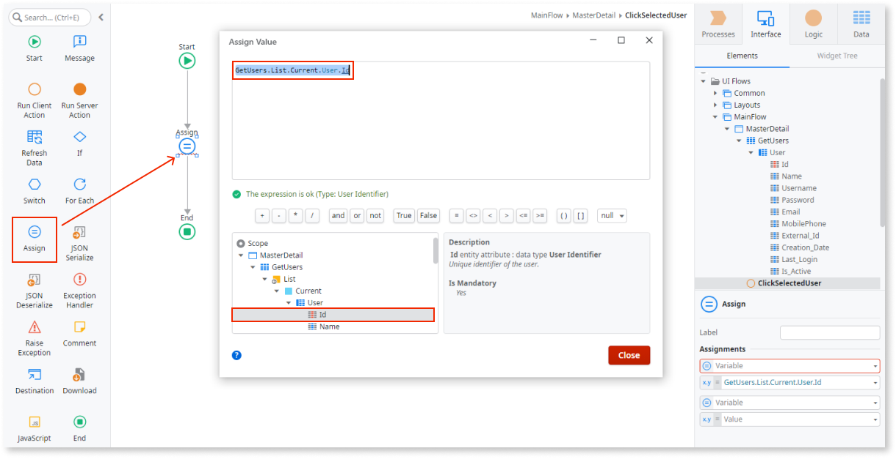

1. To store this user Id, create a local variable by right-clicking on your screen name and selecting **Add Local Variable**. Enter a name for the variable. In this example, we call it **SelectedUserId**.

    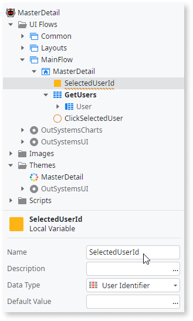

1. Select the **Assign** logic, and from the **Variable** drop-down, select the local variable you created (in this example, **SelectedUserId**).

    **Note**: You have now created all of the information that displays on the **left** side of the Master Detail widget. In the following steps, we will create the information to display on the **right** side of the Master Detail widget.

1. To display the selected user's details on the right side of the screen, create a new aggregate by right-clicking on your screen name and selecting **Fetch Data from Database**.

1. Enter a name for the aggregate. In this example, we call it **GetUserDetails**.

    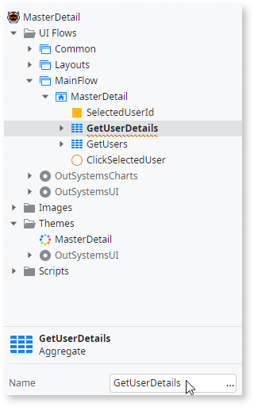

1. To add a database entity, click on the screen, select the relevant entity, and click **Select**. In this example, we use the **User** entity.

1. On the **GetUserDetails** screen, click **Filters**, then click **Add Filter**.

1. From the Filter Condition editor, enter the following condition and click **Close**.

    `User.Id = SelectedUserId`

    This filters all the results in the **User** entity to the currently selected user.

1. Double-click your client action name (in this example, **ClickSelectedUser**), and drag the GetUserDetails aggregate onto the client action. This executes the aggregate using the currently selected user.

    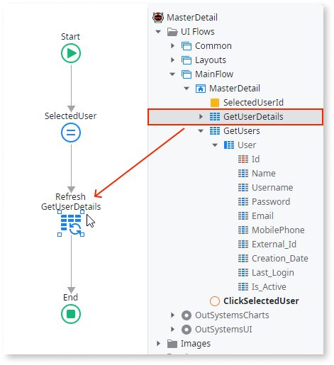

1. Double-click your screen name, and from the **GetUserDetails** aggregate, drag the attributes you want to display into the RightContent placeholder. In this example, we use the Username and Email attributes.

    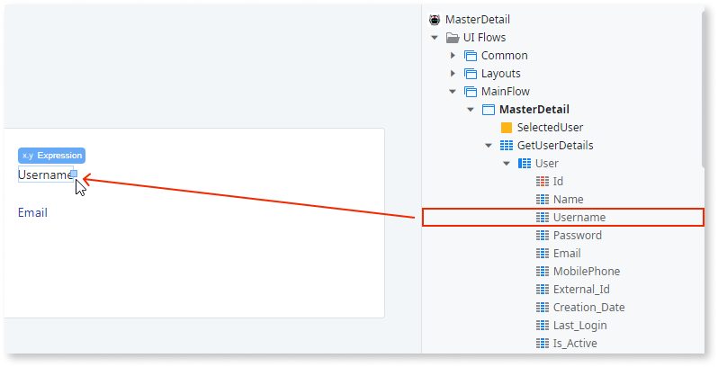

After following these steps and publishing the module, you can test the pattern in your app.

## Properties

| Property                           | Description                                                                                                            |
|------------------------------------|------------------------------------------------------------------------------------------------------------------------|
| LeftPercentage (Decimal): Optional | Set the LeftContent width using a percentage. Default value is 50%.                                                    |
| OpenedOnPhone (Boolean): Optional  | Variable to hold if the detail is opened on a phone. Default value is False.                                           |
| Height (Text): Optional            | Set the height of the widget (in pixels or %). By default, it is the height of the window, minus the title and header. |

## Compatibility with other patterns

This pattern should be used alone inside the screen content because it adapts to the height of the parent. Additionally, you should avoid using the Master Detail pattern inside patterns with swipe events, such as [Tabs](<../navigation/tabs.md>).

## Accessibility – WCAG 2.2 AA compliance {#accessibility}

By default, the **Master Detail** UI Pattern may not expose the right semantics to assistive technologies. Follow this procedure to map the pattern to an ARIA tabs structure so screen readers announce the relationship between the selectable items and the detail panel, and keyboard users can move focus predictably.

<div class="info" markdown="1">

To follow this procedure with a working example, download the [Master Detail accessibility sample OAP](resources/master-detail-a11y.oap) and open it in Service Studio.

</div>

### Set the tab roles

Use ARIA tabs roles when the pattern behaves like tabs (only one item is active at a time and it controls the detail panel).

<div class="info" markdown="1">

When a Master–Detail component behaves like a tabs interface, set `role="tablist"` on the container, `role="tab"` on each selectable item, and `role="tabpanel"` on the content panel. This conveys the interaction model to assistive technologies.

</div>

1. In **Service Studio**, go to the **Interface** tab and select the **Screen/Block** that uses **Master Detail**.

1. In the **Widget Tree**, select the **List** inside the **Master Detail**, and in **Properties** >  **Attributes**, add `role="tablist"`.

    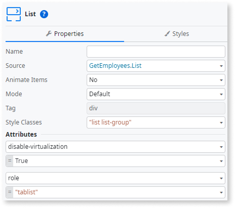

1. Select the **List Item** inside that **List**, and in **Properties** > **Attributes**, add `role="tab"`.

    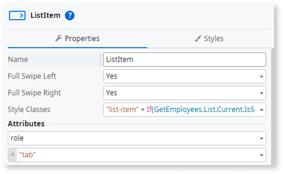

1. Select or add the **MasterDetailContent** inside **Right Content** from **Master Detail**, and in **Properties** > **Attributes**, add `role="tabpanel"`.

    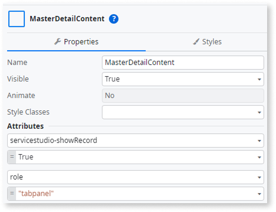

### Link each tab to the detail panel

Next, add the relationship between each tab and the content panel so screen readers understand what each tab controls.

1. In the **Interface** tab, select the **Screen/Block** that uses the **Master Detail** pattern.

1. Select the **List Item** inside that **List**, and in **Properties** > **Attributes**, add `aria-controls=MasterDetailContent.Id`.

    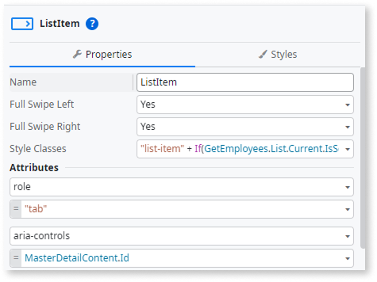

### Set ARIA on List and List Item

1. In the **Widget Tree**, select the **List** inside the **Master Detail**.

1. In **List** **Properties** > **Attributes**, add the `aria-label` attribute and set its value for `Employee list navigation`, for example.

    <div class="info" markdown="1">

    The aria-label on the list should clearly describe the purpose of the tabs for screen reader users.

    </div>

1. In **List Item** **Properties** > **Attributes**, add the `aria-selected` attribute and set its value using a condition like:

    ```text
    ToLower(GetEmployees.List.Current.IsSelected)
    ```

    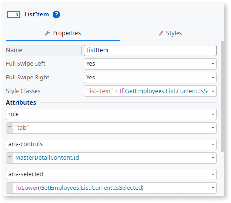

### Set aria-labelledby to Master Detail Content

1. In the **Elements**, create a **Local Variable** named `ContentAriaLabelledBy`, `Text` type.

    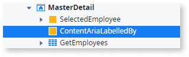

1. Create a **Client Action** and name it `SetSelected`.

     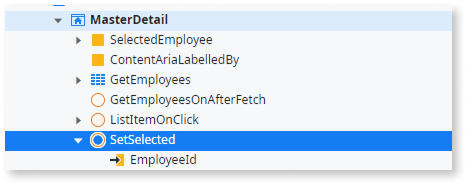

1. In the `SetSelected` action add an input parameter `EmployeeId`, `Sample_Employee Identifier` type.

    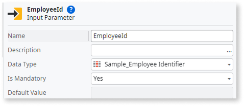

1. In `SetSelected` flow add a **ListIndexOf**, name it `GetPrevSelectedIndex`, and set the **List** to `GetEmployees.List` and its condition to `IsSelected`.

    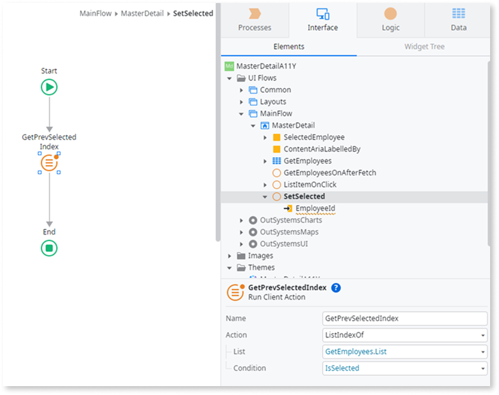

1. Add an **If** with the following condition: `GetPrevSelectedIndex.Position > -1`.

1. In the **If's** **True** branch add an **Assign** with the following assignment: `GetEmployees.List[GetPrevSelectedIndex.Position].IsSelected=False`

    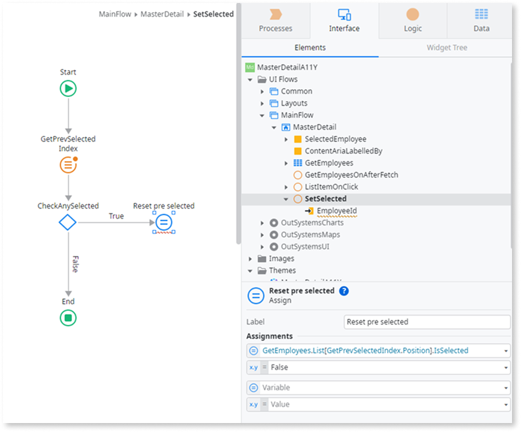

1. In the **False** branch add a **List Filter**, and set SourceList as GetEmployees.List and its condition as `Sample.Employee.Id = EmployeeId`.

    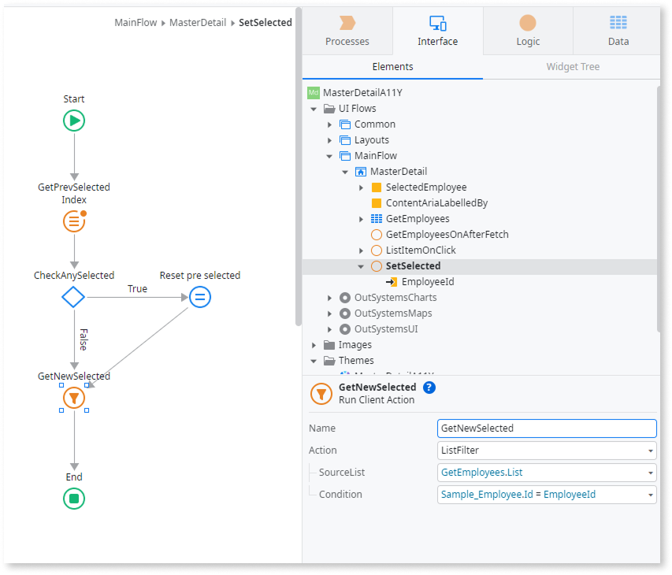

1. Add a **List Index Of** to the flow action, name it `GetNewSelectedIndex`, and set the **List** to `GetEmployees.List` and its condition to `Sample_Employee.Id = GetNewSelected.FilteredList.Current.Sample_Employee.Id`.

       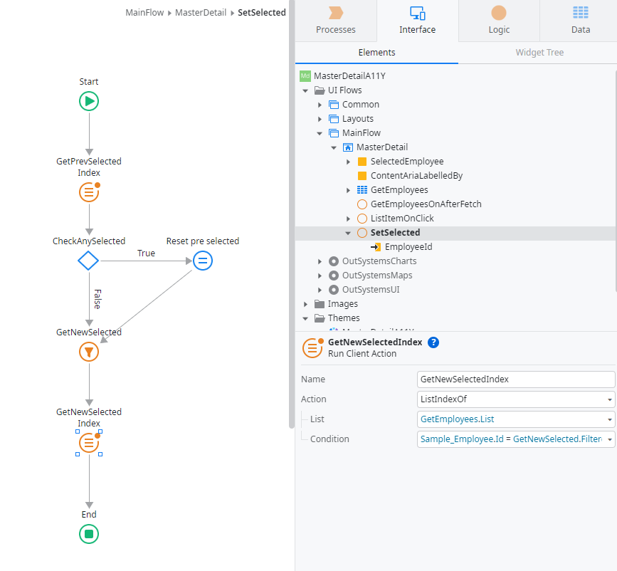 

1. Add an **If** with the following condition: `GetNewSelectedIndex.Position > -1`.

1. In the **If's** **True** branch add an **Assign** with the following assignment: `GetEmployees.List[GetNewSelectedIndex.Position].IsSelected=True`.

     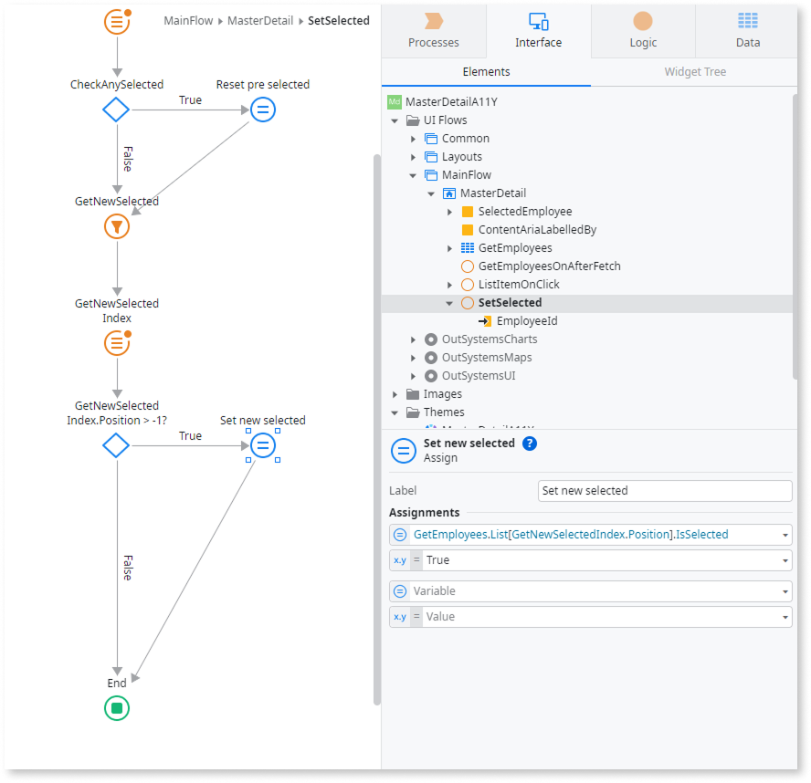

1. In the **False** branch add a **List Filter**, and set SourceList as GetEmployees.List and its condition as `SelectedEmployee=GetNewSelected.FilteredList.Current.Sample_Employee`.

     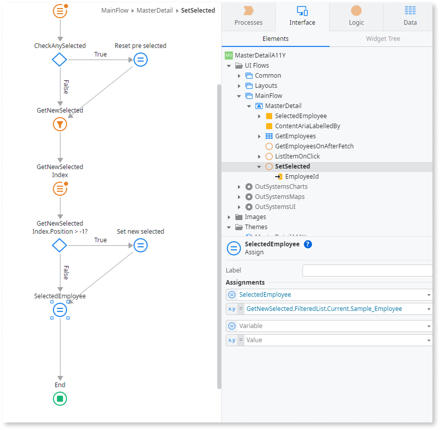

1. Add a **JavaScript node** to the flow, name it `GetHtmlIdOfSelectedItem` and add an **Input Parameter** `CurrEmployeeId`.

1. Set `CurrEmployeeId` to the `EmployeeId` input of the `SetSelected` Client Action.

    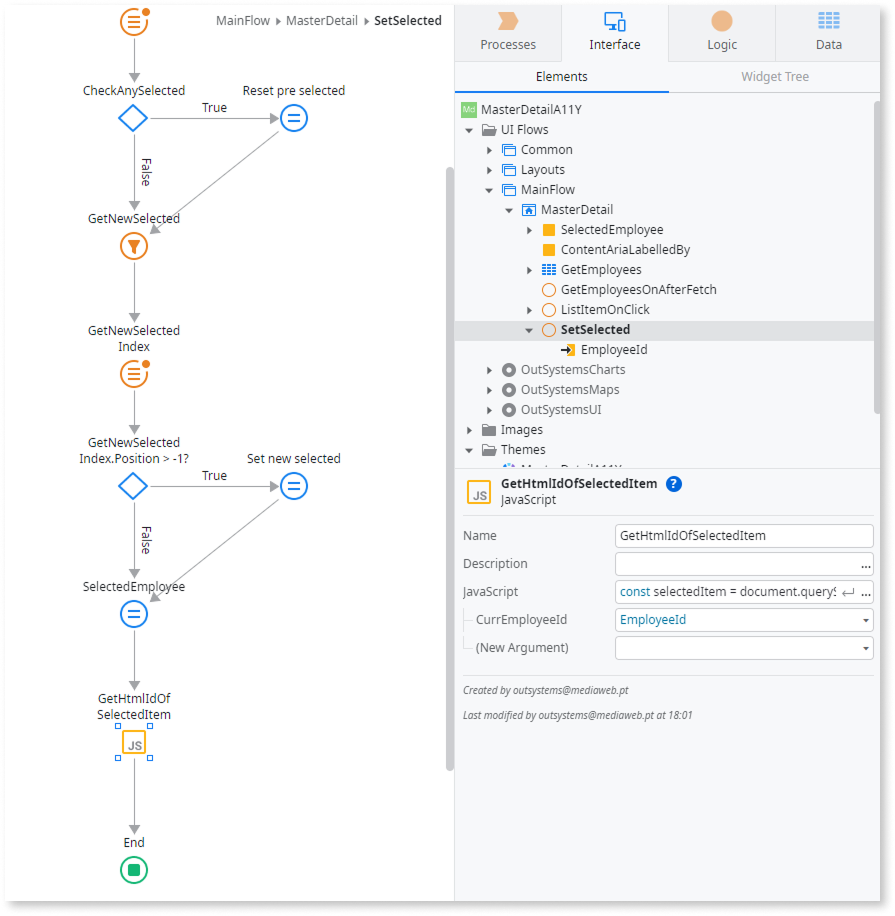

1. In the **JavaScript node** add an **Output Parameter** `SelectedItemHTMLId` and add the following code:

    ```javascript
    const selectedItem = document.querySelector(".list-item[data-id='"+$parameters.CurrEmployeeId+"']")

    if(selectedItem) {
        $parameters.SelectedItemHTMLId = selectedItem.getAttribute("id");
    } else {
        $parameters.SelectedItemHTMLId = '';
    }
    ```

1. Add a new **If** to check if there's a selected HTML ID, and add the following condition:
`GetHtmlIdOfSelectedItem.SelectedItemHTMLId <> ""`.

1. In the **If's** **True** branch add the OutSystems UI Accessibility `MasterDetailSetContentFocus` Client Action, then an **Assign** with: `ContentAriaLabelledBy=GetHtmlIdOfSelectedItem.SelectedItemHTMLId`, and link it to the **End** of the action flow.

    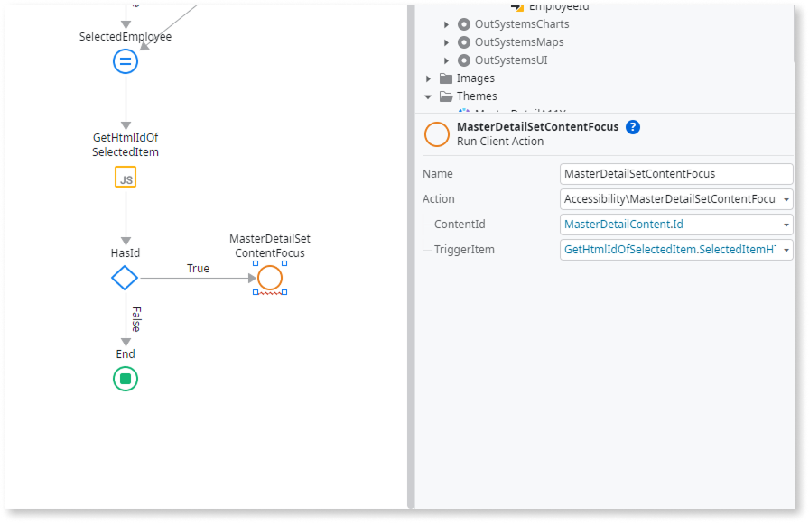

1. Link the **False** branch to the **End** of the action flow.

1. In the **Widget Tree**, select the **Master Detail Content** inside the **Master Detail**.

1. In **Master Detail Content** **Properties** > **Attributes**, add the `aria-labelledby=ContentAriaLabelledBy`.

    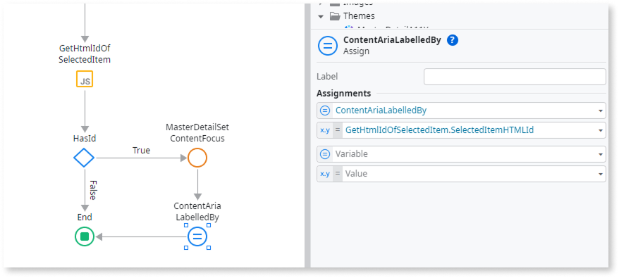

1. The `SetSelected` action needs to be added to `ListItemOnClick` and `GetEmployeesOnAfterFetch` actions.

### Enable keyboard navigation

1. In **Service Studio**, go to the **Interface** tab and select the **Screen/Block** that uses the **Master Detail** pattern.

1. In the **Widget Tree**, select the **List Item** inside that **List**.

1. In **List Item Properties** > **Attributes**, add `tabindex="0"`.

    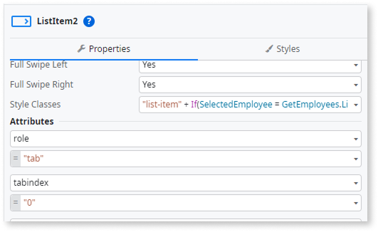

1. In **Master Detail Content Properties** > **Attributes**, add `tabindex="0"`.

    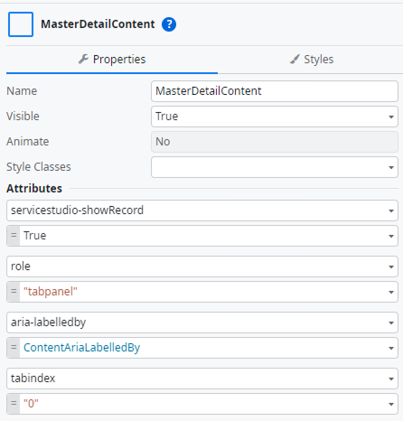

1. Publish the module.

### Result

After completing these steps, assistive technologies interpret the pattern as tabs:

* The list is announced as a tablist.

* Each selectable item is announced as a tab, and the active item is announced as selected.

* The detail area is announced as a tabpanel controlled by the selected tab.

* Only the selected tab is in the default tab order, improving keyboard navigation.

Test the pattern in your app to confirm that the structure and navigation are properly conveyed to users of assistive technologies.
