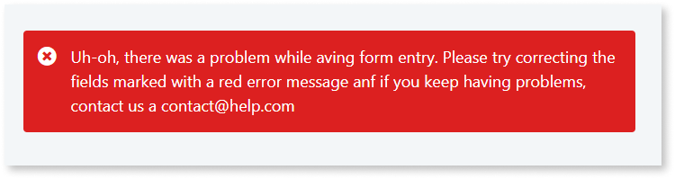
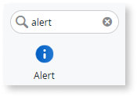
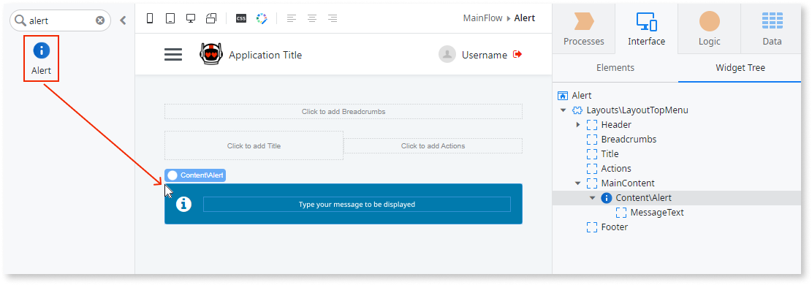
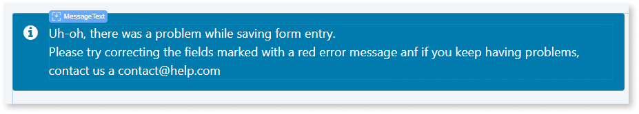
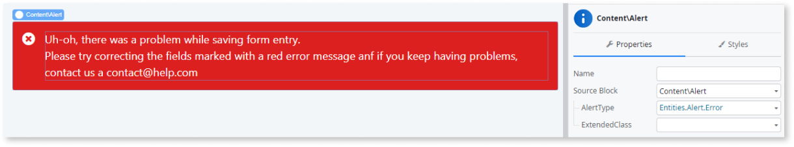

# Alert

Applies to Mobile Apps and Reactive Web Apps only

You can use the Alert UI Pattern to highlight and display important information, errors, or warnings.

**How to use the Alert UI Pattern**

1. In Service Studio, in the Toolbox, search for `Alert`.

    The Alert widget is displayed.

    

    If the UI widget doesn't display, it's because the dependency isn't added. This happens because the Remove unused references setting is enabled. To make the widget available in your app:

    1. In the Toolbox, click **Search in other modules**.

    1. In **Search in other Modules**, remove any spaces between words in your search text.
    
    1. Select the widget you want to add from the **OutSystemsUI** module, and click **Add Dependency**. 
    
    1. In the Toolbox, search for the widget again.

1. From the Toolbox, drag the Alert widget into the Main Content area of your application's screen.

    

1. Select the MessageText placeholder, and enter the Alert message you want to display.
    
    

1. On the **Property** tab, set the **AlertType** property. In this example, the alert type is set to error which changes the message to display in red. 
    
    

After following these steps and publishing the module, you can test the pattern in your app. 

## Properties

| **Property**                           | **Description**                                                                                                                                                                                                                                                                                                                                                                                                                                                                                                                                                                                                                |
|----------------------------------------|--------------------------------------------------------------------------------------------------------------------------------------------------------------------------------------------------------------------------------------------------------------------------------------------------------------------------------------------------------------------------------------------------------------------------------------------------------------------------------------------------------------------------------------------------------------------------------------------------------------------------------|
| AlertType (Alert Identifer): Mandatory | Select the type of alert. the predefined options are:  <ul><li>Error</li><li>Info</li><li>Success</li><li>Warning</li></ul> Examples  <ul><li>_Entities.Alert.Warning_ - Displays a yellow warning message.</li><li>_Entities.Alert.Info_ - Displays a blue information message.</li></ul>                                                                                                                                                                                                                                                                                                                 |
| ExtendedClass (Text): Optional         | Adds custom style classes to the Pattern. You define your [custom style classes](../../../look-feel/css.md) in your application using CSS.  Examples  <ul><li>Blank No custom styles are added (default value).</li><li>"myclass" Adds the ``myclass`` style to the UI styles being applied.</li><li>"myclass1 myclass2" - Adds the ``myclass1`` and ``myclass2`` styles to the UI styles being applied. </li></ul>You can also use the classes available on the OutSystems UI. For more information, see the [OutSystems UI Cheat Sheet](https://outsystemsui.outsystems.com/OutSystemsUIWebsite/CheatSheet). |
