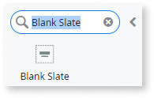
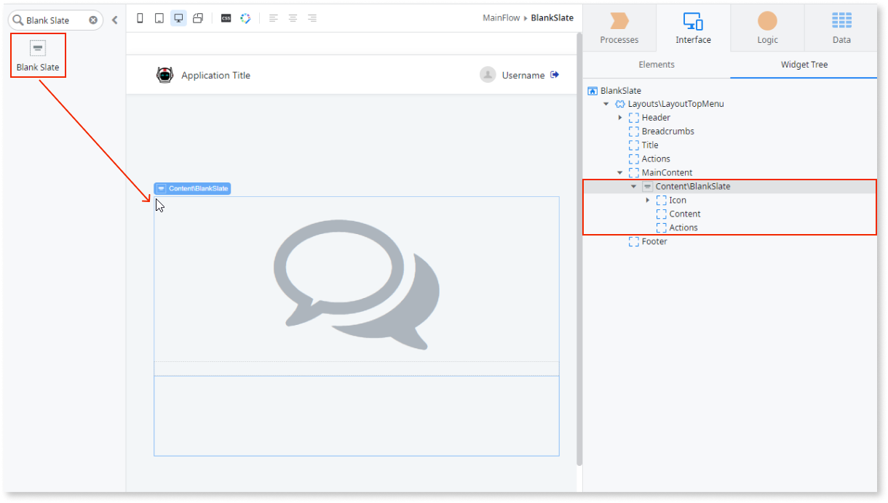
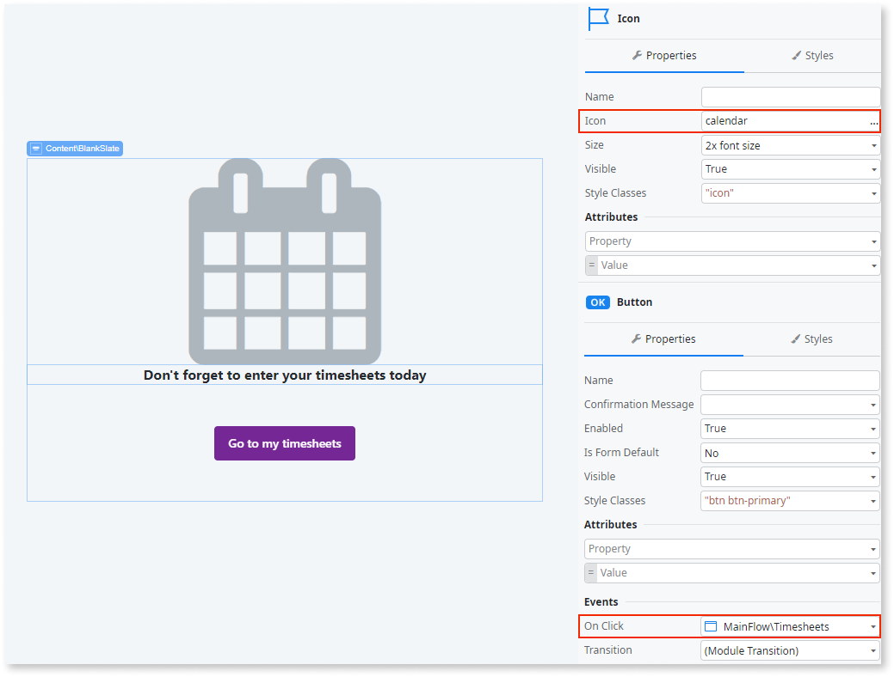
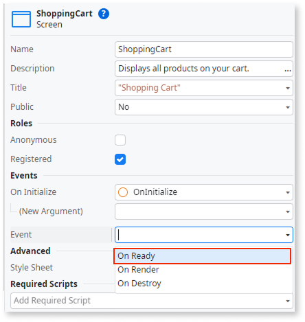
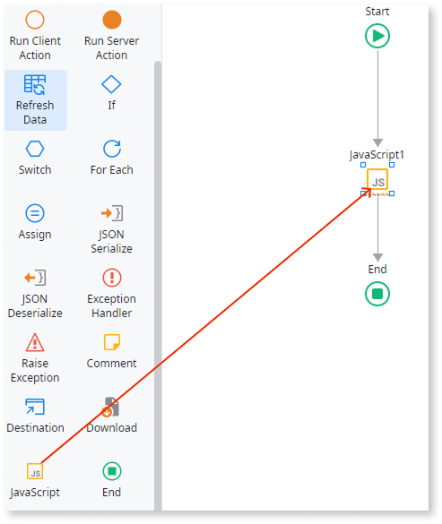
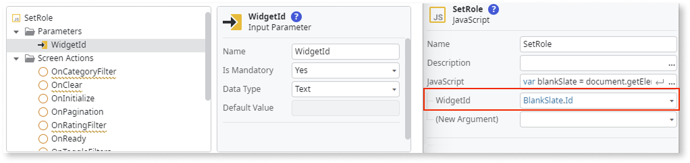
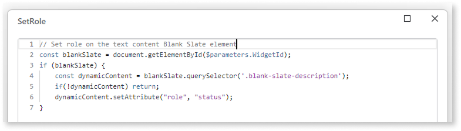

# Blank Slate

<div class="info" markdown="1">

Applies to Mobile Apps and Reactive Web Apps only

</div>

You can use the Blank State UI Pattern to inform end users, for example, to complete a task or when there is no data available for display etc.


**How to use the Blank Slate UI Pattern**

1. In Service Studio, in the Toolbox, search for `Blank Slate`.

    The Blank Slate widget is displayed.

    

    If the UI widget doesn't display, it's because the dependency isn't added. This happens because the Remove unused references setting is enabled. To make the widget available in your app:

    1. In the Toolbox, click **Search in other modules**.

    1. In **Search in other Modules**, remove any spaces between words in your search text.

    1. Select the widget you want to add from the **OutSystemsUI** module, and click **Add Dependency**.

    1. In the Toolbox, search for the widget again.

1. From the Toolbox, drag the Blank Slate widget into the Main Content area of your application's screen.

    

    By default, the Blank Slate widget contains icon, content, and action placeholders.

1. Add your content to the placeholders.

    In this example, we change the icon to a calendar icon, enter some text in the Content placeholder, and add a button to the Actions placeholder. This button, when clicked, redirects the user to another page.

    

After following these steps and publishing the module, you can test the pattern in your app.

## Properties

| Property                       | Description                                                                                                                                                                                                                                                                                                                                                                                                                                                                                                                                                                                                           |
|--------------------------------|-----------------------------------------------------------------------------------------------------------------------------------------------------------------------------------------------------------------------------------------------------------------------------------------------------------------------------------------------------------------------------------------------------------------------------------------------------------------------------------------------------------------------------------------------------------------------------------------------------------------------|
| FullHeight (Boolean): Optional | Displays a larger Blank Slate, taking over full page height. If True, the Blank Slate takes over the full page height. This is the default value. If False, the Blank Slate doesn't take over the full height of the page.                                                                                                                                                                                                                                                                                                                                                                                            |
| ExtendedClass (Text): Optional | Adds custom style classes to the Pattern. You define your [custom style classes](../../../look-feel/css.md) in your application using CSS.<p>Examples</p><ul><li>Blank - No custom styles are added (default value).</li><li>"myclass" - Adds the ``myclass`` style to the UI styles being applied.</li><li>"myclass1 myclass2" - Adds the ``myclass1`` and ``myclass2`` styles to the UI styles being applied. </li></ul>You can also use the classes available on the OutSystems UI. For more information, see the [OutSystems UI Cheat Sheet](https://outsystemsui.outsystems.com/OutSystemsUIWebsite/CheatSheet). |

## Accessibility – WCAG 2.2 AA compliance

By default, the Blank Slate UI pattern requires a small update to fully comply with WCAG 2.2 AA standards. Add the correct role so that screen readers interpret it properly.

Doing so ensures the pattern is accessible for all users, including people with visual or motor disabilities.

### Fix Blank Slate role

1. In **Service Studio**, go to the **Interface** tab.

1. Select the **Screen/Block** where the Blank Slate is used.

1. In the **Screen/Block** properties, select the **OnReady** event. 

    A client action is created.

    

1. In the **OnReady** client action, drag a **JavaScript** node to the flow.

    

1. In the **JavaScript** node, add an input parameter named **WidgetId** (type **Text**).

1. Set **WidgetId** to the Blank Slate block/widget ID (for example, `BlankSlate.Id`).

    

1. Choose one of the following roles, depending on your use case:

    **a) Blank Slate represents a static section**

    If the Blank Slate is used to represent an empty list of results (for example, an inbox or item list with no entries), set the role to **region**.


    ```javascript
    // Set role on the first Blank Slate element
    const blankSlate = document.getElementById($parameters.WidgetId);
    if (blankSlate) {
        blankSlate.children[0].setAttribute("role", "region");
    }
    ```

    
    
    **b) Blank Slate updates dynamically**

    If the Blank Slate updates dynamically (for example, search results: **No results found** or a shopping cart: **Your cart is empty**), set the role to **status**.

    ```javascript
    // Set role on the text content Blank Slate element
    const blankSlate = document.getElementById($parameters.WidgetId);
    if (blankSlate) {
        const dynamicContent = blankSlate.querySelector('.blank-slate-description');
        if(!dynamicContent) return;
        dynamicContent.setAttribute("role", "status");
    }
    ```

    <div class="info" markdown="1">

    When using this option, place the Blank Slate inside a **Block**, and enclose the block in an **If**. Alternatively, add the script to the **action that triggers the Blank Slate** to appear. If the script runs in **OnReady** and the block isn’t present, the role won’t be added to the HTML.

    </div>

1. Publish the module.

### Result

The Blank Slate now has the correct role applied.

Test it in your app to confirm the update.
