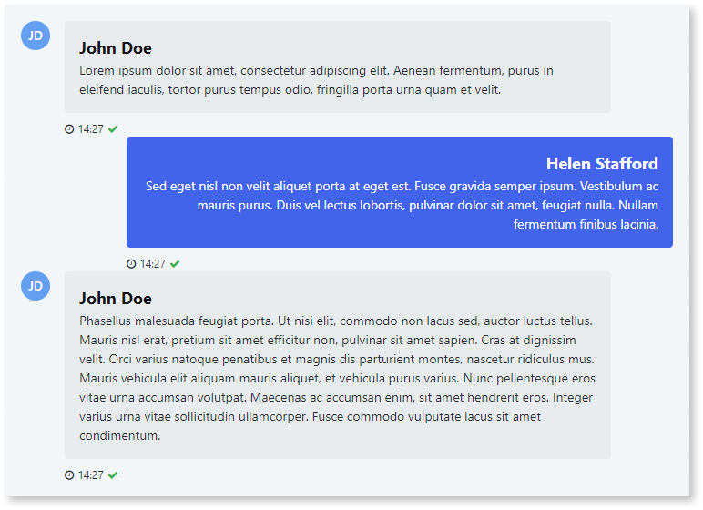
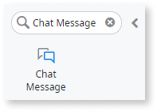
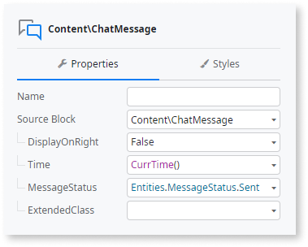

# Chat Message

Applies to Mobile Apps and Reactive Web Apps only.

You can use the Chat Message UI Pattern to display conversational posts in notifications or chat screens. It can be used to display content such as photos, text, images, delivery times, and statuses.

## How to use the Chat Message UI pattern

1. In Service Studio, in the Toolbox, search for `Chat Message`.

    The Chat Message widget is displayed.

    

    If the UI widget doesn't display, it's because the dependency isn't added. This happens because the Remove unused references setting is enabled. To make the widget available in your app:

    1. In the Toolbox, click **Search in other modules**.

    1. In **Search in other Modules**, remove any spaces between words in your search text.

    1. Select the widget you want to add from the **OutSystemsUI** module, and click **Add Dependency**.

    1. In the Toolbox, search for the widget again.

1. From the Toolbox, drag the Chat Message widget into the Main Content area of your application's screen.

    

    By default, the Chat Message widget contains Image and Content placeholders.

1. Add the relevant content to the placeholders.

    In this example, we add the user avatar to the Image placeholder and text to the Content placeholder.

    

    Alternatively, you can use, for example, a List to display a Chat Message for each message record on an entity. You can also use a [form](../../../forms/form-use.md) to allow users enter their messages. By using the relevant expressions and logic, once the user sends their message, refresh the list of messages so it appears as a conversational post.

1. You can customize the Chat Message's look and feel by setting the (optional) properties on the **Properties** tab.

    

After following these steps and publishing the module, you can test the pattern in your app.

## Properties

| Property                                           | Description                                                                                                                                                                                                                                                                                                                                                                                                                                                                                                                                                                                                                          |
|----------------------------------------------------|--------------------------------------------------------------------------------------------------------------------------------------------------------------------------------------------------------------------------------------------------------------------------------------------------------------------------------------------------------------------------------------------------------------------------------------------------------------------------------------------------------------------------------------------------------------------------------------------------------------------------------------|
| DisplayOnRight (Boolean): Optional                 | If True, the pattern is right aligned. If False, the pattern is left aligned. This is the default value.                                                                                                                                                                                                                                                                                                                                                                                                                                                                                                                             |
| Time (Time): Optional                              | Message timestamp.                                                                                                                                                                                                                                                                                                                                                                                                                                                                                                                                                                                                                   |
| MessageStatus (MessageStatus Identifier): Optional | The status of the current message, for example, sent recieved, read, and hidden.                                                                                                                                                                                                                                                                                                                                                                                                                                                                                                                                                     |
| ExtendedClass (Text): Optional                     | Adds custom style classes to the Pattern. You define your [custom style classes](../../../look-feel/css.md) in your application using CSS. 
Examples <ul><li>Blank - No custom styles are added (default value).</li><li>"myclass" - Adds the ``myclass`` style to the UI styles being applied.</li><li>"myclass1 myclass2" - Adds the ``myclass1`` and ``myclass2`` styles to the UI styles being applied.</li></ul>
You can also use the classes available on the OutSystems UI. For more information, see the [OutSystems Cheat Sheet](https://outsystemsui.outsystems.com/OutSystemsUIWebsite/CheatSheet). |

## Accessibility – WCAG 2.2 AA compliance

The default version of this pattern complies with WCAG 2.2 AA accessibility standards. No changes or manual work are required. If you customize the pattern, validate your implementation to confirm it still meets accessibility requirements.
