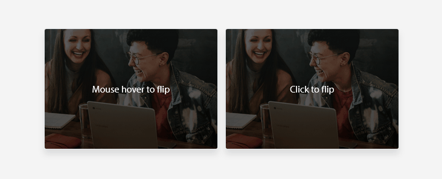
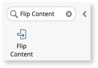
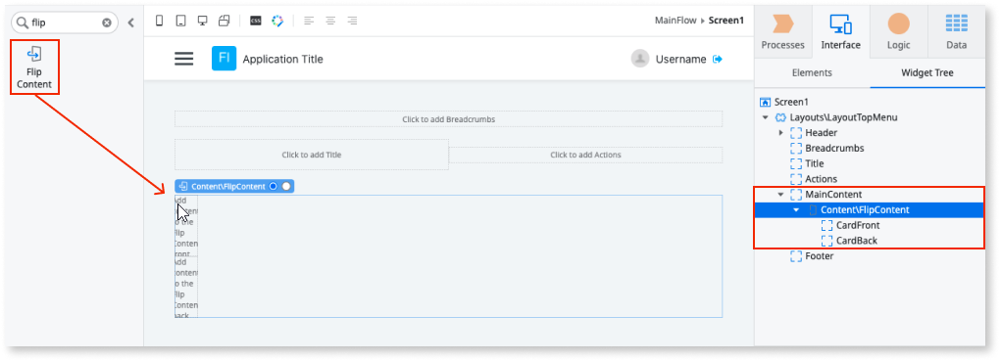
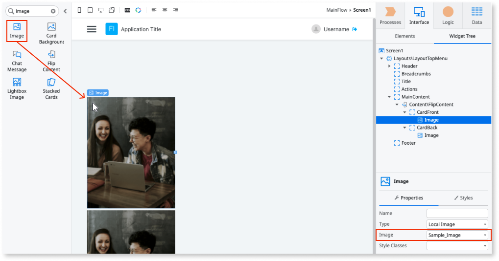
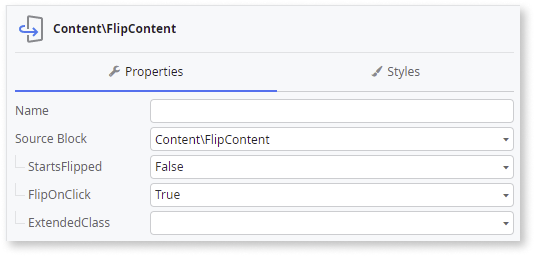

# Flip Content

Applies to Mobile Apps and Reactive Web Apps only

**This documentation is not valid for deprecated components.** To check if your component is deprecated and how to migrate old versions, see the [Patterns and Versions Overview](https://outsystemsui.outsystems.com/OutsystemsUiWebsite/MigrationOverview).

To find out what version of OutSystems UI you are using, see [OutSystems UI version](../../intro.md#outsystems-ui-version).

You can use the Flip Content UI Pattern to display information that when, for example, is clicked, flips and displays different information.

**How to use the Flip content UI Pattern**

1. In Service Studio, in the Toolbox, search for `Flip Content`.

    The Flip Content widget is displayed.

    

    If the UI widget doesn't display, it's because the dependency isn't added. This happens because the Remove unused references setting is enabled. To make the widget available in your app:

    1. In the Toolbox, click **Search in other modules**.

    1. In **Search in other Modules**, remove any spaces between words in your search text.
    
    1. Select the widget you want to add from the **OutSystemsUI** module, and click **Add Dependency**. 
    
    1. In the Toolbox, search for the widget again.

1. From the Toolbox, drag the Flip Content widget into the Main Content area of your application's screen.

    

    By default, the Flip Content widget contains **CardFront** and **CardBack** placeholders.

1. Add the required content for the front and back placeholders inside the Flip Content widget.

    In this example, we add images by dragging the Image widget into the **CardFront** and **CardBack** placeholders and from the **Image** dropdown, selecting an image from the sample OutSystems UI images.

    

1. On the **Properties** tab, you can customize the Flip Content's look and feel by setting any of the (optional) properties.

    

## Properties

| Property| Description|
|---|---|
|StartsFlipped (Boolean): Optional | Defines the initial state of the pattern. If True, the Card Front content is displayed first before flipping. If False, the Card Back content is displayed first before flipping. This is the default.  Use one of the following actions to change the value afterwards: <ul><li>FlipContentBack</li><li>FlipContentFront</li><li>FlipContentToggle</li></ul> |
|FlipOnClick (Boolean): Optional| If True, the flip event is triggered when the Flip Content card (front or back) is clicked. This is the default. If False, you can define the action that triggers the flip event.|
|ExtendedClass (Text): Optional| Adds custom style classes to the Pattern. You define your [custom style classes](../../../look-feel/css.md) in your application using CSS.  Examples <ul><li>Blank - No custom styles are added (default value).</li><li>"myclass" - Adds the ``myclass`` style to the UI styles being applied.</li><li>"myclass1 myclass2" - Adds the ``myclass1`` and ``myclass2`` styles to the UI styles being applied.</li></ul>You can also use the classes available on the OutSystems UI. For more information, see the [OutSystems UI Cheat Sheet](https://outsystemsui.outsystems.com/OutSystemsUIWebsite/CheatSheet). |

## Events

|Event| Description| 
|---|---|
|OnFlip: Optional| Event triggered after the content is flipped.| 

