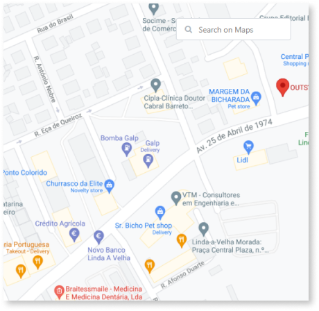
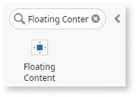
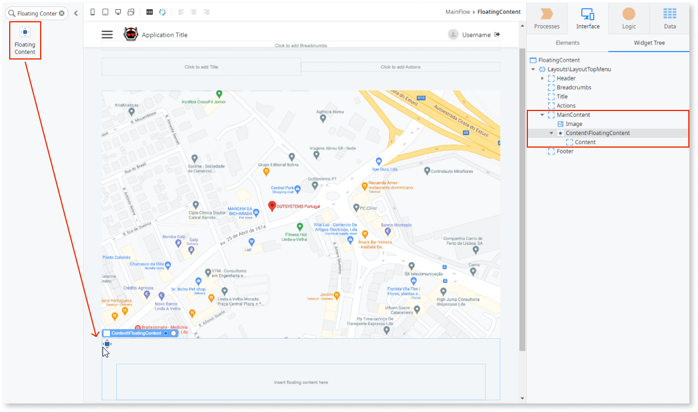
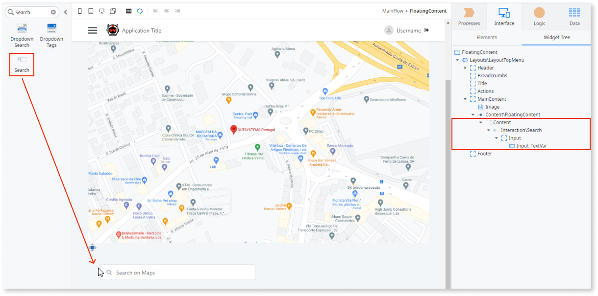
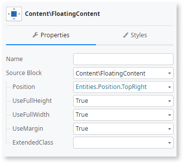

# Floating Content

Applies to Mobile Apps and Reactive Web Apps only.

You can use the Floating Content UI Pattern to display content on top of other screen elements, such as a map with navigation instructions.

## How to use the Floating Content UI pattern

1. In Service Studio, in the Toolbox, search for `Floating Content`.

    The Floating Content widget is displayed.

    

    If the UI widget doesn't display, it's because the dependency isn't added. This happens because the Remove unused references setting is enabled. To make the widget available in your app:

    1. In the Toolbox, click **Search in other modules**.

    1. In **Search in other Modules**, remove any spaces between words in your search text.

    1. Select the widget you want to add from the **OutSystemsUI** module, and click **Add Dependency**.

    1. In the Toolbox, search for the widget again.

1. From the Toolbox, drag the Floating Content widget into the Main Content area of your application's screen.

    In this example, the Main Content area of already contains an image of a map.

    

    By default, the Floating Content widget contains a Content placeholder.

1. Add the relevant content to the placeholder.

    In this example, we add a Search widget.

    

1. Select the Floating Content widget, and on the **Properties** tab, set the mandatory **Position** property. This defines where the widget is displayed. You can customize the Section's look and feel by setting any of the (optional) properties.

    

After following these steps and publishing the module, you can test the pattern in your app.

## Properties

| Property|Description|
|---|---|
| Position (Position Identifier): Mandatory | The position the floating content is displayed. |
| UseFullHeight (Boolean): Optional | If True, the widget takes up the full height of the screen. If False, the widget doesn't take up the full height of the screen. This is the default. |
| UseFullWidth (Boolean): Optional  | If True, the widget takes up the full width of the screen. If False, the widget doesn't take up the full width of the screen. This is the default. |
| UseMargin (Boolean): Optional | If True, a margin is applied to the widget. This is the default. If False, there is no margin applied to the widget. |
| ExtendedClass (Text): Optional | Adds custom style classes to the Pattern. You define your [custom style classes](../../../look-feel/css.md) in your application using CSS.  Examples   <ul><li>Blank - No custom styles are added (default value).</li><li>"myclass" - Adds the ``myclass`` style to the UI styles being applied.</li><li>"myclass1 myclass2" - Adds the ``myclass1`` and ``myclass2`` styles to the UI styles being applied.</li></ul>You can also use the classes available on the OutSystems UI. For more information, see the [OutSystems UI Cheat Sheet]<https://outsystemsui.outsystems.com/OutSystemsUIWebsite/CheatSheet>). |

## Accessibility – WCAG 2.2 AA compliance

The default version of this pattern complies with WCAG 2.2 AA accessibility standards. No changes or manual work are required. If you customize the pattern, validate your implementation to confirm it still meets accessibility requirements.
