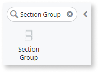
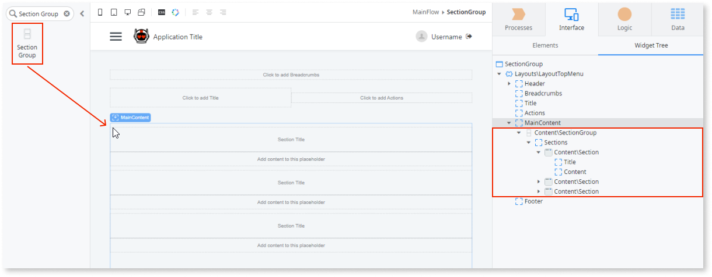
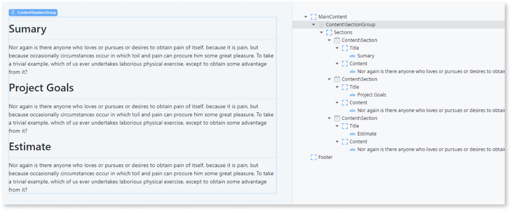
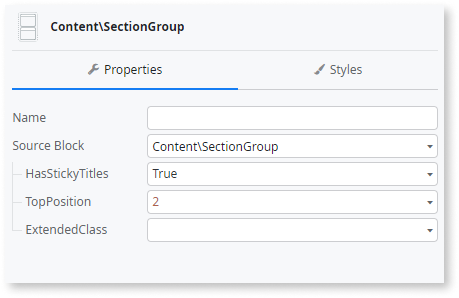
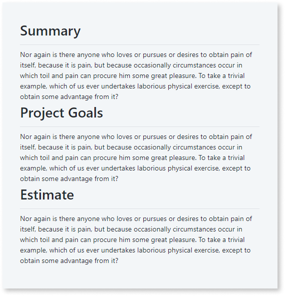
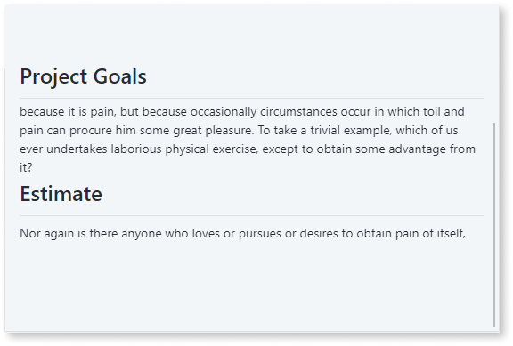

# Section Group

Applies to Mobile Apps and Reactive Web Apps only

You can use the Section Group UI Pattern to keep the context of the header while scrolling through content.

**How to use the Section Group UI Pattern**

1. In Service Studio, in the Toolbox, search for `Section Group`.
  
    The Section Group widget is displayed.

     

    If the UI widget doesn't display, it's because the dependency isn't added. This happens because the Remove unused references setting is enabled. To make the widget available in your app:

    1. In the Toolbox, click **Search in other modules**.

    1. In **Search in other Modules**, remove any spaces between words in your search text.
    
    1. Select the widget you want to add from the **OutSystemsUI** module, and click **Add Dependency**. 
    
    1. In the Toolbox, search for the widget again.

1. To From the Toolbox, drag the **Section Group** widget into the **Main Content** area of your application's screen.

    

    By default, the Section Group widget contains 3 Section widgets which contain Title and Content placeholders.

1. Add your content to the placeholders.

    In this example, we add a title to the Title placeholder and some text to the Content placeholder. 

    

1. On the **Properties** tab, you can customize the Section Group's look and feel by setting any of the (optional) properties.

    

    **HasStickyTitles = False**

    

    **HasStickyTitles = True**

    

After following these steps and publishing the module, you can test the pattern in your app.

## Properties

| Property                            | Description                                                                                                                                                                                                                                                                                                                                                                                                                                                                                                                                                                                                            |
|-------------------------------------|------------------------------------------------------------------------------------------------------------------------------------------------------------------------------------------------------------------------------------------------------------------------------------------------------------------------------------------------------------------------------------------------------------------------------------------------------------------------------------------------------------------------------------------------------------------------------------------------------------------------|
| HasStickyTitles (Boolean): Optional | If set to True, the section titles stay at the top of the page while the user scrolls through the content. If false, the section titles scroll with the content.                                                                                                                                                                                                                                                                                                                                                                                                                                                       |
| TopPosition (Integer): Optional     | Sets the position of the first section title. Only applicable when **HasStickyTitles** property is set to True.                                                                                                                                                                                                                                                                                                                                                                                                                                                                                                        |
| ExtendedClass (Text): Optional      | Adds custom style classes to the Pattern. You define your [custom style classes](../../../look-feel/css.md) in your application using CSS. 
Examples <ul><li>Blank - No custom styles are added (default value).</li><li>"myclass" - Adds the ``myclass`` style to the UI styles being applied.</li><li>"myclass1 myclass2" - Adds the ``myclass1`` and ``myclass2`` styles to the UI styles being applied.</li></ul>
You can also use the classes available on the OutSystems UI. For more information, see the [OutSystems UI Cheat Sheet](https://outsystemsui.outsystems.com/OutSystemsUIWebsite/CheatSheet). |
