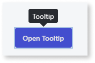
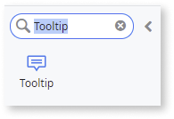
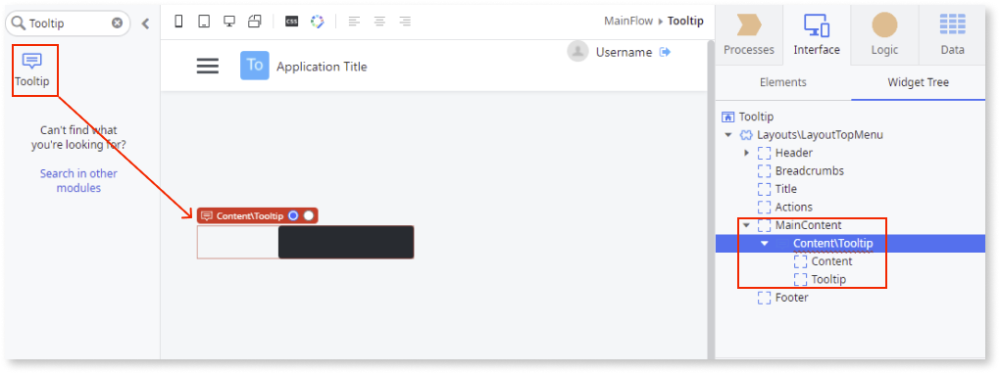
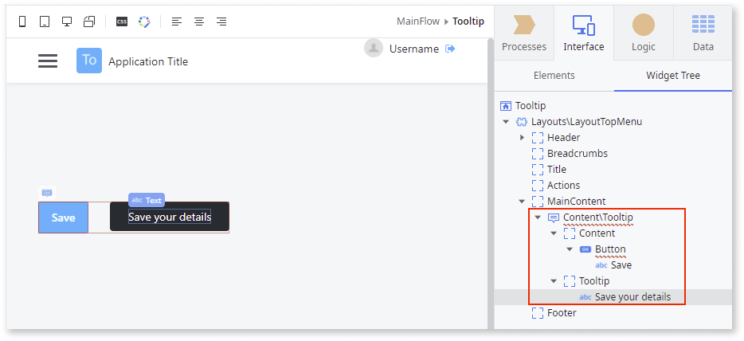
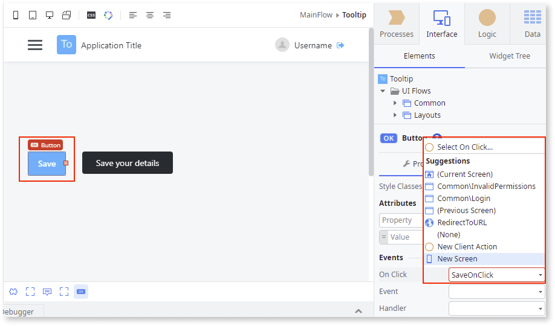
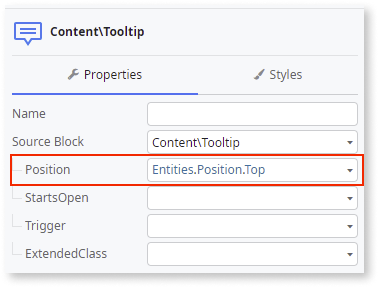

# Tooltip

Applies to Mobile Apps and Reactive Web Apps only

**This documentation is not valid for deprecated components.** To check if your component is deprecated and how to migrate old versions, see the [Patterns and Versions Overview](https://outsystemsui.outsystems.com/OutsystemsUiWebsite/MigrationOverview).

To find out what version of OutSystems UI you are using, see [OutSystems UI version](../../intro.md#outsystems-ui-version).

You can use the Tooltip UI Pattern to dynamically display informative text when a user hovers over, clicks, or taps an on-screen element.

**How to use the Tooltip UI Pattern**

**Prerequities** To use the Tooltip UI Pattern, you must use an OutSystems Layout. If you are using a Custom Layout, you must add the Layout CSS class.

1. In Service Studio, in the Toolbox, search for `Tooltip`.
  
    The Tooltip widget is displayed.

    

    If the UI widget doesn't display, it's because the dependency isn't added. This happens because the Remove unused references setting is enabled. To make the widget available in your app:

    1. In the Toolbox, click **Search in other modules**.

    1. In **Search in other Modules**, remove any spaces between words in your search text.
    
    1. Select the widget you want to add from the **OutSystemsUI** module, and click **Add Dependency**. 
    
    1. In the Toolbox, search for the widget again.

1. From the Toolbox, drag the Tooltip widget into the Main Content area of your application's screen.

    

    By default, the Tooltip widget contains Content and Tooltip placeholders.

1. Add your content to the placeholders. 
    
    In this example, we add a **Save** button to the Content placeholder and enter the tooltip text ``Save your details`` in the Tooltip placeholder.

    
    
1. Select the **Save** button and add the relevant **On Click** event.

    

1. On the **Properties** tab, from the **Position** dropdown, select where you want the tooltip to appear. In this example we want the tooltip to appear on top of the **Save** button. You can also change the look and feel of the Tooltip by setting the (optional) properties.

    

After following these steps and publishing the module, you can test the pattern in your app.

## Properties

| Properties| Description|
|---|---|
|Position (Position Identifier): Optional | Defines the Tooltip's position. The default position is right.  The predefined options are the following:<ul><li>Bottom</li><li>BottomLeft</li><li>BottomRight</li><li>Center</li><li>Left</li><li>Right</li><li>Top</li><li>TopLeft</li><li>TopRight</li></ul> Examples:<ul><li>Entities.Position.Right - The Tooltip is displayed to the right of the element.</li><li>Entities.Position.Bottom - The Tooltip is displayed underneath the element.</li></ul> |
|StartsOpen (Boolean): Optional| If True, the Tooltip is displayed when the page is first loaded (without the need for the initial trigger). If False, the tooltip is not visible. This is the default.|
|Trigger (Trigger Identifier): Optional| Defines how the tooltip is triggered. The available trigger options are OnClick and OnHover. By default, the tooltip is shown OnHover.|
|ExtendedClass (Text): Optional| Adds custom style classes to the Pattern. You define your [custom style classes](../../../look-feel/css.md) in your application using CSS.  Examples <ul><li>Blank - No custom styles are added (default value).</li><li>"myclass" - Adds the ``myclass`` style to the UI styles being applied.</li><li>"myclass1 myclass2" - Adds the ``myclass1`` and ``myclass2`` styles to the UI styles being applied.</li></ul>You can also use the classes available on the OutSystems UI. For more information, see the [OutSystems UI Cheat Sheet](https://outsystemsui.outsystems.com/OutSystemsUIWebsite/CheatSheet). |

## Events

|Event| Description  | 
|---|---|
|Initialized: Optional|Event triggered after the Tooltip instance is ready.| 
|OnToggle: Mandatory|Event triggered each time a Tooltip opens or closes.| 

To include clickable elements inside the Tooltip component, add ``data-allow-event-propagation="true"`` or ``data-allow-event-propagation=True`` to the clickable elements. This enables event propagation.
Applies to OutSystems UI version 2.14.0 and higher.

