# User Avatar

<div class="info" markdown="1">

Applies to Mobile Apps and Reactive Web Apps only

</div>

You can use the User Avatar UI pattern to display a user's initials or their image in a circular badge.

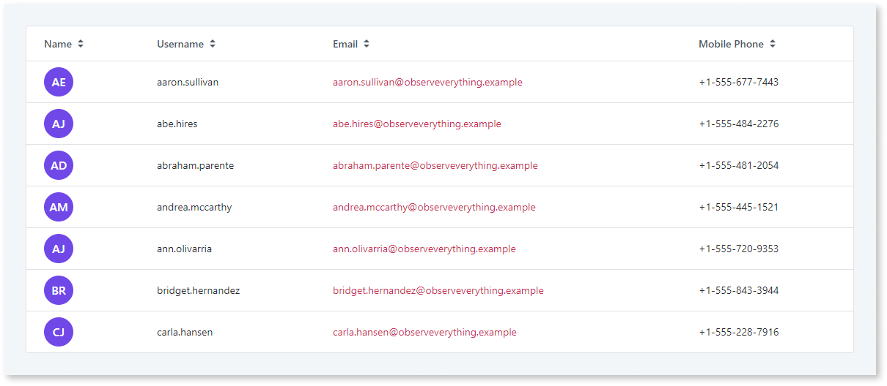

## How to use the User Avatar UI pattern

The following example demonstrates how you can display the initials of the registered users on your platform.

1. In Service Studio, in the Toolbox, search for `User Avatar`.

    The User Avatar widget is displayed.

    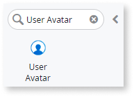

    If the UI widget doesn't display, it's because the dependency isn't added. This happens because the Remove unused references setting is enabled. To make the widget available in your app:

    1. In the Toolbox, click **Search in other modules**.

    1. In **Search in other Modules**, remove any spaces between words in your search text.

    1. Select the widget you want to add from the **OutSystemsUI** module, and click **Add Dependency**.

    1. In the Toolbox, search for the widget again.

1. From the Toolbox, drag the User Avatar widget into the Main Content area of your application's screen.

    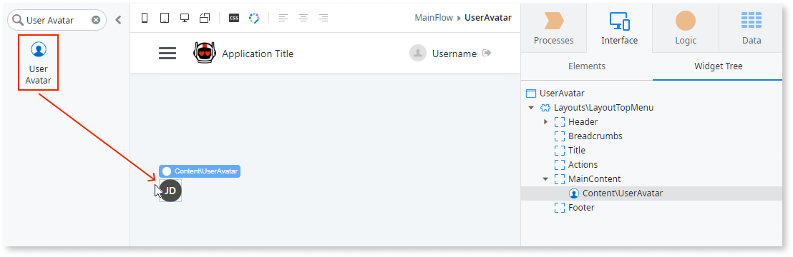

1. To create an aggregate (in this example to retrieve all the users on the platform), right-click the screen name and select **Fetch Data from Database**.

    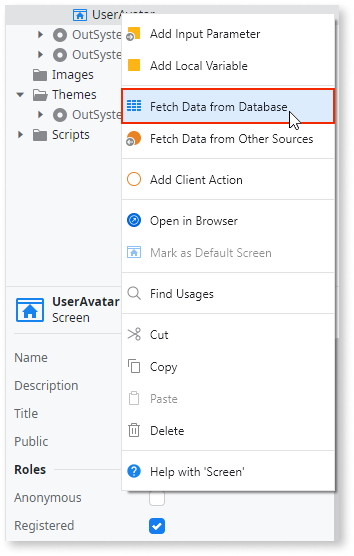

1. To add a database entity, click the screen, and from the **Select Source** pop-up, select the relevant entity and click **OK**. In this example, we select the **User** entity.

    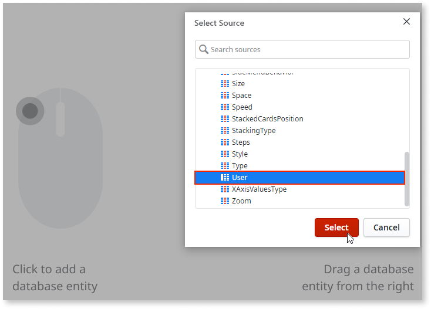

    The aggregate **GetUsers** is created.

    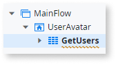

1. To reopen your screen, select the **Interface** tab, and double-click on your screen name.

1. Select the User Avatar widget, and on the **Properties** tab, from the **Name** drop-down, select **Expression Editor**.

1. In the Expression Editor, enter the following expression and click **Close**.

    `GetUsers.List.Current.User.Name`

    Note: You can also add the expression by navigating through the Expression Editor's **Scope** tree and double-clicking on the **Name** output parameter.

    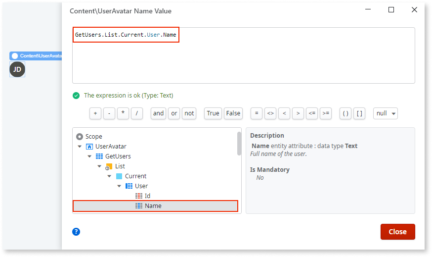

    The **Name** property is now set to display the Name property of the aggregate you created earlier, which gets and displays the names of the registered users on your platform.

1. On the **Properties** tab, you can also customize User Avatar's look and feel by setting any of the optional properties, for example, the color, shape, and size. The following example displays a blue, medium-sized, circle badge.  

    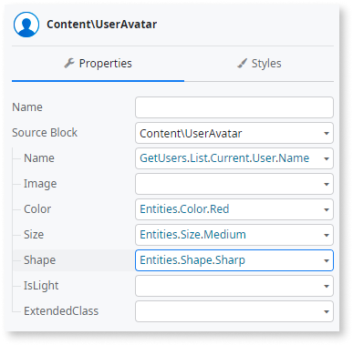

After following these steps and publishing the module, you can test the pattern in your app.

## Properties

| Property | Description |
| --- | --- |
| Name (Text): Optional | The initials that appear inside the user avatar. Set this to a data source that contains the value you want to display. <p>Examples <ul><li>_Blank_ - Displays the initials JD (John Doe). This is the default.</li><li>_VariableName_ - Displays the value that the variable "VariableName" holds at that time.</li><li>_ExampleAggregate.Name_ - Displays the names contained in the records returned by the "ExampleAggregate" aggregate execution.</li></ul></p> |
| Image (Binary Data): Optional | The users image. |
| Color (Color Identifier): Optional | Set the badge's background color. Red, orange, yellow, lime, green, blue, violet, and pink are just some of predefined colors available for the badge. <p>Examples <ul><li>_Blank_ - Displays the icon badge in the color you chose when creating the app. This is the default.</li><li>_Entities.Color.Red_ - Displays a red icon badge.</li></ul></p> |
| Size (Size Identifier): Optional | Set the badge's size. Small and medium are the predefined sizes available for the badge. <p>Examples <ul><li>_Blank_ - Displays a medium sized badge. This is the default value. </li><li>_Entities.Size.Small_ - Displays a small sized badge.</li></ul></p> |
| Shape (Shape Identifier): Optional | Set the badge's shape. Rounded, soft rounded, and sharp are the predefined shapes available for the badge. <p>Examples <ul><li>_Blank_ - Displays a rounded badge. This is the default value.</li><li>_Entities.Shape.Sharp_ - displays a square badge</li></ul></p> |
| IsLight (Boolean): Optional | Specify the badge's background and text color. <p>Examples <ul><li>_True_ - A brighter hue of the color is applied to the badge and a darker color to the text.</li><li>_False_ - A darker hue of the color is applied to the badge and a lighter color to the text. This is the default.</li></ul></p> |
| ExtendedClass (Text): Optional | Adds custom style classes to the pattern. You define your [custom style classes](../../../look-feel/css.md) in your application using CSS. <p>Examples <ul><li>Blank - No custom styles are added (default value).</li><li>"myclass" - Adds the ``myclass`` style to the UI styles being applied.</li><li>"myclass1 myclass2" - Adds the ``myclass1`` and ``myclass2`` styles to the UI styles being applied.</li></ul></p>You can also use the classes available on the OutSystems UI. For more information, see the [OutSystems UI Cheat Sheet](https://outsystemsui.outsystems.com/OutSystemsUIWebsite/CheatSheet). |

## Accessibility – WCAG 2.2 AA compliance

By default, the **User Avatar** UI pattern requires a few small updates to fully comply with WCAG 2.2 AA guidelines. You must manually adjust it to address the following issues:

* **Alternative text (`alt` attribute)** may be missing or incorrectly applied, preventing screen readers from describing or skipping the avatar as intended.

* **Color contrast** between the avatar’s background and text might not meet the minimum WCAG 2.2 AA ratio, especially when using default or dynamic color combinations.

Fixing these two issues ensures that the User Avatar is perceivable and understandable for all users, including those relying on screen readers or with low vision.

### Add or hide alternative text

Screen readers rely on the `alt` attribute to describe images. The **User Avatar** may lack appropriate alternative text or use it incorrectly, depending on how the avatar appears in your interface. There are two common scenarios:

* **Informative avatar:** The avatar appears without nearby text, so it needs an `alt` value for identification.  
* **Decorative avatar:** The avatar appears next to the user’s name or other descriptive text, so the `alt` value should be empty.

#### Option 1: informative avatar

1. In **Service Studio**, go to the **Interface** tab.

1. Select the **Screen/Block** that uses the **User Avatar**.

1. In **Screen/Block** properties, select **OnReady** to create a client action.

    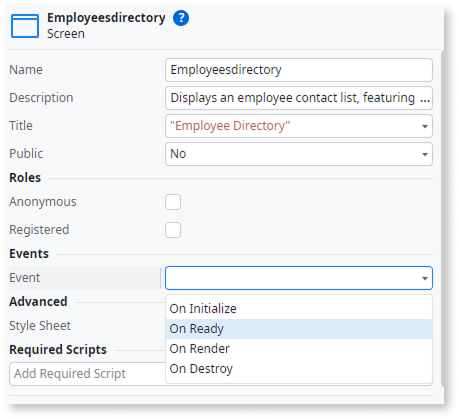

1. In **OnReady**, add a **JavaScript** node to **Client Action**.

    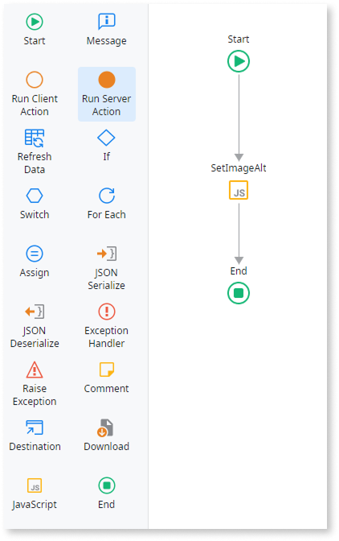

1. Add the following code:

    ```javascript
    const avatar = document.querySelector("#" + $parameters.WidgetId + " img");
    if(!avatar) return;
    avatar.setAttribute('alt', $parameters.Name + " user picture");
    ```

    <div class="info" markdown="1">

    If you're using multiple avatars in a list, adjust the selector and variable accordingly.

    </div>

    <div class="warning" markdown="1">

    When you set text in JavaScript (as in this User Avatar pattern), plan translations separately.

    JavaScript text isn’t available to the platform translation mechanism, so it won’t appear in Translations. If your app supports multiple languages, make sure you externalize these strings (for example, by using server-provided resources or a translation dictionary) and include them in your localization workflow.

    </div>

1. Publish the module.

#### Option 2: decorative avatar

1. In **Service Studio**, go to the **Interface** tab.

1. Select the **Screen/Block** that uses the **User Avatar**.

1. In **Screen/Block** properties, select **OnReady** to create a client action.

    

1. In **OnReady**, add a **JavaScript** node to **Client Action**.

    

1. Add the following code:

    ```javascript
    const avatar = document.querySelector("#" + $parameters.WidgetId + " img");
    if(!avatar) return;
    avatar.setAttribute('alt', $parameters.Name + "");
    
    ```

1. Publish the module.

### Improve color contrast

The **User Avatar** may not meet the minimum contrast ratio required for WCAG 2.2 AA compliance.  
This occurs because the **OutSystems UI** color palette includes combinations that aren’t optimized for text contrast—especially when using dynamic or brand-customized settings.

To ensure accessibility, update your color tokens so that text and background combinations meet or exceed the **4.5:1** ratio for normal text (or **3:1** for large text). The following examples may create low-contrast combinations:

* orange  
* yellow  
* lime  
* green  
* neutral-5  
* neutral-6  
* light-yellow  
* light-lime  
* light-transparent  
* light-neutral-5  
* light-neutral-6

You can still use these colors decoratively, as long as they don’t impact text or critical visual indicators.

Use a contrast checking tool such as:

* [Color Contrast Checker by Pivotal Accessibility](https://chromewebstore.google.com/detail/color-contrast-checker/gbfgefkhkofclanlcgnhlbmfgjjomock)

* [Accessible Color Picker](https://chromewebstore.google.com/detail/accessible-color-picker/bgfhbflmeekopanooidljpnmnljdihld)

* [WebAIM Contrast Checker](https://webaim.org/resources/contrastchecker/)

* [Contrast Ratio by Lea Verou](https://contrast-ratio.com/)

  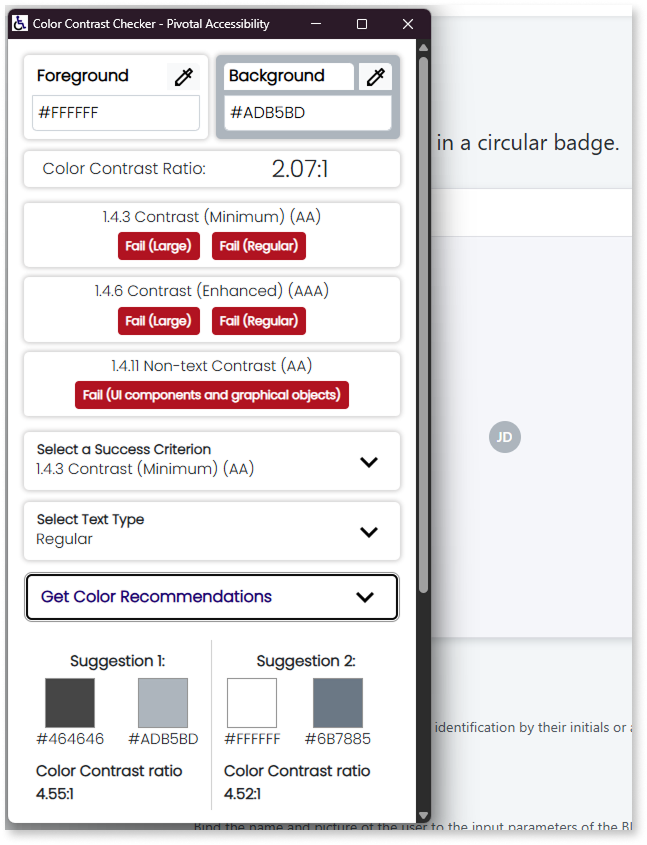

#### Update CSS variables to improve contrast

Update the theme color tokens so text and background combinations meet WCAG 2.2 AA. Replace each placeholder value with your brand colors (hex or rgba) and publish.

1. In **Service Studio**, go to the **Elements** tab.

1. Select your **Theme** in **Themes**.

1. In the theme’s CSS, add or update the needed variables.

1. Replace the placeholder values with new accessible colors and **Publish** the module.

<div class="info" markdown="1">

The following code block lists all root color variables for quick reference. You don’t need to include all of them in your theme — only the ones you intend to update.  

For readability, the examples use a black hex value (`#000000`), but you can replace it with any valid CSS color format, such as `rgb()`, `rgba()`, `hsl()`, or `oklch()`.

</div>

```css
:root {
    /* ── Color > Brand ───────────────────────────────────── */
    --color-primary:          [#000000 /* replace */];
    --color-secondary:        [#000000 /* replace */];
    --color-primary-hover:    [#000000 /* replace */];
    --color-primary-selected: [#000000 /* replace */];
    --color-primary-lightest: [#000000 /* replace */];

    /* ── Color > Focus ───────────────────────────────────── */
    --color-focus-outer:      [#000000 /* replace */];
    --color-focus-inner:      [#000000 /* replace */];

    /* ── Color > Extended (Reds) ─────────────────────────── */
    --color-red-lightest:     [#000000 /* replace */];
    --color-red-lighter:      [#000000 /* replace */];
    --color-red-light:        [#000000 /* replace */];
    --color-red:              [#000000 /* replace */];
    --color-red-dark:         [#000000 /* replace */];
    --color-red-darker:       [#000000 /* replace */];
    --color-red-darkest:      [#000000 /* replace */];

    /* ── Color > Extended (Oranges) ──────────────────────── */
    --color-orange-lightest:  [#000000 /* replace */];
    --color-orange-lighter:   [#000000 /* replace */];
    --color-orange-light:     [#000000 /* replace */];
    --color-orange:           [#000000 /* replace */];
    --color-orange-dark:      [#000000 /* replace */];
    --color-orange-darker:    [#000000 /* replace */];
    --color-orange-darkest:   [#000000 /* replace */];

    /* ── Color > Extended (Yellows) ──────────────────────── */
    --color-yellow-lightest:  [#000000 /* replace */];
    --color-yellow-lighter:   [#000000 /* replace */];
    --color-yellow-light:     [#000000 /* replace */];
    --color-yellow:           [#000000 /* replace */];
    --color-yellow-dark:      [#000000 /* replace */];
    --color-yellow-darker:    [#000000 /* replace */];
    --color-yellow-darkest:   [#000000 /* replace */];

    /* ── Color > Extended (Limes) ────────────────────────── */
    --color-lime-lightest:    [#000000 /* replace */];
    --color-lime-lighter:     [#000000 /* replace */];
    --color-lime-light:       [#000000 /* replace */];
    --color-lime:             [#000000 /* replace */];
    --color-lime-dark:        [#000000 /* replace */];
    --color-lime-darker:      [#000000 /* replace */];
    --color-lime-darkest:     [#000000 /* replace */];

    /* ── Color > Extended (Greens) ───────────────────────── */
    --color-green-lightest:   [#000000 /* replace */];
    --color-green-lighter:    [#000000 /* replace */];
    --color-green-light:      [#000000 /* replace */];
    --color-green:            [#000000 /* replace */];
    --color-green-dark:       [#000000 /* replace */];
    --color-green-darker:     [#000000 /* replace */];
    --color-green-darkest:    [#000000 /* replace */];

    /* ── Color > Extended (Teals) ────────────────────────── */
    --color-teal-lightest:    [#000000 /* replace */];
    --color-teal-lighter:     [#000000 /* replace */];
    --color-teal-light:       [#000000 /* replace */];
    --color-teal:             [#000000 /* replace */];
    --color-teal-dark:        [#000000 /* replace */];
    --color-teal-darker:      [#000000 /* replace */];
    --color-teal-darkest:     [#000000 /* replace */];

    /* ── Color > Extended (Cyans) ────────────────────────── */
    --color-cyan-lightest:    [#000000 /* replace */];
    --color-cyan-lighter:     [#000000 /* replace */];
    --color-cyan-light:       [#000000 /* replace */];
    --color-cyan:             [#000000 /* replace */];
    --color-cyan-dark:        [#000000 /* replace */];
    --color-cyan-darker:      [#000000 /* replace */];
    --color-cyan-darkest:     [#000000 /* replace */];

    /* ── Color > Extended (Blues) ────────────────────────── */
    --color-blue-lightest:    [#000000 /* replace */];
    --color-blue-lighter:     [#000000 /* replace */];
    --color-blue-light:       [#000000 /* replace */];
    --color-blue:             [#000000 /* replace */];
    --color-blue-dark:        [#000000 /* replace */];
    --color-blue-darker:      [#000000 /* replace */];
    --color-blue-darkest:     [#000000 /* replace */];

    /* ── Color > Extended (Indigos) ──────────────────────── */
    --color-indigo-lightest:  [#000000 /* replace */];
    --color-indigo-lighter:   [#000000 /* replace */];
    --color-indigo-light:     [#000000 /* replace */];
    --color-indigo:           [#000000 /* replace */];
    --color-indigo-dark:      [#000000 /* replace */];
    --color-indigo-darker:    [#000000 /* replace */];
    --color-indigo-darkest:   [#000000 /* replace */];

    /* ── Color > Extended (Violets) ──────────────────────── */
    --color-violet-lightest:  [#000000 /* replace */];
    --color-violet-lighter:   [#000000 /* replace */];
    --color-violet-light:     [#000000 /* replace */];
    --color-violet:           [#000000 /* replace */];
    --color-violet-dark:      [#000000 /* replace */];
    --color-violet-darker:    [#000000 /* replace */];
    --color-violet-darkest:   [#000000 /* replace */];

    /* ── Color > Extended (Grapes) ───────────────────────── */
    --color-grape-lightest:   [#000000 /* replace */];
    --color-grape-lighter:    [#000000 /* replace */];
    --color-grape-light:      [#000000 /* replace */];
    --color-grape:            [#000000 /* replace */];
    --color-grape-dark:       [#000000 /* replace */];
    --color-grape-darker:     [#000000 /* replace */];
    --color-grape-darkest:    [#000000 /* replace */];

    /* ── Color > Extended (Pinks) ────────────────────────── */
    --color-pink-lightest:    [#000000 /* replace */];
    --color-pink-lighter:     [#000000 /* replace */];
    --color-pink-light:       [#000000 /* replace */];
    --color-pink:             [#000000 /* replace */];
    --color-pink-dark:        [#000000 /* replace */];
    --color-pink-darker:      [#000000 /* replace */];
    --color-pink-darkest:     [#000000 /* replace */];

    /* ── Color > Neutral ─────────────────────────────────── */
    --color-neutral-0:        [#000000 /* replace */];
    --color-neutral-1:        [#000000 /* replace */];
    --color-neutral-2:        [#000000 /* replace */];
    --color-neutral-3:        [#000000 /* replace */];
    --color-neutral-4:        [#000000 /* replace */];
    --color-neutral-5:        [#000000 /* replace */];
    --color-neutral-6:        [#000000 /* replace */];
    --color-neutral-7:        [#000000 /* replace */];
    --color-neutral-8:        [#000000 /* replace */];
    --color-neutral-9:        [#000000 /* replace */];
    --color-neutral-10:       [#000000 /* replace */];

    /* ── Color > Semantic ────────────────────────────────── */
    --color-error-light:      [#000000 /* replace */];
    --color-error:            [#000000 /* replace */];
    --color-warning-light:    [#000000 /* replace */];
    --color-warning:          [#000000 /* replace */];
    --color-success-light:    [#000000 /* replace */];
    --color-success:          [#000000 /* replace */];
    --color-info-light:       [#000000 /* replace */];
    --color-info:             [#000000 /* replace */];
}
```

### Result

After completing these steps:

* Informative avatars are announced correctly by screen readers.

* Decorative avatars are skipped, avoiding redundant or confusing information for assistive technology users.

* After you update the theme color variables with accessible values, validate that each combination of background and text colors used in the **User Avatar** meets the WCAG 2.2 AA contrast requirements.

    When validating in a Style Guide or Design System context, make sure to check both the default state and the **IsLight** variant, which inverts background and text colors.

Test it in your app to confirm the update.
