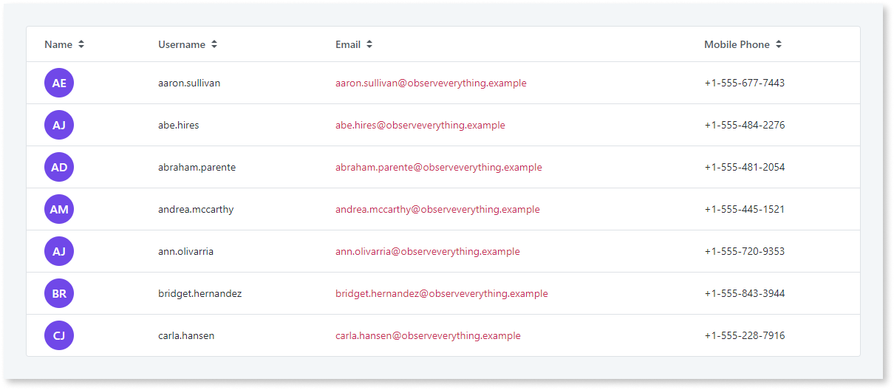
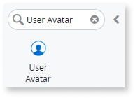
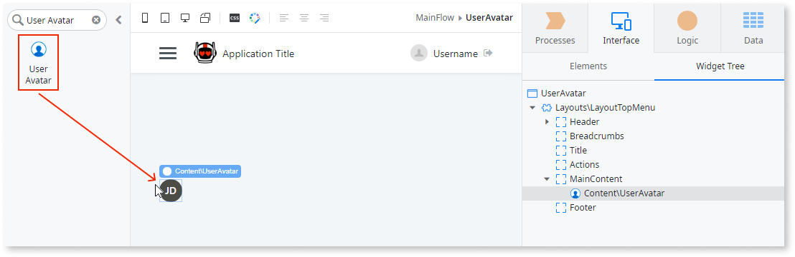
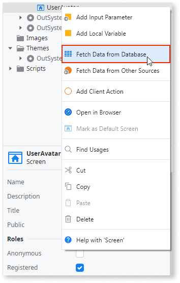
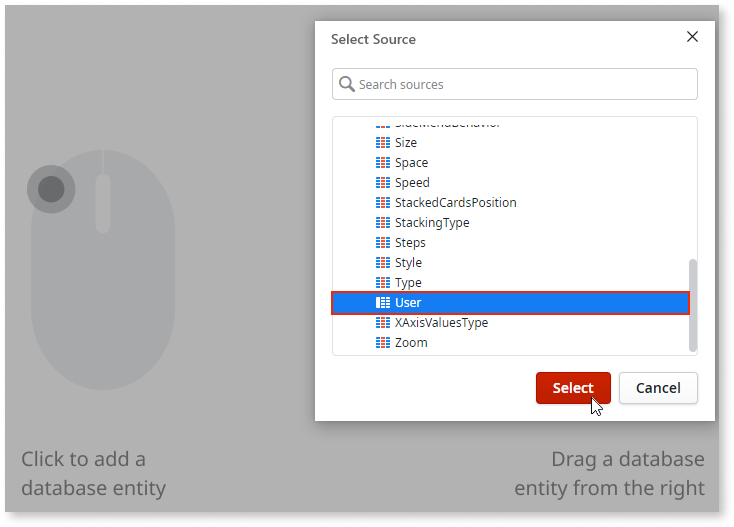
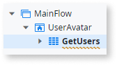
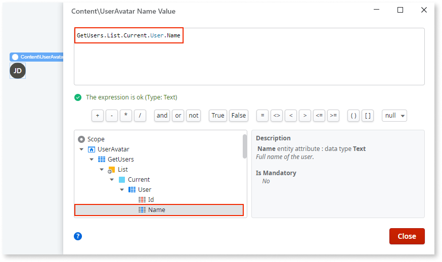
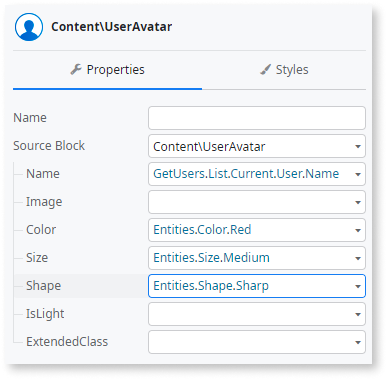

# User Avatar

Applies to Mobile Apps and Reactive Web Apps only

You can use the User Avatar UI Pattern to display a user's initials or their image in a circular badge.

**How to use the User Avatar UI Pattern**

The following example demonstrates how you can display the initials of the registered users on your platform.

1. In Service Studio, in the Toolbox, search for `User Avatar`.

    The User Avatar widget is displayed.

    

    If the UI widget doesn't display, it's because the dependency isn't added. This happens because the Remove unused references setting is enabled. To make the widget available in your app:

    1. In the Toolbox, click **Search in other modules**.

    1. In **Search in other Modules**, remove any spaces between words in your search text.
    
    1. Select the widget you want to add from the **OutSystemsUI** module, and click **Add Dependency**. 
    
    1. In the Toolbox, search for the widget again.

1. From the Toolbox, drag the User Avatar widget into the Main Content area of your application's screen.

    

1. To create an aggregate (in this example to retrieve all the users on the platform), right-click the screen name and select **Fetch Data from Database**.

    

1. To add a database entity, click the screen, and from the **Select Source** pop-up, select the relevant entity and click **OK**. In this example, we select the **User** entity.

    

    The aggregate **GetUsers** is created.

    

1. To reopen your screen, select the **Interface** tab, and double-click on your screen name.

1. Select the User Avatar widget, and on the **Properties** tab, from the **Name** drop-down, select **Expression Editor**.

1. In the Expression Editor, enter the following expression and click **DONE**.

    `GetUsers.List.Current.User.Name`

    Note: You can also add the expression by navigating through the Expression Editor's **Scope** tree and double-clicking on the **Name** output parameter.

    

    The **Name** property is now set to display the Name property of the aggregate you created earlier, which gets and displays the names of the registered users on your platform.

1. On the **Properties** tab, you can also customize User Avatar's look and feel by setting any of the optional properties, for example, the color, shape, and size. The following example displays a blue, medium-sized, circle badge.  

    

After following these steps and publishing the module, you can test the pattern in your app.

## Properties

| Property                           | Description                                                                                                                                                                                                                                                                                                                                                                                                                                                                                                                                                                                                                             |
|------------------------------------|-----------------------------------------------------------------------------------------------------------------------------------------------------------------------------------------------------------------------------------------------------------------------------------------------------------------------------------------------------------------------------------------------------------------------------------------------------------------------------------------------------------------------------------------------------------------------------------------------------------------------------------------|
| Name (Text): Optional              | The initials that appear inside the user avatar. Set this to a data source that contains the value you want to display. 
Examples <ul><li>_Blank_ - Displays the initials JD (John Doe). This is the default.</li><li>_VariableName_ - Displays the value that the variable "VariableName" holds at that time.</li><li>_ExampleAggregate.Name_ - Displays the names contained in the records returned by the "ExampleAggregate" aggregate execution.</li></ul>
                                                                                                                                                                    |
| Image (Binary Data): Optional      | The users image.                                                                                                                                                                                                                                                                                                                                                                                                                                                                                                                                                                                                                        |
| Color (Color Identifier): Optional | Set the badge's background color. Red, orange, yellow, lime, green, blue, violet, and pink are just some of predefined colors available for the badge. 
Examples <ul><li>_Blank_ - Displays the icon badge in the color you chose when creating the app. This is the default.</li><li>_Entities.Color.Red_ - Displays a red icon badge.</li></ul>
                                                                                                                                                                                                                                                                                 |
| Size (Size Identifier): Optional   | Set the badge's size. Small and medium are the predefined sizes available for the badge. 
Examples <ul><li>_Blank_ - Displays a medium sized badge. This is the default value. </li><li>_Entities.Size.Small_ - Displays a small sized badge.</li></ul>
                                                                                                                                                                                                                                                                                                                                                                           |
| Shape (Shape Identifier): Optional | Set the badge's shape. Rounded, soft rounded, and sharp are the predefined shapes available for the badge. 
Examples <ul><li>_Blank_ - Displays a rounded badge. This is the default value.</li><li>_Entities.Shape.Sharp_ - displays a square badge</li></ul>
                                                                                                                                                                                                                                                                                                                                                                    |
| IsLight (Boolean): Optional        | Specify the badge's background and text color. 
Examples <ul><li>_True_ - A brighter hue of the color is applied to the badge and a darker color to the text.</li><li>_False_ - A darker hue of the color is applied to the badge and a lighter color to the text. This is the default.</li></ul>
                                                                                                                                                                                                                                                                                                                                 |
| ExtendedClass (Text): Optional     | Adds custom style classes to the Pattern. You define your [custom style classes](../../../look-feel/css.md) in your application using CSS. 
Examples <ul><li>Blank - No custom styles are added (default value).</li><li>"myclass" - Adds the ``myclass`` style to the UI styles being applied.</li><li>"myclass1 myclass2" - Adds the ``myclass1`` and ``myclass2`` styles to the UI styles being applied.</li></ul>
You can also use the classes available on the OutSystems UI. For more information, see the [OutSystems UI Cheat Sheet](https://outsystemsui.outsystems.com/OutSystemsUIWebsite/CheatSheet). |
