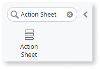
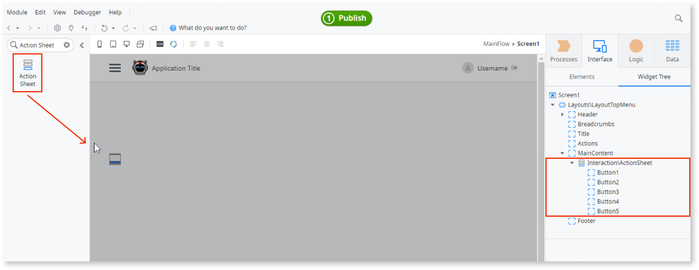
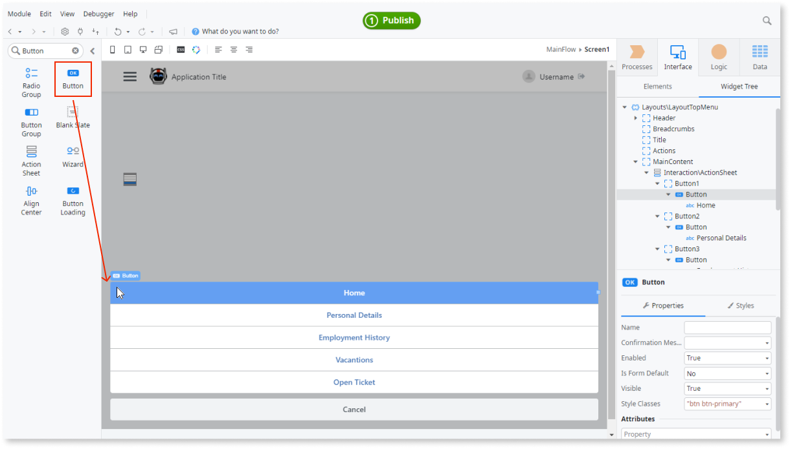
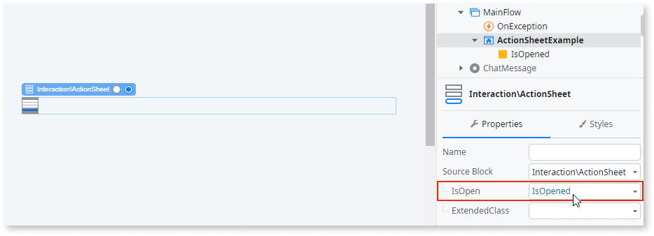
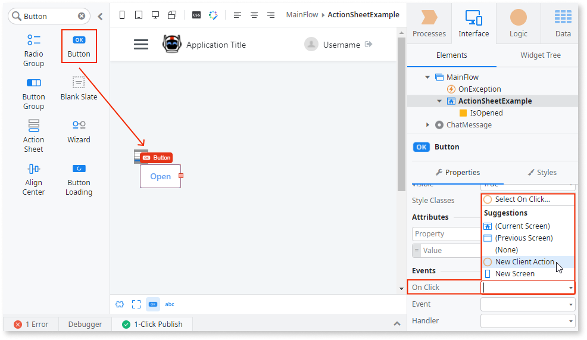
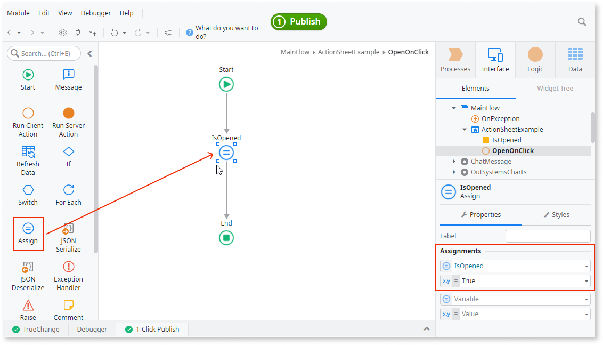
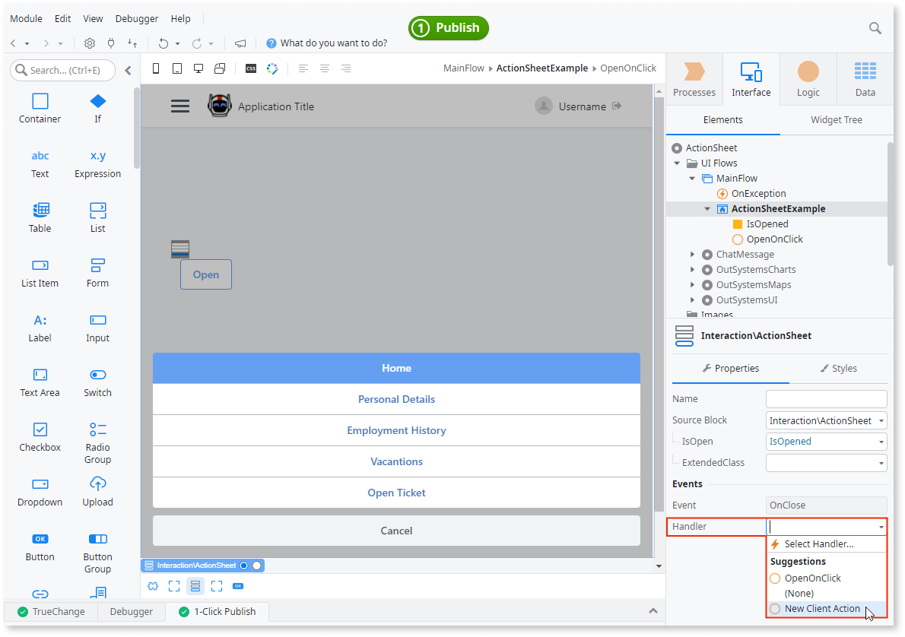
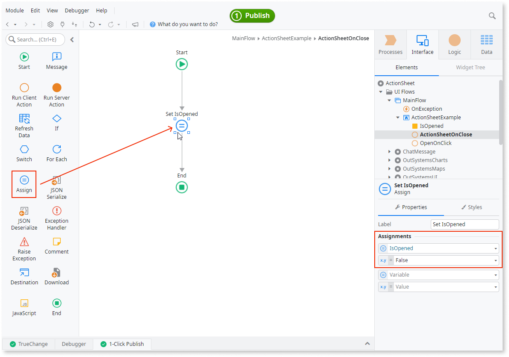

# Action Sheet

Applies to Mobile Apps and Reactive Web Apps only

You can use the Action Sheet UI Patterns to add a menu that slides from the bottom of the screen when triggered by a user action.

**How to use the Action Sheet UI Pattern**

1. In Service Studio, in the Toolbox, search for `Action Sheet`.

    The Action Sheet widget is displayed.

    

    If the UI widget doesn't display, it's because the dependency isn't added. This happens because the Remove unused references setting is enabled. To make the widget available in your app:

    1. In the Toolbox, click **Search in other modules**.

    1. In **Search in other Modules**, remove any spaces between words in your search text.

    1. Select the widget you want to add from the **OutSystemsUI** module, and click **Add Dependency**.

    1. In the Toolbox, search for the widget again.

1. From the Toolbox, drag the Action Sheet widget into the Main Content area of your application's screen.

    

    By default, the Action Sheet widget contains 5 button placeholders.

1. Add the relevant content to the Button placeholders. In this example, we add buttons that navigate to other pages when clicked.

    

1. Add a local variable. In this example, we call the variable **IsOpened**.

1. Select the Action Sheet pattern, and on the **Properties** tab, set the **IsOpen** property to the new local variable (in this example, **IsOpened**).

    

1. To open the Action Sheet menu, we add a button and on the **Properties** tab, from the **OnClick** dropdown, select **New Client Action**.

    

1. Add an Assign to the client action and set the **IsOpened** local variable to **True**.

    

1. To close the Action Sheet menu, on the **Properties** tab, from the **Handler** dropdrown of the **OnClose** event, select **New Client Action**.

    

1. Add an Assign to the client action and set the **IsOpened** local variable to **False**.

    

After following these steps and publishing the module, you can test the pattern in your app.

## Properties

| Property                   | Description                                                                                                                                                                                                                                                                                                                                                                                                                                                                                                                                                                                                                       |
|----------------------------|-----------------------------------------------------------------------------------------------------------------------------------------------------------------------------------------------------------------------------------------------------------------------------------------------------------------------------------------------------------------------------------------------------------------------------------------------------------------------------------------------------------------------------------------------------------------------------------------------------------------------------------|
| IsOpen(Boolean): Mandatory | Assign a variable open/close the Action Sheet.                                                                                                                                                                                                                                                                                                                                                                                                                                                                                                                                                                                    |
| ExtendedClass              | Adds custom style classes to the Pattern. You define your [custom style classes](../../../look-feel/css.md) in your application using CSS.  Examples  <ul><li>Blank - No custom styles are added (default value).</li><li>"myclass" - Adds the ``myclass`` style to the UI styles being applied.</li><li>"myclass1 myclass2" - Adds the ``myclass1`` and ``myclass2`` styles to the UI styles being applied.</li></ul>You can also use the classes available on the OutSystems UI. For more information, see the [OutSystems UI Cheat Sheet](https://outsystemsui.outsystems.com/OutSystemsUIWebsite/CheatSheet). |
