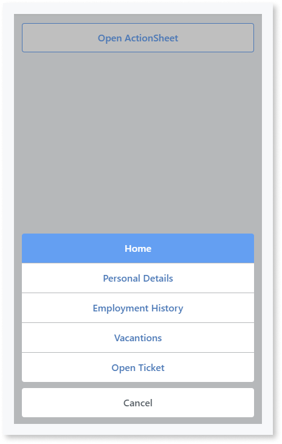
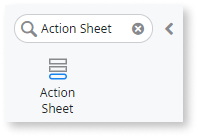
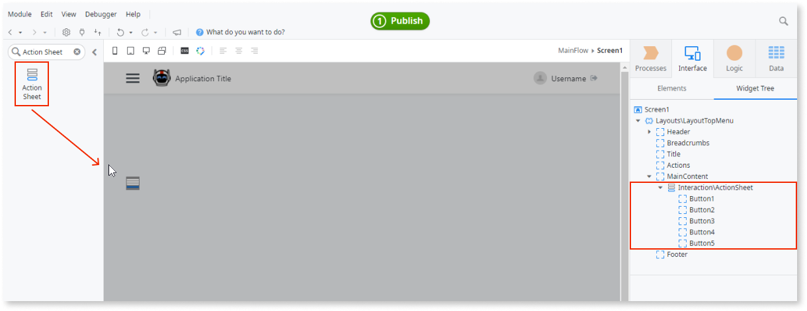
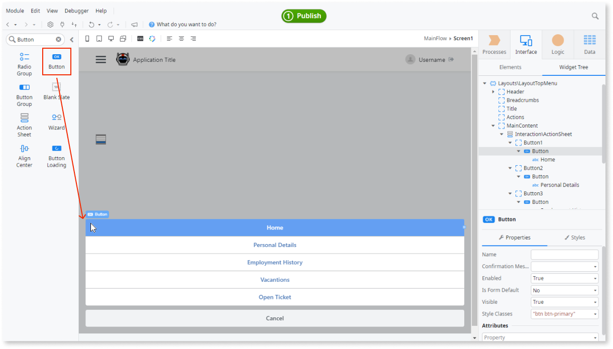
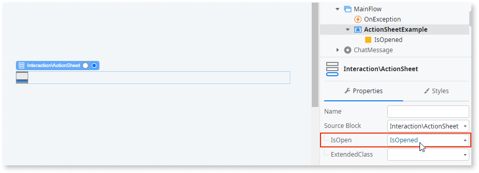
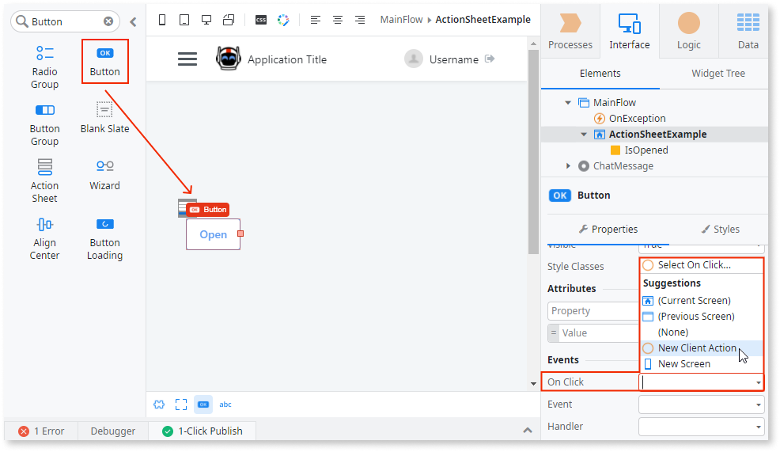
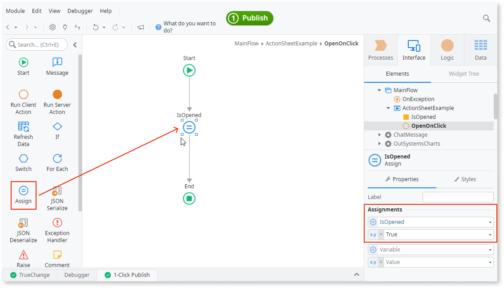
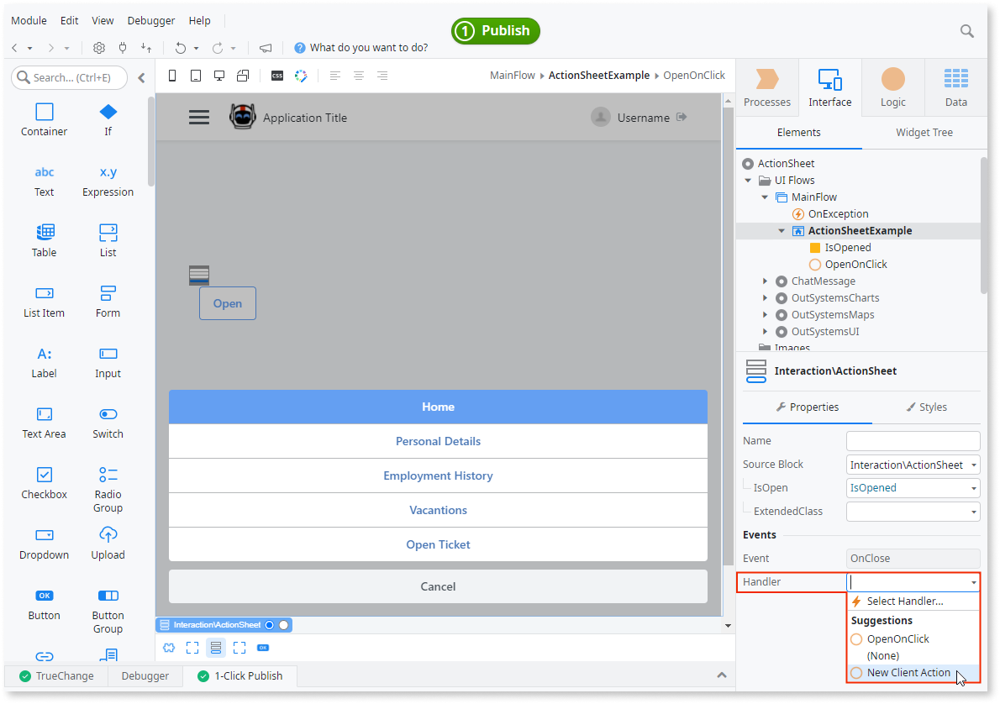
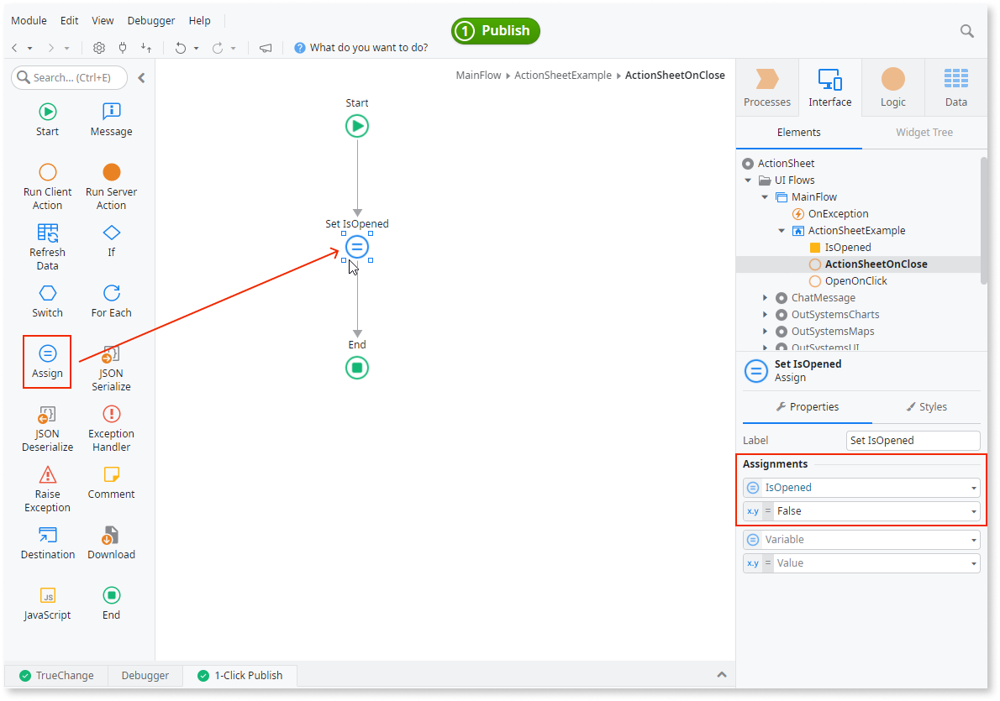

---
tags:
  - Accessibility
  - Front-End
  - Mobile app
  - OutSystems UI
  - Screens
  - UI
  - UI Patterns
summary: Learn to implement the Action Sheet UI pattern in mobile and reactive web apps using OutSystems 11 (O11) in Service Studio.
locale: en-us
guid: 54f296bf-249a-425b-b54c-6d446248c228
app_type: mobile apps, reactive web apps
platform-version: o11
figma: https://www.figma.com/file/iBD5yo23NiW53L1zdPqGGM/Developing%20an%20Application?node-id=1295:18300
audience:
  - Developer
  - Front-end developer
outsystems-tools:
  - service studio
coverage-type:
  - remember
  - apply
isautopublish: true
---
# Action Sheet

<div class="info" markdown="1">

Applies to Mobile Apps and Reactive Web Apps only

</div>

You can use the Action Sheet UI pattern to add a menu that slides from the bottom of the screen when triggered by a user action.



## How to use the Action Sheet UI pattern

1. In Service Studio, in the Toolbox, search for `Action Sheet`.

    The Action Sheet widget is displayed.

    

    If the UI widget doesn't display, it's because the dependency isn't added. This happens because the Remove unused references setting is enabled. To make the widget available in your app:

    1. In the Toolbox, click **Search in other modules**.

    1. In **Search in other Modules**, remove any spaces between words in your search text.

    1. Select the widget you want to add from the **OutSystemsUI** module, and click **Add Dependency**.

    1. In the Toolbox, search for the widget again.

1. From the Toolbox, drag the Action Sheet widget into the Main Content area of your application's screen.

    

    By default, the Action Sheet widget contains 5 button placeholders.

1. Add the relevant content to the Button placeholders. In this example, we add buttons that navigate to other pages when clicked.

    

1. Add a local variable. In this example, we call the variable **IsOpened**.

1. Select the Action Sheet pattern, and on the **Properties** tab, set the **IsOpen** property to the new local variable (in this example, **IsOpened**).

    

1. To open the Action Sheet menu, we add a button and on the **Properties** tab, from the **OnClick** dropdown, select **New Client Action**.

    

1. Add an Assign to the client action and set the **IsOpened** local variable to **True**.

    

1. To close the Action Sheet menu, on the **Properties** tab, from the **Handler** dropdrown of the **OnClose** event, select **New Client Action**.

    

1. Add an Assign to the client action and set the **IsOpened** local variable to **False**.

    

After following these steps and publishing the module, you can test the pattern in your app.

## Properties

| Property | Description |
| --- | --- |
| IsOpen(Boolean): Mandatory | Assign a variable open or close the Action Sheet. |
| ExtendedClass | Adds custom style classes to the Pattern. You define your [custom style classes](../../../look-feel/css.md) in your application using CSS.<br/><br/>Examples<br/><br/><ul><li>Blank - No custom styles are added (default value).</li><li>"myclass" - Adds the ``myclass`` style to the UI styles being applied.</li><li>"myclass1 myclass2" - Adds the ``myclass1`` and ``myclass2`` styles to the UI styles being applied.</li></ul>You can also use the classes available on the OutSystems UI. For more information, see the [OutSystems UI Cheat Sheet](https://outsystemsui.outsystems.com/OutSystemsUIWebsite/CheatSheet). |

## Accessibility – WCAG 2.2 AA compliance {#accessibility}

By default, the **Action Sheet** UI Pattern may not accurately convey its expanded or collapsed state to assistive technologies.  
Set the appropriate ARIA attributes so screen readers announce when the Action Sheet opens or closes, ensuring users always understand its current state.

<div class="info" markdown="1">

This solution follows the recommendation that the Action Sheet component should be instantiated only once per screen.
In scenarios with dynamic content, instead of creating multiple Action Sheet instances, update the content of the existing Action Sheet dynamically according to the context of use.

</div>

### Set the correct ARIA state for the Action Sheet trigger

Expose the open and closed state through the trigger button and remove invalid state attributes from the container.

1. In **Service Studio**, go to the **Interface** tab.

1. Select the **Screen/Block** where the **Action Sheet** is used.

1. Select the **Button** that triggers the **Action Sheet**. In **Properties**, under **Attributes**, add `aria-expanded=If(IsOpen, "true", "false")`, `aria-controls = actionSheetId` and `aria-haspopup="menu`;

### Correct the ARIA attributes on the Action Sheet container

Remove `aria-expanded` from the Action Sheet container, since `aria-expanded` belongs on the trigger element.

1. In the **AdminDashboard** screen, under **Events**, create a client action for **OnRender**.

1. Add a **JavaScript** node, and paste the following code:

    ```javascript
    // 1. Use querySelector to find it anywhere in the DOM,
    // in case OutSystems moved it to a body-level layer.
    const actionSheet = document.querySelector('.action-sheet-container');

    // Fallback to the ID if the class isn't found.
    const targetElement = actionSheet || document.getElementById($parameters.ActionSheetId);

    if (!targetElement) return;

    // 2. Strip the attribute.
    if (targetElement.hasAttribute('aria-expanded')) {
    targetElement.removeAttribute('aria-expanded');
    }
    ```

1. Publish the module.

### Result

After completing these steps:

* The trigger button exposes the Action Sheet state through `aria-expanded`, so assistive technologies can identify when the Action Sheet is open or closed.
* The trigger button references the Action Sheet container through `aria-controls`, clarifying which element the button affects.
* The trigger button indicates it opens a popup through `aria-haspopup`, helping screen readers set the right expectation before the Action Sheet opens.
* The Action Sheet container no longer exposes `aria-expanded`, which prevents incorrect semantics and reduces the risk of confusing screen reader output.

Test the pattern in your app to confirm that the Action Sheet opens and closes as expected, and that screen readers announce the state changes consistently.
